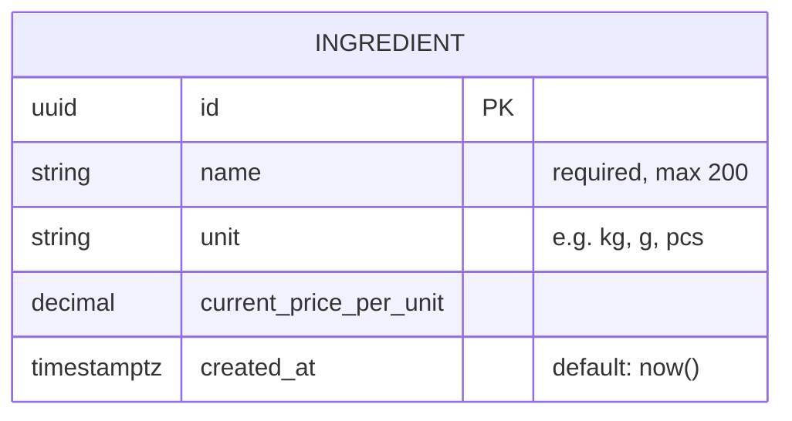
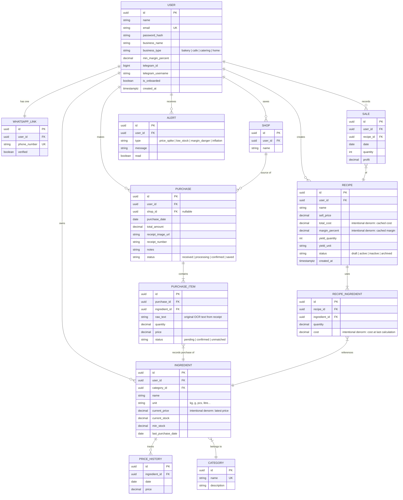
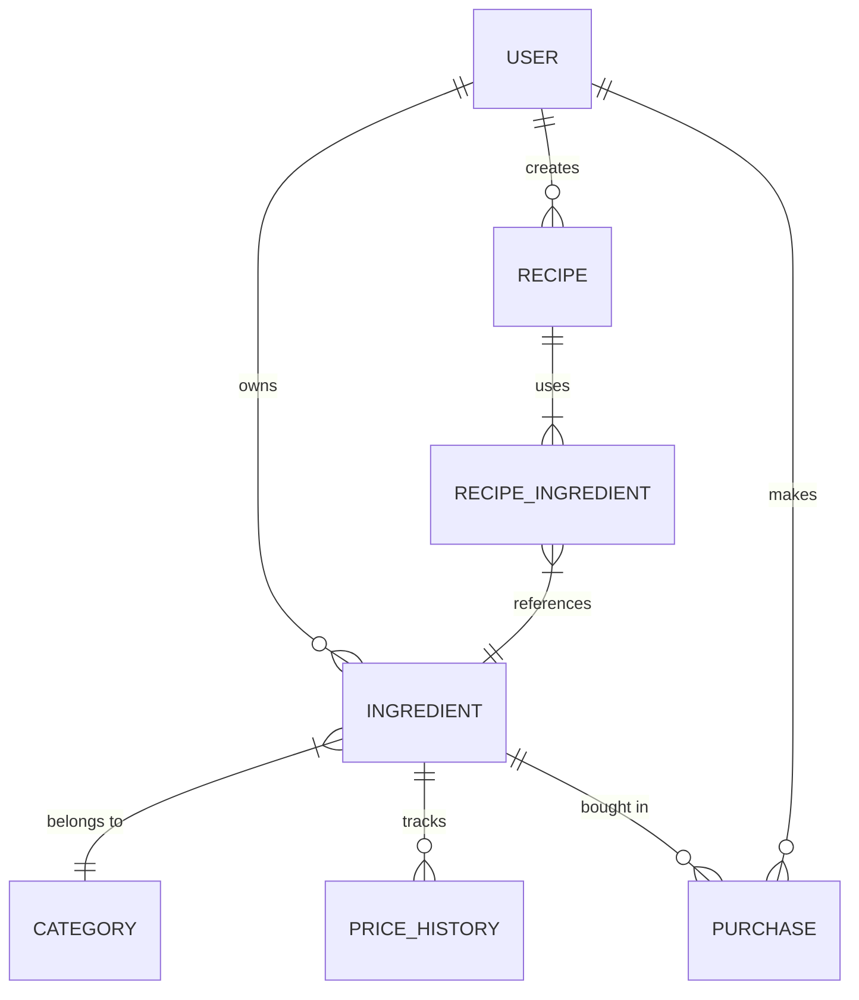

# Schema Map — Beginner Track Database Evolution

The database schema grows across the four phases. You start with a single table and progressively add entities as each phase introduces new concepts.

---

## How the Schema Grows

```
Phase 1 (Lessons 01–05)    → 1 table:   ingredients
Phase 2 (Lessons 06–09)    → same schema, no changes (MediatR is a code pattern, not a schema change)
Phase 3 (Lessons 10–13)    → same schema (Telegram bot reuses existing handlers)
Phase 4 (Lessons 14–17)    → full schema: 11 tables, 10 foreign key relationships
Phase 5 (Lessons 18–28)    → builds the full schema iteratively via additive migrations
                               18: users + categories
                               22: ingredients extended (user_id, category_id, stock fields)
                               23: price_history table
                               24: recipes + recipe_ingredients
                               26: purchases table
```

---

## Phase 1–3 Schema (Single Table)

These phases only need one table. The goal is to learn the API and architecture patterns — not database design.



### C# class (Lesson 02)

```csharp
public class Ingredient
{
    public Guid     Id                  { get; set; }
    public required string Name         { get; set; }   // required = NOT NULL
    public string?  Unit                { get; set; }   // nullable
    public decimal  CurrentPricePerUnit { get; set; }
    public DateTimeOffset CreatedAt     { get; set; } = DateTimeOffset.UtcNow;
}
```

### DbContext (Lesson 04)

```csharp
public class NastartDbContext(DbContextOptions<NastartDbContext> options) : DbContext(options)
{
    public DbSet<Ingredient> Ingredients { get; set; }
}
```

---

## Phase 4 Schema (Full Nastart Schema)

Phase 4 introduces normalization (Lesson 14) and all the supporting tables needed for business queries (Lesson 17). The schema below is what you configure and index in Lessons 14–17.



---

## DbContext — Phase 4

```csharp
public class NastartDbContext(DbContextOptions<NastartDbContext> options) : DbContext(options)
{
    public DbSet<User>              Users              { get; set; }
    public DbSet<WhatsappLink>      WhatsappLinks      { get; set; }
    public DbSet<Category>          Categories         { get; set; }
    public DbSet<Ingredient>        Ingredients        { get; set; }
    public DbSet<PriceHistory>      PriceHistory       { get; set; }
    public DbSet<Shop>              Shops              { get; set; }
    public DbSet<Purchase>          Purchases          { get; set; }
    public DbSet<PurchaseItem>      PurchaseItems      { get; set; }
    public DbSet<Recipe>            Recipes            { get; set; }
    public DbSet<RecipeIngredient>  RecipeIngredients  { get; set; }
    public DbSet<Sale>              Sales              { get; set; }
    public DbSet<Alert>             Alerts             { get; set; }

    protected override void OnModelCreating(ModelBuilder modelBuilder)
    {
        // Auto-registers all IEntityTypeConfiguration<T> implementations
        modelBuilder.ApplyConfigurationsFromAssembly(typeof(NastartDbContext).Assembly);
    }
}
```

---

## Indexes Applied in Phase 4 (Lesson 15)

```
ingredients       → idx_ingredients_user_id           (user_id)
                  → idx_ingredients_name_trgm          (name) GIN trigram

purchases         → idx_purchases_user_date            (user_id, purchase_date)

purchase_items    → idx_purchase_items_ingredient_id   (ingredient_id)

price_history     → idx_price_history_ingredient_date  (ingredient_id, date)

recipes           → idx_recipes_user_status            (user_id, status)

alerts            → idx_alerts_user_read               (user_id, read)

sales             → idx_sales_user_date                (user_id, date)
```

---

## Normalization Decisions (Lesson 14)

| Column | Table | Decision | Reason |
|---|---|---|---|
| `category_name` | ~~ingredient~~ → `category.name` | **3NF** | Extracted to avoid repeating the name on every ingredient row |
| Price over time | ~~ingredient.price_jan...~~ → `price_history` | **3NF** | One row per date, not one column per date |
| `current_price` | `ingredient` | **Intentional denorm** | Read on every recipe cost calculation; avoids `MAX(date)` join each time |
| `total_cost`, `margin_percent` | `recipe` | **Intentional denorm** | Cached for fast dashboard queries |
| `cost` | `recipe_ingredient` | **Intentional denorm** | Snapshot of cost at last calculation for historical accuracy |
| `raw_text` | `purchase_item` | **Intentional denorm** | Keeps the original OCR string for debugging/audit |
| `RECIPE_INGREDIENT` table | junction | **Many-to-many** | A recipe uses many ingredients; an ingredient appears in many recipes |

---

## Entity Relationships Quick Reference

| Relationship | Type | FK location |
|---|---|---|
| User → Ingredient | one-to-many | `ingredient.user_id` |
| User → Recipe | one-to-many | `recipe.user_id` |
| User → Purchase | one-to-many | `purchase.user_id` |
| User → Sale | one-to-many | `sale.user_id` |
| User → Alert | one-to-many | `alert.user_id` |
| User → Shop | one-to-many | `shop.user_id` |
| User → WhatsappLink | one-to-one | `whatsapp_link.user_id` |
| Ingredient → Category | many-to-one | `ingredient.category_id` |
| Ingredient → PriceHistory | one-to-many | `price_history.ingredient_id` |
| Purchase → PurchaseItem | one-to-many | `purchase_item.purchase_id` |
| PurchaseItem → Ingredient | many-to-one | `purchase_item.ingredient_id` |
| Recipe → RecipeIngredient | one-to-many | `recipe_ingredient.recipe_id` |
| RecipeIngredient → Ingredient | many-to-one | `recipe_ingredient.ingredient_id` |
| Sale → Recipe | many-to-one | `sale.recipe_id` |
| Shop → Purchase | one-to-many | `purchase.shop_id` |

---

## Phase 5 Migration Sequence

Phase 5 migrates from the Phase 1–3 single-table schema to the production schema using four EF Core migrations. Each migration is **additive** — it only adds columns or tables, never drops.

| Migration | Command | What it adds |
|---|---|---|
| `AddUsersAndCategories` | Lesson 18 | `users` table, `categories` table, 4 seeded categories |
| `AddIngredientFullSchema` | Lesson 22 | `user_id`, `category_id`, `stock_quantity`, `reorder_threshold`, `last_updated_at` on `ingredients` |
| `AddPriceHistory` | Lesson 23 | `price_history` table |
| `AddRecipes` | Lesson 24 | `recipes` table, `recipe_ingredients` table |
| `AddPurchases` | Lesson 26 | `purchases` table |

### Phase 5 Subset of the Full Schema

Phase 5 implements the core tables needed for the bakery workflow. Tables deferred to Phase 6+ (Telegram/OCR) are: `whatsapp_links`, `shops`, `purchase_items`, `sales`, `alerts`.


