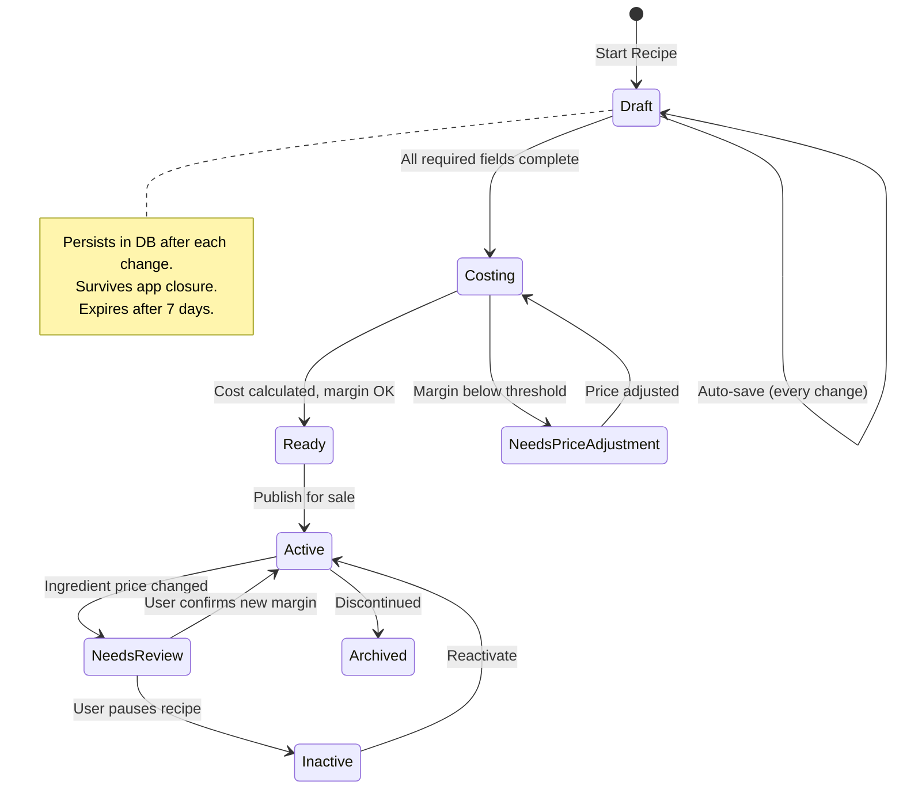

# Week 4: Recipe Context Domain 🍳

> **Goal**: Build the Recipe bounded context — Recipe aggregate with RecipeItem child entities, Margin value object, CostCalculationService for computing recipe costs, and Alert aggregate for notifications.

---

## Table of Contents
1. [Day 1: Strongly-Typed IDs & Margin Value Object](#day-1-strongly-typed-ids--margin-value-object)
2. [Day 2: Recipe Aggregate Root](#day-2-recipe-aggregate-root)
3. [Day 3: RecipeItem Entity (Child Collection)](#day-3-recipeitem-entity-child-collection)
4. [Day 4: CostCalculationService (Domain Service)](#day-4-costcalculationservice-domain-service)
5. [Day 5: Domain Events — MarginBelowThresholdEvent](#day-5-domain-events--marginbelowthresholdevent)
6. [Day 6: Alert Aggregate](#day-6-alert-aggregate)
7. [Day 7: Unit Testing Recipe Domain](#day-7-unit-testing-recipe-domain)
8. [Resources](#resources) *(Microsoft Official Docs Verified)*

---

# Day 1: Strongly-Typed IDs & Margin Value Object

## 🧒 Explain Like I'm 5

Imagine you're selling lemonade for $1. If it costs you 80 cents to make, you keep 20 cents. That 20 cents is your **margin** — it's like "how much money you get to keep!"

If you only keep 5 cents, that's bad! 😟 We need to know when our margin is too small.

## 🔧 Engineer Language

The **Margin** value object represents the difference between selling price and cost, expressed as a percentage or absolute amount. It encapsulates business rules like "is this margin below our minimum acceptable threshold?"

> 📖 **Microsoft Docs**: *"Value objects have no identity. They are immutable, and equality is determined by the values of their properties rather than by identity."*
>
> — [Implement Value Objects](https://learn.microsoft.com/en-us/dotnet/architecture/microservices/microservice-ddd-cqrs-patterns/implement-value-objects)

### RecipeId — Strongly-Typed ID

Create `src/Nastart.Domain/Recipe/ValueObjects/RecipeIds.cs`:

```csharp
namespace Nastart.Domain.Recipe.ValueObjects;

/// <summary>
/// Strongly-typed ID for Recipe aggregate.
/// Uses record struct for value semantics and zero allocation.
/// </summary>
/// <remarks>
/// See: https://learn.microsoft.com/en-us/ef/core/what-is-new/ef-core-7.0/whatsnew#value-generation-for-ddd-guarded-types
/// </remarks>
public readonly record struct RecipeId(Guid Value)
{
    public static RecipeId New() => new(Guid.NewGuid());
    public static RecipeId Empty => new(Guid.Empty);
    public bool IsEmpty => Value == Guid.Empty;
    public override string ToString() => Value.ToString();
    
    public static implicit operator Guid(RecipeId id) => id.Value;
    public static explicit operator RecipeId(Guid guid) => new(guid);
}

/// <summary>
/// Strongly-typed ID for RecipeItem entity.
/// </summary>
public readonly record struct RecipeItemId(Guid Value)
{
    public static RecipeItemId New() => new(Guid.NewGuid());
    public static RecipeItemId Empty => new(Guid.Empty);
    public bool IsEmpty => Value == Guid.Empty;
    public override string ToString() => Value.ToString();
}

/// <summary>
/// Strongly-typed ID for Alert aggregate.
/// </summary>
public readonly record struct AlertId(Guid Value)
{
    public static AlertId New() => new(Guid.NewGuid());
    public static AlertId Empty => new(Guid.Empty);
    public bool IsEmpty => Value == Guid.Empty;
    public override string ToString() => Value.ToString();
}
```

### Margin Value Object

The Margin represents the profit margin of a recipe — the percentage or amount remaining after costs.

Create `src/Nastart.Domain/Recipe/ValueObjects/Margin.cs`:

```csharp
using Nastart.Domain.Common;

namespace Nastart.Domain.Recipe.ValueObjects;

/// <summary>
/// Represents the profit margin of a recipe.
/// Can be expressed as a percentage (0-100) or calculated from cost/selling price.
/// </summary>
/// <remarks>
/// See: https://learn.microsoft.com/en-us/dotnet/architecture/microservices/microservice-ddd-cqrs-patterns/implement-value-objects
/// </remarks>
public class Margin : ValueObject
{
    /// <summary>The margin as a percentage (e.g., 25.5 means 25.5%).</summary>
    public decimal Percentage { get; }
    
    /// <summary>The absolute amount of the margin.</summary>
    public decimal Amount { get; }
    
    /// <summary>The selling price used to calculate this margin.</summary>
    public decimal SellingPrice { get; }
    
    /// <summary>The cost used to calculate this margin.</summary>
    public decimal Cost { get; }

    // Private constructor — use factory methods
    private Margin(decimal percentage, decimal amount, decimal sellingPrice, decimal cost)
    {
        Percentage = percentage;
        Amount = amount;
        SellingPrice = sellingPrice;
        Cost = cost;
    }

    /// <summary>
    /// Creates a Margin from cost and selling price.
    /// </summary>
    /// <param name="cost">The total cost of the recipe.</param>
    /// <param name="sellingPrice">The selling price of the recipe.</param>
    /// <returns>A new Margin value object.</returns>
    /// <exception cref="ArgumentException">When selling price is zero or negative.</exception>
    public static Margin Calculate(decimal cost, decimal sellingPrice)
    {
        if (sellingPrice <= 0)
            throw new ArgumentException("Selling price must be greater than zero.", nameof(sellingPrice));
        
        if (cost < 0)
            throw new ArgumentException("Cost cannot be negative.", nameof(cost));
        
        var amount = sellingPrice - cost;
        var percentage = (amount / sellingPrice) * 100;
        
        return new Margin(
            percentage: Math.Round(percentage, 2),
            amount: Math.Round(amount, 2),
            sellingPrice: sellingPrice,
            cost: cost
        );
    }

    /// <summary>
    /// Creates a Margin directly from a percentage.
    /// Used when you know the target margin percentage.
    /// </summary>
    /// <param name="percentage">The margin percentage (e.g., 30 for 30%).</param>
    /// <param name="sellingPrice">The selling price.</param>
    public static Margin FromPercentage(decimal percentage, decimal sellingPrice)
    {
        if (percentage < 0 || percentage > 100)
            throw new ArgumentOutOfRangeException(nameof(percentage), "Percentage must be between 0 and 100.");
        
        if (sellingPrice <= 0)
            throw new ArgumentException("Selling price must be greater than zero.", nameof(sellingPrice));
        
        var amount = (percentage / 100) * sellingPrice;
        var cost = sellingPrice - amount;
        
        return new Margin(
            percentage: Math.Round(percentage, 2),
            amount: Math.Round(amount, 2),
            sellingPrice: sellingPrice,
            cost: Math.Round(cost, 2)
        );
    }

    /// <summary>
    /// Checks if this margin is below a given threshold percentage.
    /// </summary>
    /// <param name="thresholdPercentage">The minimum acceptable margin percentage.</param>
    /// <returns>True if the margin is below the threshold.</returns>
    public bool IsBelow(decimal thresholdPercentage)
    {
        return Percentage < thresholdPercentage;
    }

    /// <summary>
    /// Checks if this margin is above a given threshold percentage.
    /// </summary>
    public bool IsAbove(decimal thresholdPercentage)
    {
        return Percentage > thresholdPercentage;
    }

    /// <summary>
    /// Checks if the recipe is operating at a loss (negative margin).
    /// </summary>
    public bool IsLoss => Amount < 0;

    /// <summary>
    /// Returns the status of this margin relative to common thresholds.
    /// </summary>
    public MarginStatus GetStatus(decimal warningThreshold = 15m, decimal criticalThreshold = 10m)
    {
        if (IsLoss) return MarginStatus.Loss;
        if (IsBelow(criticalThreshold)) return MarginStatus.Critical;
        if (IsBelow(warningThreshold)) return MarginStatus.Warning;
        return MarginStatus.Healthy;
    }

    protected override IEnumerable<object> GetEqualityComponents()
    {
        yield return Percentage;
        yield return Amount;
        yield return SellingPrice;
        yield return Cost;
    }

    public override string ToString() => $"{Percentage:F2}% (${Amount:F2})";
}

/// <summary>
/// Represents the health status of a margin.
/// </summary>
public enum MarginStatus
{
    Healthy,   // Above warning threshold
    Warning,   // Between warning and critical
    Critical,  // Below critical threshold but still profitable
    Loss       // Negative margin — losing money
}
```

### Alternative: Margin as C# Record (Simpler Approach)

For simpler scenarios, you can use a record:

```csharp
namespace Nastart.Domain.Recipe.ValueObjects;

/// <summary>
/// Simplified Margin using C# record.
/// </summary>
public sealed record MarginSimple
{
    public decimal Percentage { get; init; }
    public decimal Amount { get; init; }

    private MarginSimple(decimal percentage, decimal amount)
    {
        Percentage = percentage;
        Amount = amount;
    }

    public static MarginSimple Calculate(decimal cost, decimal sellingPrice)
    {
        if (sellingPrice <= 0)
            throw new ArgumentException("Selling price must be greater than zero.");
        
        var amount = sellingPrice - cost;
        var percentage = (amount / sellingPrice) * 100;
        
        return new MarginSimple(Math.Round(percentage, 2), Math.Round(amount, 2));
    }

    public bool IsBelow(decimal threshold) => Percentage < threshold;
}
```

### Folder Structure After Day 1:

```
src/Nastart.Domain/
├── Common/                        # From Week 2
│   ├── Entity.cs
│   ├── AggregateRoot.cs
│   └── ValueObject.cs
├── Finance/                       # From Week 3
│   ├── Aggregates/
│   ├── Entities/
│   ├── Services/
│   └── ValueObjects/
├── Recipe/                        # NEW - Week 4
│   ├── Aggregates/               # Coming Day 2
│   ├── Entities/                 # Coming Day 3
│   ├── Events/                   # Coming Day 5
│   ├── Services/                 # Coming Day 4
│   └── ValueObjects/
│       ├── RecipeIds.cs          ✅ Created
│       └── Margin.cs             ✅ Created
```

---

# Day 2: Recipe Aggregate Root

## 🧒 Explain Like I'm 5

A **recipe** is like a treasure map 🗺️ that tells you:
- What ingredients you need
- How much of each ingredient
- How to make the dish

The Recipe is the "boss" — it decides what ingredients can be added or removed!

## 🔧 Engineer Language

The **Recipe** aggregate root encapsulates a collection of RecipeItems (ingredients with quantities). Following DDD principles, the aggregate root is the only entry point for modifications — clients cannot directly manipulate the items collection.

> 📖 **Microsoft Docs**: *"An aggregate's root Entity should be the only entry point for updates to the aggregate, through methods on the aggregate root. Those methods (or the aggregate root) should maintain consistency across the aggregate's data at all times."*
>
> — [Design a microservice domain model](https://learn.microsoft.com/en-us/dotnet/architecture/microservices/microservice-ddd-cqrs-patterns/microservice-domain-model)

### Key DDD Pattern: Encapsulated Collections

```csharp
// ❌ WRONG — Direct collection access breaks encapsulation
myRecipe.Items.Add(new RecipeItem(...));

// ✅ CORRECT — Domain methods maintain invariants
myRecipe.AddIngredient(ingredientId, quantity, unitCost);
```

> 📖 **Microsoft Docs**: *"Collections within the entity (like the order items) should be read-only properties. You should be able to update it only from within the aggregate root class methods."*
>
> — [Implement a microservice domain model with .NET](https://learn.microsoft.com/en-us/dotnet/architecture/microservices/microservice-ddd-cqrs-patterns/net-core-microservice-domain-model)

### Recipe Aggregate Root

Create `src/Nastart.Domain/Recipe/Aggregates/Recipe.cs`:

```csharp
using Nastart.Domain.Common;
using Nastart.Domain.Recipe.Entities;
using Nastart.Domain.Recipe.Events;
using Nastart.Domain.Recipe.ValueObjects;
using Nastart.Domain.Inventory.ValueObjects; // For IngredientId from Week 2

namespace Nastart.Domain.Recipe.Aggregates;

/// <summary>
/// Recipe aggregate root — represents a dish/item that can be sold.
/// Contains a collection of RecipeItems (ingredients with quantities).
/// </summary>
/// <remarks>
/// Design principles:
/// - Recipe is the ONLY entry point for modifying items
/// - Items collection is read-only externally
/// - All domain logic flows through aggregate methods
/// 
/// See: https://learn.microsoft.com/en-us/dotnet/architecture/microservices/microservice-ddd-cqrs-patterns/net-core-microservice-domain-model
/// </remarks>
public class Recipe : AggregateRoot<RecipeId>
{
    // ═══════════════════════════════════════════════════════════════
    // PRIVATE BACKING FIELD — Only the aggregate can modify this
    // ═══════════════════════════════════════════════════════════════
    private readonly List<RecipeItem> _items = new();

    // ═══════════════════════════════════════════════════════════════
    // PUBLIC PROPERTIES
    // ═══════════════════════════════════════════════════════════════
    
    /// <summary>The recipe name (e.g., "Margherita Pizza").</summary>
    public string Name { get; private set; } = string.Empty;
    
    /// <summary>Optional description of the recipe.</summary>
    public string? Description { get; private set; }
    
    /// <summary>The selling price of this recipe.</summary>
    public decimal SellingPrice { get; private set; }
    
    /// <summary>The category this recipe belongs to (e.g., "Main Course", "Dessert").</summary>
    public string Category { get; private set; } = string.Empty;
    
    /// <summary>Whether this recipe is currently active/available for sale.</summary>
    public bool IsActive { get; private set; } = true;
    
    /// <summary>
    /// READ-ONLY access to recipe items.
    /// Modifications MUST go through aggregate methods.
    /// </summary>
    /// <remarks>
    /// Using AsReadOnly() prevents external code from casting back to List
    /// and bypassing our encapsulation.
    /// </remarks>
    public IReadOnlyCollection<RecipeItem> Items => _items.AsReadOnly();
    
    /// <summary>The calculated total cost of all ingredients.</summary>
    public decimal TotalCost { get; private set; }
    
    /// <summary>The calculated margin for this recipe.</summary>
    public Margin CurrentMargin { get; private set; } = null!;
    
    /// <summary>When this recipe was created.</summary>
    public DateTime CreatedAt { get; private set; }
    
    /// <summary>When this recipe was last modified.</summary>
    public DateTime? ModifiedAt { get; private set; }

    // ═══════════════════════════════════════════════════════════════
    // CONSTRUCTORS
    // ═══════════════════════════════════════════════════════════════
    
    /// <summary>EF Core constructor — do not use directly.</summary>
    private Recipe() : base(RecipeId.Empty) { }

    /// <summary>
    /// Creates a new Recipe.
    /// </summary>
    /// <param name="id">The unique identifier for this recipe.</param>
    /// <param name="name">The recipe name.</param>
    /// <param name="sellingPrice">The price at which this recipe is sold.</param>
    /// <param name="category">The category (e.g., "Appetizer", "Main").</param>
    /// <param name="description">Optional description.</param>
    public Recipe(RecipeId id, string name, decimal sellingPrice, string category, string? description = null)
        : base(id)
    {
        SetName(name);
        SetSellingPrice(sellingPrice);
        SetCategory(category);
        Description = description;
        CreatedAt = DateTime.UtcNow;
        
        // Initialize margin with zero cost
        RecalculateCost();
        
        AddDomainEvent(new RecipeCreatedEvent(Id, Name));
    }

    // ═══════════════════════════════════════════════════════════════
    // FACTORY METHOD — Alternative creation pattern
    // ═══════════════════════════════════════════════════════════════
    
    /// <summary>
    /// Factory method to create a new Recipe with validation.
    /// </summary>
    public static Recipe Create(string name, decimal sellingPrice, string category, string? description = null)
    {
        return new Recipe(RecipeId.New(), name, sellingPrice, category, description);
    }

    // ═══════════════════════════════════════════════════════════════
    // DOMAIN METHODS — The ONLY way to modify the aggregate
    // ═══════════════════════════════════════════════════════════════

    /// <summary>
    /// Adds an ingredient to this recipe.
    /// This is the ONLY way to add items — direct collection access is not allowed.
    /// </summary>
    /// <param name="ingredientId">The ingredient to add.</param>
    /// <param name="ingredientName">Display name of the ingredient.</param>
    /// <param name="quantity">How much of the ingredient is needed.</param>
    /// <param name="unit">The unit of measurement (e.g., "kg", "pieces").</param>
    /// <param name="unitCost">The cost per unit of this ingredient.</param>
    /// <remarks>
    /// Pattern from eShopOnContainers:
    /// See: https://learn.microsoft.com/en-us/dotnet/architecture/microservices/microservice-ddd-cqrs-patterns/net-core-microservice-domain-model
    /// </remarks>
    public void AddIngredient(
        IngredientId ingredientId,
        string ingredientName,
        decimal quantity,
        string unit,
        decimal unitCost)
    {
        // Check if ingredient already exists — consolidate if so
        var existingItem = _items.FirstOrDefault(i => i.IngredientId == ingredientId);
        
        if (existingItem != null)
        {
            // Update existing item
            existingItem.UpdateQuantity(existingItem.Quantity + quantity);
            existingItem.UpdateUnitCost(unitCost); // Use latest cost
        }
        else
        {
            // Add new item
            var item = new RecipeItem(
                RecipeItemId.New(),
                Id,
                ingredientId,
                ingredientName,
                quantity,
                unit,
                unitCost
            );
            _items.Add(item);
        }
        
        RecalculateCost();
        ModifiedAt = DateTime.UtcNow;
        
        AddDomainEvent(new RecipeIngredientAddedEvent(Id, ingredientId, ingredientName, quantity));
    }

    /// <summary>
    /// Removes an ingredient from this recipe.
    /// </summary>
    /// <param name="ingredientId">The ingredient to remove.</param>
    /// <returns>True if the ingredient was found and removed.</returns>
    public bool RemoveIngredient(IngredientId ingredientId)
    {
        var item = _items.FirstOrDefault(i => i.IngredientId == ingredientId);
        if (item == null)
            return false;
        
        _items.Remove(item);
        RecalculateCost();
        ModifiedAt = DateTime.UtcNow;
        
        AddDomainEvent(new RecipeIngredientRemovedEvent(Id, ingredientId));
        return true;
    }

    /// <summary>
    /// Updates the quantity of an existing ingredient.
    /// </summary>
    public void UpdateIngredientQuantity(IngredientId ingredientId, decimal newQuantity)
    {
        var item = _items.FirstOrDefault(i => i.IngredientId == ingredientId)
            ?? throw new InvalidOperationException($"Ingredient {ingredientId} not found in recipe.");
        
        item.UpdateQuantity(newQuantity);
        RecalculateCost();
        ModifiedAt = DateTime.UtcNow;
    }

    /// <summary>
    /// Updates ingredient costs when prices change.
    /// Called by application layer when ingredient prices are updated.
    /// </summary>
    public void UpdateIngredientCost(IngredientId ingredientId, decimal newUnitCost)
    {
        var item = _items.FirstOrDefault(i => i.IngredientId == ingredientId)
            ?? throw new InvalidOperationException($"Ingredient {ingredientId} not found in recipe.");
        
        var oldCost = item.UnitCost;
        item.UpdateUnitCost(newUnitCost);
        RecalculateCost();
        ModifiedAt = DateTime.UtcNow;
        
        // Check for significant cost changes
        var costChange = ((newUnitCost - oldCost) / oldCost) * 100;
        if (Math.Abs(costChange) > 10) // 10% threshold
        {
            AddDomainEvent(new RecipeCostChangedEvent(Id, Name, oldCost, newUnitCost, TotalCost));
        }
    }

    /// <summary>
    /// Updates the selling price and recalculates margin.
    /// </summary>
    public void SetSellingPrice(decimal newPrice)
    {
        if (newPrice <= 0)
            throw new ArgumentException("Selling price must be greater than zero.", nameof(newPrice));
        
        var oldPrice = SellingPrice;
        SellingPrice = newPrice;
        RecalculateCost(); // This also recalculates margin
        ModifiedAt = DateTime.UtcNow;
        
        if (oldPrice > 0 && oldPrice != newPrice)
        {
            AddDomainEvent(new RecipePriceChangedEvent(Id, Name, oldPrice, newPrice));
        }
    }

    /// <summary>
    /// Deactivates this recipe (removes from sale).
    /// </summary>
    public void Deactivate()
    {
        if (!IsActive) return;
        
        IsActive = false;
        ModifiedAt = DateTime.UtcNow;
        AddDomainEvent(new RecipeDeactivatedEvent(Id, Name));
    }

    /// <summary>
    /// Reactivates this recipe.
    /// </summary>
    public void Activate()
    {
        if (IsActive) return;
        
        IsActive = true;
        ModifiedAt = DateTime.UtcNow;
    }

    // ═══════════════════════════════════════════════════════════════
    // PRIVATE METHODS — Internal logic
    // ═══════════════════════════════════════════════════════════════

    /// <summary>
    /// Recalculates the total cost and margin.
    /// Called internally whenever items or prices change.
    /// </summary>
    private void RecalculateCost()
    {
        TotalCost = _items.Sum(item => item.TotalCost);
        
        if (SellingPrice > 0)
        {
            CurrentMargin = Margin.Calculate(TotalCost, SellingPrice);
            
            // Check for low margin alert
            if (CurrentMargin.IsBelow(15)) // 15% threshold
            {
                AddDomainEvent(new MarginBelowThresholdEvent(
                    Id, 
                    Name, 
                    CurrentMargin.Percentage, 
                    thresholdPercentage: 15m
                ));
            }
        }
    }

    private void SetName(string name)
    {
        if (string.IsNullOrWhiteSpace(name))
            throw new ArgumentException("Recipe name cannot be empty.", nameof(name));
        
        if (name.Length > 200)
            throw new ArgumentException("Recipe name cannot exceed 200 characters.", nameof(name));
        
        Name = name.Trim();
    }

    private void SetCategory(string category)
    {
        if (string.IsNullOrWhiteSpace(category))
            throw new ArgumentException("Category cannot be empty.", nameof(category));
        
        Category = category.Trim();
    }
}
```

### Key Design Patterns Applied:

| Pattern | Implementation | Purpose |
|---------|---------------|---------|
| Private Collection | `private readonly List<RecipeItem> _items` | Encapsulation |
| Read-Only Exposure | `IReadOnlyCollection<RecipeItem> Items => _items.AsReadOnly()` | Prevent external modification |
| Domain Methods | `AddIngredient()`, `RemoveIngredient()` | Control all mutations |
| Invariant Enforcement | `RecalculateCost()` after each change | Consistency |
| Domain Events | `AddDomainEvent()` on significant changes | Decoupling |

### Recipe State Machine — Draft State Persistence

> 💡 **UX Enhancement**: Users often abandon recipe creation mid-way (network issues, app switches). We need to persist Draft state so they can continue later.



**RecipeState Enum**:

```csharp
namespace Nastart.Domain.Recipe.ValueObjects;

/// <summary>
/// Represents the lifecycle state of a Recipe.
/// Enables draft persistence for fault tolerance.
/// </summary>
public enum RecipeState
{
    /// <summary>Recipe is being created, auto-saved on each change.</summary>
    Draft,
    
    /// <summary>All required fields complete, cost being calculated.</summary>
    Costing,
    
    /// <summary>Cost calculated but margin below threshold — needs price adjustment.</summary>
    NeedsPriceAdjustment,
    
    /// <summary>Recipe is ready but not yet published.</summary>
    Ready,
    
    /// <summary>Recipe is active and available for sale.</summary>
    Active,
    
    /// <summary>Recipe needs review due to ingredient price changes.</summary>
    NeedsReview,
    
    /// <summary>Recipe is temporarily paused (not for sale).</summary>
    Inactive,
    
    /// <summary>Recipe is discontinued.</summary>
    Archived
}
```

**Add state to Recipe aggregate**:

```csharp
// Add to Recipe aggregate properties
public RecipeState State { get; private set; } = RecipeState.Draft;
public DateTime? LastAutoSaveAt { get; private set; }

// State transition methods
public void TransitionToCosting()
{
    if (State != RecipeState.Draft)
        throw new InvalidOperationException($"Cannot transition to Costing from {State}");
    
    if (string.IsNullOrEmpty(Name) || SellingPrice <= 0 || _items.Count == 0)
        throw new InvalidOperationException("Recipe must have name, price, and at least one ingredient");
    
    State = RecipeState.Costing;
    RecalculateCost();
    
    // Auto-transition based on margin
    if (CurrentMargin.IsBelow(15))
        State = RecipeState.NeedsPriceAdjustment;
    else
        State = RecipeState.Ready;
}

public void Publish()
{
    if (State != RecipeState.Ready)
        throw new InvalidOperationException($"Cannot publish recipe in {State} state");
    
    State = RecipeState.Active;
    AddDomainEvent(new RecipePublishedEvent(Id, Name));
}

public void MarkForReview(string reason)
{
    if (State != RecipeState.Active)
        throw new InvalidOperationException($"Only active recipes can be marked for review");
    
    State = RecipeState.NeedsReview;
    AddDomainEvent(new RecipeNeedsReviewEvent(Id, Name, reason));
}

public void AutoSave()
{
    LastAutoSaveAt = DateTime.UtcNow;
    // Draft is persisted — no explicit action needed, just timestamp update
}
```

**Why Draft Persistence Matters**:
- **Fault tolerance**: User loses nothing on network disconnect
- **Mobile-friendly**: Users switch apps frequently
- **UX**: "Continue where you left off" experience
- **Data quality**: Incomplete recipes are still captured

---

# Day 3: RecipeItem Entity (Child Collection)

## 🧒 Explain Like I'm 5

Remember the recipe is like a treasure map? Each **RecipeItem** is one line on that map:
- "You need 2 cups of flour" 🌾
- "You need 1 egg" 🥚

The treasure map (Recipe) controls adding and removing lines!

## 🔧 Engineer Language

**RecipeItem** is a child entity within the Recipe aggregate. It has its own identity (RecipeItemId) but can only exist within a Recipe. The parent aggregate controls the lifecycle of child entities.

> 📖 **Microsoft Docs**: *"A domain entity in DDD must implement the domain logic or behavior related to the entity data. The entity's methods take care of the invariants and rules of the entity."*
>
> — [Design a microservice domain model](https://learn.microsoft.com/en-us/dotnet/architecture/microservices/microservice-ddd-cqrs-patterns/microservice-domain-model)

### RecipeItem Entity

Create `src/Nastart.Domain/Recipe/Entities/RecipeItem.cs`:

```csharp
using Nastart.Domain.Common;
using Nastart.Domain.Recipe.ValueObjects;
using Nastart.Domain.Inventory.ValueObjects; // For IngredientId

namespace Nastart.Domain.Recipe.Entities;

/// <summary>
/// Represents an ingredient line item within a Recipe.
/// This is a child entity — it cannot exist outside of a Recipe aggregate.
/// </summary>
/// <remarks>
/// Key points:
/// - Has its own identity (RecipeItemId)
/// - Belongs to a specific Recipe (RecipeId)
/// - References an Ingredient from Inventory context (IngredientId)
/// - Lifecycle managed by parent Recipe aggregate
/// 
/// See: https://learn.microsoft.com/en-us/dotnet/architecture/microservices/microservice-ddd-cqrs-patterns/net-core-microservice-domain-model
/// </remarks>
public class RecipeItem : Entity<RecipeItemId>
{
    // ═══════════════════════════════════════════════════════════════
    // PROPERTIES
    // ═══════════════════════════════════════════════════════════════
    
    /// <summary>The Recipe this item belongs to.</summary>
    public RecipeId RecipeId { get; private set; }
    
    /// <summary>Reference to the Ingredient from Inventory context.</summary>
    public IngredientId IngredientId { get; private set; }
    
    /// <summary>Display name of the ingredient (cached for performance).</summary>
    public string IngredientName { get; private set; } = string.Empty;
    
    /// <summary>How much of this ingredient is needed.</summary>
    public decimal Quantity { get; private set; }
    
    /// <summary>The unit of measurement (e.g., "kg", "liters", "pieces").</summary>
    public string Unit { get; private set; } = string.Empty;
    
    /// <summary>The cost per unit of this ingredient.</summary>
    public decimal UnitCost { get; private set; }
    
    /// <summary>Calculated: Quantity × UnitCost.</summary>
    public decimal TotalCost => Quantity * UnitCost;
    
    /// <summary>When this item was added to the recipe.</summary>
    public DateTime AddedAt { get; private set; }
    
    /// <summary>When this item was last modified.</summary>
    public DateTime? ModifiedAt { get; private set; }

    // ═══════════════════════════════════════════════════════════════
    // CONSTRUCTORS
    // ═══════════════════════════════════════════════════════════════
    
    /// <summary>EF Core constructor.</summary>
    private RecipeItem() : base(RecipeItemId.Empty) { }

    /// <summary>
    /// Creates a new RecipeItem.
    /// </summary>
    /// <remarks>
    /// This constructor is internal — only the Recipe aggregate can create items.
    /// </remarks>
    internal RecipeItem(
        RecipeItemId id,
        RecipeId recipeId,
        IngredientId ingredientId,
        string ingredientName,
        decimal quantity,
        string unit,
        decimal unitCost)
        : base(id)
    {
        if (quantity <= 0)
            throw new ArgumentException("Quantity must be greater than zero.", nameof(quantity));
        
        if (unitCost < 0)
            throw new ArgumentException("Unit cost cannot be negative.", nameof(unitCost));
        
        if (string.IsNullOrWhiteSpace(ingredientName))
            throw new ArgumentException("Ingredient name cannot be empty.", nameof(ingredientName));
        
        if (string.IsNullOrWhiteSpace(unit))
            throw new ArgumentException("Unit cannot be empty.", nameof(unit));
        
        RecipeId = recipeId;
        IngredientId = ingredientId;
        IngredientName = ingredientName.Trim();
        Quantity = quantity;
        Unit = unit.Trim();
        UnitCost = unitCost;
        AddedAt = DateTime.UtcNow;
    }

    // ═══════════════════════════════════════════════════════════════
    // DOMAIN METHODS
    // ═══════════════════════════════════════════════════════════════

    /// <summary>
    /// Updates the quantity of this ingredient.
    /// </summary>
    /// <remarks>
    /// Internal — can only be called by the parent Recipe aggregate.
    /// </remarks>
    internal void UpdateQuantity(decimal newQuantity)
    {
        if (newQuantity <= 0)
            throw new ArgumentException("Quantity must be greater than zero.", nameof(newQuantity));
        
        Quantity = newQuantity;
        ModifiedAt = DateTime.UtcNow;
    }

    /// <summary>
    /// Updates the unit cost when ingredient prices change.
    /// </summary>
    internal void UpdateUnitCost(decimal newUnitCost)
    {
        if (newUnitCost < 0)
            throw new ArgumentException("Unit cost cannot be negative.", nameof(newUnitCost));
        
        UnitCost = newUnitCost;
        ModifiedAt = DateTime.UtcNow;
    }

    /// <summary>
    /// Updates the ingredient name (if it changes in Inventory context).
    /// </summary>
    internal void UpdateIngredientName(string newName)
    {
        if (string.IsNullOrWhiteSpace(newName))
            throw new ArgumentException("Ingredient name cannot be empty.", nameof(newName));
        
        IngredientName = newName.Trim();
        ModifiedAt = DateTime.UtcNow;
    }
}
```

### Why `internal` Constructors and Methods?

```csharp
// ❌ public — Anyone can create or modify
public RecipeItem(...) { }
public void UpdateQuantity(decimal newQuantity) { }

// ✅ internal — Only code within the same assembly (Domain project)
internal RecipeItem(...) { }
internal void UpdateQuantity(decimal newQuantity) { }
```

This enforces that only the `Recipe` aggregate can create and modify `RecipeItem` entities.

### Entity Framework Core Configuration (Preview):

```csharp
// In Nastart.Infrastructure — for reference
public class RecipeConfiguration : IEntityTypeConfiguration<Recipe>
{
    public void Configure(EntityTypeBuilder<Recipe> builder)
    {
        builder.HasKey(r => r.Id);
        
        // Map RecipeId value object
        builder.Property(r => r.Id)
            .HasConversion(
                id => id.Value,
                value => new RecipeId(value));
        
        // Configure owned collection of RecipeItems
        builder.OwnsMany(r => r.Items, itemBuilder =>
        {
            itemBuilder.WithOwner().HasForeignKey(i => i.RecipeId);
            itemBuilder.HasKey(i => i.Id);
            
            itemBuilder.Property(i => i.Id)
                .HasConversion(
                    id => id.Value,
                    value => new RecipeItemId(value));
            
            itemBuilder.Property(i => i.IngredientId)
                .HasConversion(
                    id => id.Value,
                    value => new IngredientId(value));
        });
        
        // Map Margin value object
        builder.OwnsOne(r => r.CurrentMargin, marginBuilder =>
        {
            marginBuilder.Property(m => m.Percentage).HasColumnName("MarginPercentage");
            marginBuilder.Property(m => m.Amount).HasColumnName("MarginAmount");
        });
    }
}
```

---

# Day 4: CostCalculationService (Domain Service)

## 🧒 Explain Like I'm 5

Imagine you want to know how much it costs to make 10 lemonades, not just 1. You need a helper who's good at math! 🧮

The **CostCalculationService** is that helper — it calculates costs for different scenarios:
- "What if ingredient prices go up?"
- "What's the cost for a big order?"

## 🔧 Engineer Language

A **Domain Service** contains domain logic that doesn't naturally fit within a single Entity or Value Object. It's stateless and operates on domain objects.

> 📖 **Microsoft Docs**: *"Domain services encapsulate domain logic. Domain services are often used to model behavior that spans multiple entities."*
>
> — [Using tactical DDD to design microservices](https://learn.microsoft.com/en-us/azure/architecture/microservices/model/tactical-ddd)

### When to Use a Domain Service

| Use Domain Service When | Example |
|-------------------------|---------|
| Logic spans multiple aggregates | Calculating cost across Recipe + current Ingredient prices |
| Logic doesn't belong to any entity | Price forecasting, batch calculations |
| Orchestrating complex calculations | "What-if" scenarios |
| Stateless operations | Pure functions on domain objects |

### CostCalculationService

Create `src/Nastart.Domain/Recipe/Services/CostCalculationService.cs`:

```csharp
using Nastart.Domain.Recipe.Aggregates;
using Nastart.Domain.Recipe.ValueObjects;

namespace Nastart.Domain.Recipe.Services;

/// <summary>
/// Domain service for recipe cost calculations and projections.
/// Stateless — all data comes from parameters.
/// </summary>
/// <remarks>
/// Domain services contain logic that:
/// - Doesn't naturally fit in an entity
/// - Spans multiple aggregates
/// - Is stateless/pure
/// 
/// See: https://learn.microsoft.com/en-us/azure/architecture/microservices/model/tactical-ddd
/// </remarks>
public class CostCalculationService : ICostCalculationService
{
    /// <summary>
    /// Calculates the cost of producing multiple servings of a recipe.
    /// </summary>
    /// <param name="recipe">The recipe to calculate for.</param>
    /// <param name="servings">Number of servings to produce.</param>
    /// <returns>Total cost for the specified servings.</returns>
    public decimal CalculateBatchCost(Recipe recipe, int servings)
    {
        if (recipe == null)
            throw new ArgumentNullException(nameof(recipe));
        
        if (servings <= 0)
            throw new ArgumentException("Servings must be greater than zero.", nameof(servings));
        
        return recipe.TotalCost * servings;
    }

    /// <summary>
    /// Projects what the margin would be with new ingredient costs.
    /// Useful for "what-if" scenarios when prices change.
    /// </summary>
    /// <param name="recipe">The recipe to analyze.</param>
    /// <param name="newPrices">Dictionary of IngredientId to new unit costs.</param>
    /// <returns>Projected margin with new prices.</returns>
    public Margin ProjectMarginWithNewPrices(
        Recipe recipe,
        IReadOnlyDictionary<Guid, decimal> newPrices)
    {
        if (recipe == null)
            throw new ArgumentNullException(nameof(recipe));
        
        if (newPrices == null || newPrices.Count == 0)
            return recipe.CurrentMargin;
        
        decimal projectedCost = 0;
        
        foreach (var item in recipe.Items)
        {
            // Use new price if available, otherwise current price
            var unitCost = newPrices.TryGetValue(item.IngredientId.Value, out var newCost)
                ? newCost
                : item.UnitCost;
            
            projectedCost += item.Quantity * unitCost;
        }
        
        return Margin.Calculate(projectedCost, recipe.SellingPrice);
    }

    /// <summary>
    /// Calculates the selling price needed to achieve a target margin.
    /// </summary>
    /// <param name="recipe">The recipe to calculate for.</param>
    /// <param name="targetMarginPercentage">Desired margin percentage (e.g., 30 for 30%).</param>
    /// <returns>Required selling price.</returns>
    public decimal CalculateRequiredSellingPrice(Recipe recipe, decimal targetMarginPercentage)
    {
        if (recipe == null)
            throw new ArgumentNullException(nameof(recipe));
        
        if (targetMarginPercentage < 0 || targetMarginPercentage >= 100)
            throw new ArgumentOutOfRangeException(
                nameof(targetMarginPercentage), 
                "Target margin must be between 0 and 100 (exclusive).");
        
        // Formula: SellingPrice = Cost / (1 - MarginPercentage/100)
        var marginDecimal = targetMarginPercentage / 100;
        var requiredPrice = recipe.TotalCost / (1 - marginDecimal);
        
        return Math.Round(requiredPrice, 2);
    }

    /// <summary>
    /// Analyzes the cost breakdown by ingredient category.
    /// </summary>
    public CostBreakdown AnalyzeCostBreakdown(Recipe recipe)
    {
        if (recipe == null)
            throw new ArgumentNullException(nameof(recipe));
        
        var ingredientCosts = recipe.Items
            .Select(item => new IngredientCostInfo(
                item.IngredientName,
                item.TotalCost,
                recipe.TotalCost > 0 
                    ? (item.TotalCost / recipe.TotalCost) * 100 
                    : 0
            ))
            .OrderByDescending(x => x.CostPercentage)
            .ToList();
        
        return new CostBreakdown(
            TotalCost: recipe.TotalCost,
            SellingPrice: recipe.SellingPrice,
            Margin: recipe.CurrentMargin,
            IngredientCosts: ingredientCosts,
            HighestCostIngredient: ingredientCosts.FirstOrDefault()?.IngredientName ?? "None"
        );
    }

    /// <summary>
    /// Identifies recipes with margins below a threshold.
    /// </summary>
    /// <param name="recipes">Collection of recipes to analyze.</param>
    /// <param name="marginThreshold">Minimum acceptable margin percentage.</param>
    /// <returns>Recipes with low margins, ordered by margin ascending.</returns>
    public IEnumerable<LowMarginRecipe> IdentifyLowMarginRecipes(
        IEnumerable<Recipe> recipes,
        decimal marginThreshold)
    {
        if (recipes == null)
            throw new ArgumentNullException(nameof(recipes));
        
        return recipes
            .Where(r => r.CurrentMargin.IsBelow(marginThreshold))
            .OrderBy(r => r.CurrentMargin.Percentage)
            .Select(r => new LowMarginRecipe(
                r.Id,
                r.Name,
                r.CurrentMargin.Percentage,
                marginThreshold,
                CalculateRequiredSellingPrice(r, marginThreshold)
            ));
    }

    /// <summary>
    /// Calculates the impact of a price change on all recipes using an ingredient.
    /// </summary>
    public IEnumerable<PriceImpact> CalculatePriceChangeImpact(
        IEnumerable<Recipe> recipes,
        Guid ingredientId,
        decimal oldPrice,
        decimal newPrice)
    {
        if (recipes == null)
            throw new ArgumentNullException(nameof(recipes));
        
        var priceChange = newPrice - oldPrice;
        
        return recipes
            .Where(r => r.Items.Any(i => i.IngredientId.Value == ingredientId))
            .Select(r =>
            {
                var item = r.Items.First(i => i.IngredientId.Value == ingredientId);
                var costImpact = item.Quantity * priceChange;
                var currentMargin = r.CurrentMargin;
                var newCost = r.TotalCost + costImpact;
                var newMargin = Margin.Calculate(newCost, r.SellingPrice);
                
                return new PriceImpact(
                    r.Id,
                    r.Name,
                    costImpact,
                    currentMargin.Percentage,
                    newMargin.Percentage,
                    newMargin.IsBelow(15) // Will fall below 15% threshold?
                );
            });
    }
}

/// <summary>
/// Interface for the cost calculation domain service.
/// </summary>
public interface ICostCalculationService
{
    decimal CalculateBatchCost(Recipe recipe, int servings);
    Margin ProjectMarginWithNewPrices(Recipe recipe, IReadOnlyDictionary<Guid, decimal> newPrices);
    decimal CalculateRequiredSellingPrice(Recipe recipe, decimal targetMarginPercentage);
    CostBreakdown AnalyzeCostBreakdown(Recipe recipe);
    IEnumerable<LowMarginRecipe> IdentifyLowMarginRecipes(IEnumerable<Recipe> recipes, decimal marginThreshold);
    IEnumerable<PriceImpact> CalculatePriceChangeImpact(IEnumerable<Recipe> recipes, Guid ingredientId, decimal oldPrice, decimal newPrice);
}

/// <summary>Result of cost breakdown analysis.</summary>
public record CostBreakdown(
    decimal TotalCost,
    decimal SellingPrice,
    Margin Margin,
    IReadOnlyList<IngredientCostInfo> IngredientCosts,
    string HighestCostIngredient
);

/// <summary>Cost information for a single ingredient.</summary>
public record IngredientCostInfo(
    string IngredientName,
    decimal TotalCost,
    decimal CostPercentage
);

/// <summary>Information about a recipe with low margin.</summary>
public record LowMarginRecipe(
    RecipeId RecipeId,
    string RecipeName,
    decimal CurrentMarginPercentage,
    decimal ThresholdPercentage,
    decimal SuggestedSellingPrice
);

/// <summary>Impact of a price change on a recipe.</summary>
public record PriceImpact(
    RecipeId RecipeId,
    string RecipeName,
    decimal CostChange,
    decimal CurrentMarginPercentage,
    decimal NewMarginPercentage,
    bool WillBeBelowThreshold
);
```

### Domain Service vs Application Service

| Aspect | Domain Service | Application Service |
|--------|---------------|---------------------|
| Contains | Domain logic, calculations | Orchestration, transaction coordination |
| Dependencies | Domain objects only | Repositories, external services |
| State | Stateless | May coordinate stateful operations |
| Layer | Domain | Application |
| Example | `CalculateRequiredSellingPrice()` | `UpdateRecipePricesCommand` |

---

# Day 5: Domain Events — MarginBelowThresholdEvent

## 🧒 Explain Like I'm 5

Imagine you have a piggy bank alarm 🚨 that goes off when you have less than $5 left. 

**MarginBelowThresholdEvent** is like that alarm — it tells everyone "Hey! This recipe isn't making enough money!"

## 🔧 Engineer Language

**Domain Events** capture something important that happened in the domain. They're used to:
- Decouple aggregates
- Trigger side effects
- Enable eventual consistency
- Audit trail

> 📖 **Microsoft Docs**: *"Use domain events to explicitly implement side effects of changes within your domain. In DDD terminology, use domain events to explicitly implement side effects across multiple aggregates."*
>
> — [Domain events: Design and implementation](https://learn.microsoft.com/en-us/dotnet/architecture/microservices/microservice-ddd-cqrs-patterns/domain-events-design-implementation)

### Recipe Domain Events

Create `src/Nastart.Domain/Recipe/Events/RecipeEvents.cs`:

```csharp
using MediatR;
using Nastart.Domain.Recipe.ValueObjects;
using Nastart.Domain.Inventory.ValueObjects;

namespace Nastart.Domain.Recipe.Events;

/// <summary>
/// Base record for Recipe domain events.
/// Using records for immutability and value equality.
/// </summary>
public abstract record RecipeDomainEvent : INotification
{
    public DateTime OccurredOn { get; } = DateTime.UtcNow;
}

/// <summary>
/// Raised when a new recipe is created.
/// </summary>
public record RecipeCreatedEvent(
    RecipeId RecipeId,
    string RecipeName
) : RecipeDomainEvent;

/// <summary>
/// Raised when an ingredient is added to a recipe.
/// </summary>
public record RecipeIngredientAddedEvent(
    RecipeId RecipeId,
    IngredientId IngredientId,
    string IngredientName,
    decimal Quantity
) : RecipeDomainEvent;

/// <summary>
/// Raised when an ingredient is removed from a recipe.
/// </summary>
public record RecipeIngredientRemovedEvent(
    RecipeId RecipeId,
    IngredientId IngredientId
) : RecipeDomainEvent;

/// <summary>
/// Raised when the selling price of a recipe changes.
/// </summary>
public record RecipePriceChangedEvent(
    RecipeId RecipeId,
    string RecipeName,
    decimal OldPrice,
    decimal NewPrice
) : RecipeDomainEvent
{
    public decimal PriceChange => NewPrice - OldPrice;
    public decimal PercentageChange => OldPrice > 0 
        ? ((NewPrice - OldPrice) / OldPrice) * 100 
        : 0;
}

/// <summary>
/// Raised when the total cost of a recipe changes significantly.
/// </summary>
public record RecipeCostChangedEvent(
    RecipeId RecipeId,
    string RecipeName,
    decimal OldCost,
    decimal NewCost,
    decimal TotalRecipeCost
) : RecipeDomainEvent
{
    public decimal CostChange => NewCost - OldCost;
    public decimal PercentageChange => OldCost > 0 
        ? ((NewCost - OldCost) / OldCost) * 100 
        : 0;
}

/// <summary>
/// ⚠️ CRITICAL EVENT: Raised when a recipe's margin falls below the acceptable threshold.
/// This should trigger alerts and possibly automatic notifications.
/// </summary>
/// <remarks>
/// Threshold-based event pattern from Microsoft docs:
/// See: https://learn.microsoft.com/en-us/dotnet/standard/events/how-to-raise-and-consume-events
/// </remarks>
public record MarginBelowThresholdEvent(
    RecipeId RecipeId,
    string RecipeName,
    decimal CurrentMarginPercentage,
    decimal ThresholdPercentage
) : RecipeDomainEvent
{
    /// <summary>
    /// How far below the threshold the margin is.
    /// </summary>
    public decimal MarginGap => ThresholdPercentage - CurrentMarginPercentage;
    
    /// <summary>
    /// The severity of this alert.
    /// </summary>
    public AlertSeverity Severity => CurrentMarginPercentage switch
    {
        < 0 => AlertSeverity.Critical,      // Losing money
        < 5 => AlertSeverity.High,          // Very low margin
        < 10 => AlertSeverity.Medium,       // Low margin
        _ => AlertSeverity.Low              // Just below threshold
    };
}

/// <summary>
/// Raised when a recipe is deactivated (removed from sale).
/// </summary>
public record RecipeDeactivatedEvent(
    RecipeId RecipeId,
    string RecipeName
) : RecipeDomainEvent;

/// <summary>
/// Severity levels for alerts.
/// </summary>
public enum AlertSeverity
{
    Low,
    Medium,
    High,
    Critical
}
```

### Event Handler Example (Application Layer Preview):

```csharp
// This goes in Nastart.Application — showing for reference
using MediatR;
using Nastart.Domain.Recipe.Events;

namespace Nastart.Application.Recipe.EventHandlers;

/// <summary>
/// Handles the MarginBelowThresholdEvent by creating an Alert.
/// </summary>
public class MarginBelowThresholdEventHandler 
    : INotificationHandler<MarginBelowThresholdEvent>
{
    private readonly IAlertRepository _alertRepository;
    private readonly ILogger<MarginBelowThresholdEventHandler> _logger;

    public MarginBelowThresholdEventHandler(
        IAlertRepository alertRepository,
        ILogger<MarginBelowThresholdEventHandler> logger)
    {
        _alertRepository = alertRepository;
        _logger = logger;
    }

    public async Task Handle(
        MarginBelowThresholdEvent notification, 
        CancellationToken cancellationToken)
    {
        _logger.LogWarning(
            "Low margin alert for recipe {RecipeName}: {Margin}% (threshold: {Threshold}%)",
            notification.RecipeName,
            notification.CurrentMarginPercentage,
            notification.ThresholdPercentage);

        // Create an Alert aggregate
        var alert = Alert.CreateMarginAlert(
            notification.RecipeId,
            notification.RecipeName,
            notification.CurrentMarginPercentage,
            notification.ThresholdPercentage,
            notification.Severity
        );

        await _alertRepository.AddAsync(alert, cancellationToken);
    }
}
```

---

# Day 6: Alert Aggregate

## 🧒 Explain Like I'm 5

When something important happens (like your recipe not making enough money), we want to tell people about it. An **Alert** is like a sticky note 📝 that says:

- "Hey! The pizza margin is too low!"
- "Check this out!"

And we can mark it as "done" ✅ when someone looks at it.

## 🔧 Engineer Language

The **Alert** aggregate represents a domain notification that requires attention. It has its own lifecycle (created → acknowledged → resolved) and can be triggered by domain events from other aggregates.

### Alert Aggregate

Create `src/Nastart.Domain/Recipe/Aggregates/Alert.cs`:

```csharp
using Nastart.Domain.Common;
using Nastart.Domain.Recipe.Events;
using Nastart.Domain.Recipe.ValueObjects;

namespace Nastart.Domain.Recipe.Aggregates;

/// <summary>
/// Represents a business alert that requires attention.
/// Aggregates notifications from various domain events.
/// </summary>
public class Alert : AggregateRoot<AlertId>
{
    // ═══════════════════════════════════════════════════════════════
    // PROPERTIES
    // ═══════════════════════════════════════════════════════════════
    
    /// <summary>The type of alert.</summary>
    public AlertType Type { get; private set; }
    
    /// <summary>The severity level.</summary>
    public AlertSeverity Severity { get; private set; }
    
    /// <summary>Short title for the alert.</summary>
    public string Title { get; private set; } = string.Empty;
    
    /// <summary>Detailed message.</summary>
    public string Message { get; private set; } = string.Empty;
    
    /// <summary>The entity this alert relates to (e.g., RecipeId).</summary>
    public Guid? RelatedEntityId { get; private set; }
    
    /// <summary>The type of related entity.</summary>
    public string? RelatedEntityType { get; private set; }
    
    /// <summary>Current status of the alert.</summary>
    public AlertStatus Status { get; private set; } = AlertStatus.New;
    
    /// <summary>When the alert was created.</summary>
    public DateTime CreatedAt { get; private set; }
    
    /// <summary>When the alert was acknowledged.</summary>
    public DateTime? AcknowledgedAt { get; private set; }
    
    /// <summary>Who acknowledged the alert.</summary>
    public string? AcknowledgedBy { get; private set; }
    
    /// <summary>When the alert was resolved.</summary>
    public DateTime? ResolvedAt { get; private set; }
    
    /// <summary>Who resolved the alert.</summary>
    public string? ResolvedBy { get; private set; }
    
    /// <summary>Resolution notes.</summary>
    public string? ResolutionNotes { get; private set; }

    // ═══════════════════════════════════════════════════════════════
    // CONSTRUCTORS
    // ═══════════════════════════════════════════════════════════════
    
    /// <summary>EF Core constructor.</summary>
    private Alert() : base(AlertId.Empty) { }

    private Alert(
        AlertId id,
        AlertType type,
        AlertSeverity severity,
        string title,
        string message,
        Guid? relatedEntityId = null,
        string? relatedEntityType = null)
        : base(id)
    {
        if (string.IsNullOrWhiteSpace(title))
            throw new ArgumentException("Alert title cannot be empty.", nameof(title));
        
        Type = type;
        Severity = severity;
        Title = title;
        Message = message;
        RelatedEntityId = relatedEntityId;
        RelatedEntityType = relatedEntityType;
        CreatedAt = DateTime.UtcNow;
        
        AddDomainEvent(new AlertCreatedEvent(Id, Type, Severity, Title));
    }

    // ═══════════════════════════════════════════════════════════════
    // FACTORY METHODS — Semantic construction
    // ═══════════════════════════════════════════════════════════════

    /// <summary>
    /// Creates a margin alert for a recipe.
    /// </summary>
    public static Alert CreateMarginAlert(
        RecipeId recipeId,
        string recipeName,
        decimal currentMargin,
        decimal threshold,
        AlertSeverity severity)
    {
        return new Alert(
            AlertId.New(),
            AlertType.LowMargin,
            severity,
            title: $"Low Margin: {recipeName}",
            message: $"Recipe '{recipeName}' has a margin of {currentMargin:F1}%, " +
                     $"which is below the threshold of {threshold:F1}%.",
            relatedEntityId: recipeId.Value,
            relatedEntityType: "Recipe"
        );
    }

    /// <summary>
    /// Creates a price spike alert for an ingredient.
    /// </summary>
    public static Alert CreatePriceSpikeAlert(
        Guid ingredientId,
        string ingredientName,
        decimal oldPrice,
        decimal newPrice,
        decimal changePercentage)
    {
        var severity = changePercentage switch
        {
            > 50 => AlertSeverity.Critical,
            > 30 => AlertSeverity.High,
            > 15 => AlertSeverity.Medium,
            _ => AlertSeverity.Low
        };
        
        return new Alert(
            AlertId.New(),
            AlertType.PriceSpike,
            severity,
            title: $"Price Spike: {ingredientName}",
            message: $"Ingredient '{ingredientName}' price changed from " +
                     $"${oldPrice:F2} to ${newPrice:F2} ({changePercentage:F1}% increase).",
            relatedEntityId: ingredientId,
            relatedEntityType: "Ingredient"
        );
    }

    /// <summary>
    /// Creates a low stock alert for an ingredient.
    /// </summary>
    public static Alert CreateLowStockAlert(
        Guid ingredientId,
        string ingredientName,
        decimal currentStock,
        decimal minimumStock,
        string unit)
    {
        return new Alert(
            AlertId.New(),
            AlertType.LowStock,
            AlertSeverity.Medium,
            title: $"Low Stock: {ingredientName}",
            message: $"Ingredient '{ingredientName}' stock is {currentStock} {unit}, " +
                     $"below the minimum of {minimumStock} {unit}.",
            relatedEntityId: ingredientId,
            relatedEntityType: "Ingredient"
        );
    }

    /// <summary>
    /// Creates a general informational alert.
    /// </summary>
    public static Alert CreateInfo(string title, string message)
    {
        return new Alert(
            AlertId.New(),
            AlertType.Information,
            AlertSeverity.Low,
            title,
            message
        );
    }

    // ═══════════════════════════════════════════════════════════════
    // DOMAIN METHODS
    // ═══════════════════════════════════════════════════════════════

    /// <summary>
    /// Acknowledges the alert — someone has seen it.
    /// </summary>
    /// <param name="acknowledgedBy">Who acknowledged the alert.</param>
    public void Acknowledge(string acknowledgedBy)
    {
        if (Status != AlertStatus.New)
            return; // Already acknowledged or resolved
        
        if (string.IsNullOrWhiteSpace(acknowledgedBy))
            throw new ArgumentException("Acknowledged by cannot be empty.", nameof(acknowledgedBy));
        
        Status = AlertStatus.Acknowledged;
        AcknowledgedAt = DateTime.UtcNow;
        AcknowledgedBy = acknowledgedBy;
        
        AddDomainEvent(new AlertAcknowledgedEvent(Id, acknowledgedBy));
    }

    /// <summary>
    /// Resolves the alert — the issue has been addressed.
    /// </summary>
    /// <param name="resolvedBy">Who resolved the alert.</param>
    /// <param name="notes">Optional notes about how it was resolved.</param>
    public void Resolve(string resolvedBy, string? notes = null)
    {
        if (Status == AlertStatus.Resolved)
            return; // Already resolved
        
        if (string.IsNullOrWhiteSpace(resolvedBy))
            throw new ArgumentException("Resolved by cannot be empty.", nameof(resolvedBy));
        
        Status = AlertStatus.Resolved;
        ResolvedAt = DateTime.UtcNow;
        ResolvedBy = resolvedBy;
        ResolutionNotes = notes;
        
        AddDomainEvent(new AlertResolvedEvent(Id, resolvedBy, notes));
    }

    /// <summary>
    /// Escalates the severity of this alert.
    /// </summary>
    public void Escalate()
    {
        if (Status == AlertStatus.Resolved)
            throw new InvalidOperationException("Cannot escalate a resolved alert.");
        
        Severity = Severity switch
        {
            AlertSeverity.Low => AlertSeverity.Medium,
            AlertSeverity.Medium => AlertSeverity.High,
            AlertSeverity.High => AlertSeverity.Critical,
            _ => Severity
        };
        
        AddDomainEvent(new AlertEscalatedEvent(Id, Severity));
    }

    /// <summary>
    /// Checks if this alert is still active (not resolved).
    /// </summary>
    public bool IsActive => Status != AlertStatus.Resolved;

    /// <summary>
    /// Gets how long since this alert was created.
    /// </summary>
    public TimeSpan Age => DateTime.UtcNow - CreatedAt;
}

/// <summary>
/// Types of alerts.
/// </summary>
public enum AlertType
{
    LowMargin,
    PriceSpike,
    LowStock,
    ExpiringIngredient,
    SalesAnomaly,
    Information
}

/// <summary>
/// Status of an alert in its lifecycle.
/// </summary>
public enum AlertStatus
{
    New,          // Just created, not seen
    Acknowledged, // Someone has seen it
    Resolved      // Issue addressed
}
```

### Alert Domain Events

Add to `src/Nastart.Domain/Recipe/Events/AlertEvents.cs`:

```csharp
using MediatR;
using Nastart.Domain.Recipe.ValueObjects;

namespace Nastart.Domain.Recipe.Events;

/// <summary>
/// Raised when a new alert is created.
/// </summary>
public record AlertCreatedEvent(
    AlertId AlertId,
    AlertType Type,
    AlertSeverity Severity,
    string Title
) : INotification
{
    public DateTime OccurredOn { get; } = DateTime.UtcNow;
}

/// <summary>
/// Raised when an alert is acknowledged.
/// </summary>
public record AlertAcknowledgedEvent(
    AlertId AlertId,
    string AcknowledgedBy
) : INotification
{
    public DateTime OccurredOn { get; } = DateTime.UtcNow;
}

/// <summary>
/// Raised when an alert is resolved.
/// </summary>
public record AlertResolvedEvent(
    AlertId AlertId,
    string ResolvedBy,
    string? Notes
) : INotification
{
    public DateTime OccurredOn { get; } = DateTime.UtcNow;
}

/// <summary>
/// Raised when an alert is escalated.
/// </summary>
public record AlertEscalatedEvent(
    AlertId AlertId,
    AlertSeverity NewSeverity
) : INotification
{
    public DateTime OccurredOn { get; } = DateTime.UtcNow;
}
```

---

# Day 7: Unit Testing Recipe Domain

## 🧒 Explain Like I'm 5

Before you serve food to customers, you taste it first! 🍝👅

**Unit tests** are like tasting the recipe:
- "Does this taste right?"
- "Is it too salty?"

We test our code to make sure it works correctly before using it.

## 🔧 Engineer Language

Unit tests verify that individual domain components behave correctly in isolation. We use **FluentAssertions** for readable assertions and follow the **Arrange-Act-Assert** pattern.

### Testing the Recipe Aggregate

Create `tests/Nastart.Domain.Tests/Recipe/RecipeTests.cs`:

```csharp
using FluentAssertions;
using Nastart.Domain.Recipe.Aggregates;
using Nastart.Domain.Recipe.Events;
using Nastart.Domain.Recipe.ValueObjects;
using Nastart.Domain.Inventory.ValueObjects;

namespace Nastart.Domain.Tests.Recipe;

public class RecipeTests
{
    // ═══════════════════════════════════════════════════════════════
    // CREATION TESTS
    // ═══════════════════════════════════════════════════════════════

    [Fact]
    public void Create_WithValidData_ShouldCreateRecipe()
    {
        // Arrange & Act
        var recipe = Aggregates.Recipe.Create(
            name: "Margherita Pizza",
            sellingPrice: 15.00m,
            category: "Main Course",
            description: "Classic Italian pizza"
        );

        // Assert
        recipe.Name.Should().Be("Margherita Pizza");
        recipe.SellingPrice.Should().Be(15.00m);
        recipe.Category.Should().Be("Main Course");
        recipe.Description.Should().Be("Classic Italian pizza");
        recipe.IsActive.Should().BeTrue();
        recipe.Items.Should().BeEmpty();
        recipe.TotalCost.Should().Be(0);
    }

    [Fact]
    public void Create_ShouldRaiseRecipeCreatedEvent()
    {
        // Act
        var recipe = Aggregates.Recipe.Create(
            name: "Caesar Salad",
            sellingPrice: 12.00m,
            category: "Appetizer"
        );

        // Assert
        var events = recipe.DomainEvents.ToList();
        events.Should().ContainSingle()
            .Which.Should().BeOfType<RecipeCreatedEvent>()
            .Which.RecipeName.Should().Be("Caesar Salad");
    }

    [Theory]
    [InlineData("")]
    [InlineData("   ")]
    [InlineData(null)]
    public void Create_WithEmptyName_ShouldThrowException(string? invalidName)
    {
        // Act
        var act = () => Aggregates.Recipe.Create(
            name: invalidName!,
            sellingPrice: 10.00m,
            category: "Main"
        );

        // Assert
        act.Should().Throw<ArgumentException>()
            .WithMessage("*name*");
    }

    [Fact]
    public void Create_WithZeroOrNegativePrice_ShouldThrowException()
    {
        // Act & Assert
        var act1 = () => Aggregates.Recipe.Create("Test", 0m, "Main");
        var act2 = () => Aggregates.Recipe.Create("Test", -5m, "Main");

        act1.Should().Throw<ArgumentException>();
        act2.Should().Throw<ArgumentException>();
    }

    // ═══════════════════════════════════════════════════════════════
    // ADD INGREDIENT TESTS
    // ═══════════════════════════════════════════════════════════════

    [Fact]
    public void AddIngredient_ShouldAddItemToCollection()
    {
        // Arrange
        var recipe = CreateTestRecipe();
        var ingredientId = IngredientId.New();

        // Act
        recipe.AddIngredient(
            ingredientId: ingredientId,
            ingredientName: "Flour",
            quantity: 0.5m,
            unit: "kg",
            unitCost: 2.00m
        );

        // Assert
        recipe.Items.Should().HaveCount(1);
        var item = recipe.Items.First();
        item.IngredientId.Should().Be(ingredientId);
        item.IngredientName.Should().Be("Flour");
        item.Quantity.Should().Be(0.5m);
        item.Unit.Should().Be("kg");
        item.UnitCost.Should().Be(2.00m);
    }

    [Fact]
    public void AddIngredient_ShouldRecalculateTotalCost()
    {
        // Arrange
        var recipe = CreateTestRecipe(sellingPrice: 20.00m);

        // Act
        recipe.AddIngredient(IngredientId.New(), "Flour", 1m, "kg", 3.00m);
        recipe.AddIngredient(IngredientId.New(), "Eggs", 2m, "pieces", 0.50m);

        // Assert
        recipe.TotalCost.Should().Be(4.00m); // 3.00 + 1.00
    }

    [Fact]
    public void AddIngredient_ShouldRecalculateMargin()
    {
        // Arrange
        var recipe = CreateTestRecipe(sellingPrice: 20.00m);

        // Act
        recipe.AddIngredient(IngredientId.New(), "Flour", 1m, "kg", 5.00m);

        // Assert
        // Margin = (20 - 5) / 20 * 100 = 75%
        recipe.CurrentMargin.Percentage.Should().Be(75.00m);
        recipe.CurrentMargin.Amount.Should().Be(15.00m);
    }

    [Fact]
    public void AddIngredient_WhenSameIngredientExists_ShouldConsolidate()
    {
        // Arrange
        var recipe = CreateTestRecipe();
        var ingredientId = IngredientId.New();

        // Act
        recipe.AddIngredient(ingredientId, "Flour", 0.5m, "kg", 2.00m);
        recipe.AddIngredient(ingredientId, "Flour", 0.3m, "kg", 2.50m); // Same ingredient

        // Assert
        recipe.Items.Should().HaveCount(1);
        var item = recipe.Items.First();
        item.Quantity.Should().Be(0.8m);    // Consolidated quantity
        item.UnitCost.Should().Be(2.50m);   // Latest cost
    }

    [Fact]
    public void AddIngredient_ShouldRaiseEvent()
    {
        // Arrange
        var recipe = CreateTestRecipe();
        recipe.ClearDomainEvents();
        var ingredientId = IngredientId.New();

        // Act
        recipe.AddIngredient(ingredientId, "Tomatoes", 0.2m, "kg", 4.00m);

        // Assert
        recipe.DomainEvents.Should().ContainSingle()
            .Which.Should().BeOfType<RecipeIngredientAddedEvent>();
    }

    // ═══════════════════════════════════════════════════════════════
    // REMOVE INGREDIENT TESTS
    // ═══════════════════════════════════════════════════════════════

    [Fact]
    public void RemoveIngredient_WhenExists_ShouldRemoveAndReturnTrue()
    {
        // Arrange
        var recipe = CreateTestRecipe();
        var ingredientId = IngredientId.New();
        recipe.AddIngredient(ingredientId, "Flour", 1m, "kg", 2.00m);
        recipe.ClearDomainEvents();

        // Act
        var result = recipe.RemoveIngredient(ingredientId);

        // Assert
        result.Should().BeTrue();
        recipe.Items.Should().BeEmpty();
        recipe.TotalCost.Should().Be(0);
    }

    [Fact]
    public void RemoveIngredient_WhenNotExists_ShouldReturnFalse()
    {
        // Arrange
        var recipe = CreateTestRecipe();

        // Act
        var result = recipe.RemoveIngredient(IngredientId.New());

        // Assert
        result.Should().BeFalse();
    }

    // ═══════════════════════════════════════════════════════════════
    // MARGIN THRESHOLD TESTS
    // ═══════════════════════════════════════════════════════════════

    [Fact]
    public void AddIngredient_WhenMarginFallsBelowThreshold_ShouldRaiseAlert()
    {
        // Arrange
        var recipe = CreateTestRecipe(sellingPrice: 10.00m);
        recipe.ClearDomainEvents();

        // Act - Add expensive ingredient that drops margin below 15%
        recipe.AddIngredient(IngredientId.New(), "Premium Truffle", 1m, "g", 9.00m);
        // Cost = 9.00, Selling = 10.00, Margin = 10%

        // Assert
        recipe.CurrentMargin.Percentage.Should().Be(10.00m);
        recipe.DomainEvents.Should().Contain(e => e is MarginBelowThresholdEvent);
    }

    [Fact]
    public void UpdateSellingPrice_ShouldRecalculateMargin()
    {
        // Arrange
        var recipe = CreateTestRecipe(sellingPrice: 10.00m);
        recipe.AddIngredient(IngredientId.New(), "Ingredient", 1m, "unit", 5.00m);
        // Initial margin = 50%
        recipe.ClearDomainEvents();

        // Act
        recipe.SetSellingPrice(20.00m);

        // Assert
        // New margin = (20 - 5) / 20 * 100 = 75%
        recipe.CurrentMargin.Percentage.Should().Be(75.00m);
        recipe.DomainEvents.Should().Contain(e => e is RecipePriceChangedEvent);
    }

    // ═══════════════════════════════════════════════════════════════
    // HELPER METHODS
    // ═══════════════════════════════════════════════════════════════

    private static Aggregates.Recipe CreateTestRecipe(
        string name = "Test Recipe",
        decimal sellingPrice = 10.00m,
        string category = "Test")
    {
        return Aggregates.Recipe.Create(name, sellingPrice, category);
    }
}
```

### Testing the Margin Value Object

Create `tests/Nastart.Domain.Tests/Recipe/MarginTests.cs`:

```csharp
using FluentAssertions;
using Nastart.Domain.Recipe.ValueObjects;

namespace Nastart.Domain.Tests.Recipe;

public class MarginTests
{
    [Fact]
    public void Calculate_WithValidInputs_ShouldComputeCorrectMargin()
    {
        // Arrange
        decimal cost = 7.00m;
        decimal sellingPrice = 10.00m;

        // Act
        var margin = Margin.Calculate(cost, sellingPrice);

        // Assert
        margin.Percentage.Should().Be(30.00m);  // (10 - 7) / 10 * 100
        margin.Amount.Should().Be(3.00m);
        margin.Cost.Should().Be(7.00m);
        margin.SellingPrice.Should().Be(10.00m);
    }

    [Fact]
    public void Calculate_WithZeroCost_ShouldReturn100PercentMargin()
    {
        // Act
        var margin = Margin.Calculate(cost: 0m, sellingPrice: 10.00m);

        // Assert
        margin.Percentage.Should().Be(100.00m);
    }

    [Fact]
    public void Calculate_WithCostGreaterThanPrice_ShouldReturnNegativeMargin()
    {
        // Act - Cost more than selling price (loss)
        var margin = Margin.Calculate(cost: 12.00m, sellingPrice: 10.00m);

        // Assert
        margin.Percentage.Should().Be(-20.00m);
        margin.Amount.Should().Be(-2.00m);
        margin.IsLoss.Should().BeTrue();
    }

    [Fact]
    public void Calculate_WithZeroOrNegativePrice_ShouldThrow()
    {
        // Act & Assert
        var act1 = () => Margin.Calculate(5m, 0m);
        var act2 = () => Margin.Calculate(5m, -10m);

        act1.Should().Throw<ArgumentException>();
        act2.Should().Throw<ArgumentException>();
    }

    [Theory]
    [InlineData(20, 15, true)]   // 20% is below 15% threshold? No
    [InlineData(10, 15, true)]   // 10% is below 15% threshold? Yes
    [InlineData(15, 15, false)]  // 15% is below 15% threshold? No (equal)
    [InlineData(5, 10, true)]    // 5% is below 10% threshold? Yes
    public void IsBelow_ShouldReturnCorrectResult(
        decimal marginPercentage, 
        decimal threshold, 
        bool expected)
    {
        // Arrange - Create margin with specific percentage
        var margin = Margin.FromPercentage(marginPercentage, sellingPrice: 100m);

        // Act
        var result = margin.IsBelow(threshold);

        // Assert
        result.Should().Be(expected);
    }

    [Theory]
    [InlineData(30, MarginStatus.Healthy)]
    [InlineData(12, MarginStatus.Warning)]    // Between 10 and 15
    [InlineData(8, MarginStatus.Critical)]    // Below 10
    [InlineData(-5, MarginStatus.Loss)]       // Negative margin
    public void GetStatus_ShouldReturnCorrectStatus(
        decimal marginPercentage, 
        MarginStatus expectedStatus)
    {
        // Arrange
        var margin = Margin.FromPercentage(marginPercentage, sellingPrice: 100m);

        // Act
        var status = margin.GetStatus(warningThreshold: 15m, criticalThreshold: 10m);

        // Assert
        status.Should().Be(expectedStatus);
    }

    [Fact]
    public void FromPercentage_ShouldCalculateCorrectCost()
    {
        // Arrange
        decimal targetMargin = 30m;
        decimal sellingPrice = 100m;

        // Act
        var margin = Margin.FromPercentage(targetMargin, sellingPrice);

        // Assert
        margin.Percentage.Should().Be(30m);
        margin.Amount.Should().Be(30m);
        margin.Cost.Should().Be(70m);  // 100 - 30
    }
}
```

### Testing the CostCalculationService

Create `tests/Nastart.Domain.Tests/Recipe/CostCalculationServiceTests.cs`:

```csharp
using FluentAssertions;
using Nastart.Domain.Recipe.Aggregates;
using Nastart.Domain.Recipe.Services;
using Nastart.Domain.Recipe.ValueObjects;
using Nastart.Domain.Inventory.ValueObjects;

namespace Nastart.Domain.Tests.Recipe;

public class CostCalculationServiceTests
{
    private readonly CostCalculationService _service = new();

    [Fact]
    public void CalculateBatchCost_ShouldMultiplyCostByServings()
    {
        // Arrange
        var recipe = CreateRecipeWithIngredients(totalCost: 5.00m);

        // Act
        var batchCost = _service.CalculateBatchCost(recipe, servings: 10);

        // Assert
        batchCost.Should().Be(50.00m);
    }

    [Fact]
    public void CalculateRequiredSellingPrice_ShouldReturnCorrectPrice()
    {
        // Arrange
        var recipe = CreateRecipeWithIngredients(totalCost: 7.00m, sellingPrice: 10.00m);

        // Act - Calculate price needed for 30% margin
        var requiredPrice = _service.CalculateRequiredSellingPrice(recipe, targetMarginPercentage: 30m);

        // Assert
        // Required Price = Cost / (1 - 0.30) = 7.00 / 0.70 = 10.00
        requiredPrice.Should().Be(10.00m);
    }

    [Fact]
    public void ProjectMarginWithNewPrices_ShouldCalculateProjectedMargin()
    {
        // Arrange
        var ingredientId = IngredientId.New();
        var recipe = Aggregates.Recipe.Create("Test", 20.00m, "Main");
        recipe.AddIngredient(ingredientId, "Ingredient", 2m, "kg", 3.00m);
        // Current cost = 6.00, margin = 70%

        var newPrices = new Dictionary<Guid, decimal>
        {
            { ingredientId.Value, 5.00m } // Price increase from 3.00 to 5.00
        };

        // Act
        var projectedMargin = _service.ProjectMarginWithNewPrices(recipe, newPrices);

        // Assert
        // New cost = 2 * 5 = 10.00
        // New margin = (20 - 10) / 20 * 100 = 50%
        projectedMargin.Percentage.Should().Be(50.00m);
    }

    [Fact]
    public void IdentifyLowMarginRecipes_ShouldReturnRecipesBelowThreshold()
    {
        // Arrange
        var recipes = new List<Aggregates.Recipe>
        {
            CreateRecipeWithIngredients("High Margin", totalCost: 5m, sellingPrice: 20m),  // 75%
            CreateRecipeWithIngredients("Medium Margin", totalCost: 15m, sellingPrice: 20m), // 25%
            CreateRecipeWithIngredients("Low Margin", totalCost: 18m, sellingPrice: 20m)    // 10%
        };

        // Act
        var lowMarginRecipes = _service.IdentifyLowMarginRecipes(recipes, marginThreshold: 20m).ToList();

        // Assert
        lowMarginRecipes.Should().HaveCount(1);
        lowMarginRecipes.First().RecipeName.Should().Be("Low Margin");
    }

    [Fact]
    public void AnalyzeCostBreakdown_ShouldReturnIngredientCosts()
    {
        // Arrange
        var recipe = Aggregates.Recipe.Create("Pizza", 15.00m, "Main");
        recipe.AddIngredient(IngredientId.New(), "Cheese", 0.2m, "kg", 20.00m); // 4.00
        recipe.AddIngredient(IngredientId.New(), "Dough", 0.3m, "kg", 5.00m);   // 1.50
        // Total = 5.50

        // Act
        var breakdown = _service.AnalyzeCostBreakdown(recipe);

        // Assert
        breakdown.TotalCost.Should().Be(5.50m);
        breakdown.HighestCostIngredient.Should().Be("Cheese");
        breakdown.IngredientCosts.Should().HaveCount(2);
        breakdown.IngredientCosts.First().IngredientName.Should().Be("Cheese"); // Highest first
    }

    // ═══════════════════════════════════════════════════════════════
    // HELPER METHODS
    // ═══════════════════════════════════════════════════════════════

    private static Aggregates.Recipe CreateRecipeWithIngredients(
        string name = "Test",
        decimal totalCost = 5.00m,
        decimal sellingPrice = 10.00m)
    {
        var recipe = Aggregates.Recipe.Create(name, sellingPrice, "Main");
        recipe.AddIngredient(IngredientId.New(), "Ingredient", 1m, "unit", totalCost);
        return recipe;
    }
}
```

### Testing the Alert Aggregate

Create `tests/Nastart.Domain.Tests/Recipe/AlertTests.cs`:

```csharp
using FluentAssertions;
using Nastart.Domain.Recipe.Aggregates;
using Nastart.Domain.Recipe.Events;
using Nastart.Domain.Recipe.ValueObjects;

namespace Nastart.Domain.Tests.Recipe;

public class AlertTests
{
    [Fact]
    public void CreateMarginAlert_ShouldSetCorrectProperties()
    {
        // Arrange
        var recipeId = RecipeId.New();

        // Act
        var alert = Alert.CreateMarginAlert(
            recipeId,
            recipeName: "Pizza",
            currentMargin: 8m,
            threshold: 15m,
            AlertSeverity.High
        );

        // Assert
        alert.Type.Should().Be(AlertType.LowMargin);
        alert.Severity.Should().Be(AlertSeverity.High);
        alert.Title.Should().Contain("Pizza");
        alert.Message.Should().Contain("8");
        alert.Message.Should().Contain("15");
        alert.Status.Should().Be(AlertStatus.New);
        alert.RelatedEntityId.Should().Be(recipeId.Value);
    }

    [Fact]
    public void Acknowledge_ShouldUpdateStatusAndTimestamp()
    {
        // Arrange
        var alert = Alert.CreateInfo("Test", "Message");
        alert.ClearDomainEvents();

        // Act
        alert.Acknowledge("john.doe");

        // Assert
        alert.Status.Should().Be(AlertStatus.Acknowledged);
        alert.AcknowledgedAt.Should().NotBeNull();
        alert.AcknowledgedBy.Should().Be("john.doe");
        alert.DomainEvents.Should().ContainSingle()
            .Which.Should().BeOfType<AlertAcknowledgedEvent>();
    }

    [Fact]
    public void Resolve_ShouldUpdateStatusWithNotes()
    {
        // Arrange
        var alert = Alert.CreateInfo("Test", "Message");
        alert.Acknowledge("user1");
        alert.ClearDomainEvents();

        // Act
        alert.Resolve("user2", "Fixed by adjusting price");

        // Assert
        alert.Status.Should().Be(AlertStatus.Resolved);
        alert.ResolvedAt.Should().NotBeNull();
        alert.ResolvedBy.Should().Be("user2");
        alert.ResolutionNotes.Should().Be("Fixed by adjusting price");
        alert.IsActive.Should().BeFalse();
    }

    [Fact]
    public void Escalate_ShouldIncreaseSeverity()
    {
        // Arrange
        var alert = Alert.CreateInfo("Test", "Message");
        alert.Severity.Should().Be(AlertSeverity.Low);

        // Act
        alert.Escalate();

        // Assert
        alert.Severity.Should().Be(AlertSeverity.Medium);
    }

    [Fact]
    public void Escalate_WhenResolved_ShouldThrow()
    {
        // Arrange
        var alert = Alert.CreateInfo("Test", "Message");
        alert.Resolve("user");

        // Act & Assert
        var act = () => alert.Escalate();
        act.Should().Throw<InvalidOperationException>();
    }
}
```

### Running the Tests

```powershell
# Run all Recipe domain tests
cd c:\Users\AU1833\Documents\personal\nastart\backend
dotnet test tests/Nastart.Domain.Tests --filter "FullyQualifiedName~Recipe"

# Run with verbose output
dotnet test tests/Nastart.Domain.Tests --filter "FullyQualifiedName~Recipe" --logger "console;verbosity=detailed"
```

---

# Resources

## Microsoft Official Documentation (Verified)

| Topic | Link |
|-------|------|
| Design a microservice domain model | https://learn.microsoft.com/en-us/dotnet/architecture/microservices/microservice-ddd-cqrs-patterns/microservice-domain-model |
| Implement a domain model with .NET | https://learn.microsoft.com/en-us/dotnet/architecture/microservices/microservice-ddd-cqrs-patterns/net-core-microservice-domain-model |
| Implement Value Objects | https://learn.microsoft.com/en-us/dotnet/architecture/microservices/microservice-ddd-cqrs-patterns/implement-value-objects |
| Domain events: Design and implementation | https://learn.microsoft.com/en-us/dotnet/architecture/microservices/microservice-ddd-cqrs-patterns/domain-events-design-implementation |
| Using tactical DDD to design microservices | https://learn.microsoft.com/en-us/azure/architecture/microservices/model/tactical-ddd |
| Value generation for DDD guarded types | https://learn.microsoft.com/en-us/ef/core/what-is-new/ef-core-7.0/whatsnew#value-generation-for-ddd-guarded-types |
| How to raise and consume events | https://learn.microsoft.com/en-us/dotnet/standard/events/how-to-raise-and-consume-events |

## Folder Structure After Week 4

```
src/Nastart.Domain/
├── Common/                           # Week 2
│   ├── Entity.cs
│   ├── AggregateRoot.cs
│   ├── ValueObject.cs
│   └── IAggregateRoot.cs
├── Inventory/                        # Week 2
│   ├── Aggregates/
│   │   └── Ingredient.cs
│   ├── Events/
│   │   └── IngredientEvents.cs
│   └── ValueObjects/
│       └── InventoryIds.cs
├── Finance/                          # Week 3
│   ├── Aggregates/
│   │   ├── Purchase.cs
│   │   └── PriceHistory.cs
│   ├── Entities/
│   │   └── PurchaseItem.cs
│   ├── Events/
│   │   └── FinanceEvents.cs
│   ├── Services/
│   │   └── PriceAnalysisService.cs
│   └── ValueObjects/
│       └── FinanceIds.cs
├── Recipe/                           # Week 4 ⭐
│   ├── Aggregates/
│   │   ├── Recipe.cs              ✅
│   │   └── Alert.cs               ✅
│   ├── Entities/
│   │   └── RecipeItem.cs          ✅
│   ├── Events/
│   │   ├── RecipeEvents.cs        ✅
│   │   └── AlertEvents.cs         ✅
│   ├── Services/
│   │   └── CostCalculationService.cs ✅
│   └── ValueObjects/
│       ├── RecipeIds.cs           ✅
│       └── Margin.cs              ✅

tests/Nastart.Domain.Tests/
├── Inventory/
├── Finance/
└── Recipe/                          # Week 4 ⭐
    ├── RecipeTests.cs             ✅
    ├── MarginTests.cs             ✅
    ├── CostCalculationServiceTests.cs ✅
    └── AlertTests.cs              ✅
```

## Week 4 Checklist

- [x] Create `RecipeId`, `RecipeItemId`, `AlertId` strongly-typed IDs
- [x] Create `Margin` value object with `IsBelow()`, `GetStatus()`
- [x] Build `Recipe` aggregate with private `_items` collection
- [x] Implement `AddIngredient()`, `RemoveIngredient()`, `RecalculateCost()`
- [x] Create `RecipeItem` child entity with internal constructors
- [x] Build `CostCalculationService` domain service
- [x] Write `MarginBelowThresholdEvent` and other recipe events
- [x] Create `Alert` aggregate with lifecycle methods
- [x] Write comprehensive unit tests

---

## Next Week Preview: Week 5 — Application Layer

In Week 5, we'll build the Application Layer:
- **Commands**: `CreateRecipeCommand`, `AddIngredientCommand`
- **Queries**: `GetRecipeByIdQuery`, `GetLowMarginRecipesQuery`
- **MediatR Handlers**: Command and Query handlers
- **Domain Event Handlers**: React to `MarginBelowThresholdEvent`
- **DTOs**: Data Transfer Objects for API responses

---

*Last Updated: Week 4 Lesson*
*Stack: .NET 10, C# 13, DDD, Clean Architecture*
