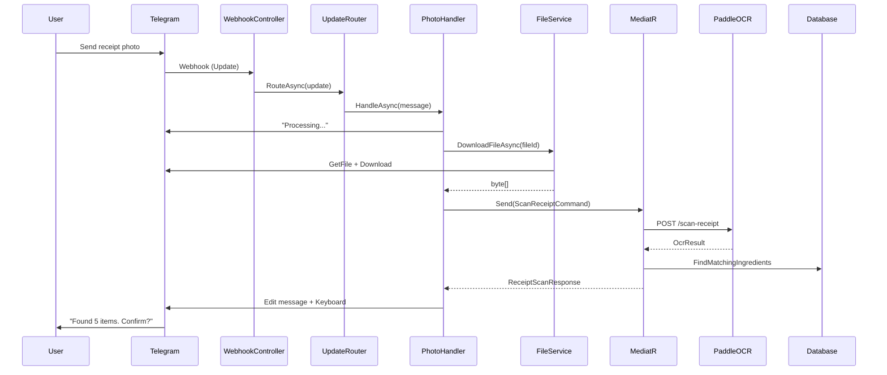

# Week 9: Receipt Photo Handling 📸

> **Goal**: Connect the Telegram bot to PaddleOCR microservice for receipt scanning, implement fuzzy ingredient matching, and create confirmation workflows with inline keyboards.

---

## Table of Contents
1. [Day 1: Photo Handler Architecture](#day-1-photo-handler-architecture)
2. [Day 2: Telegram File Download Service](#day-2-telegram-file-download-service)
3. [Day 3: MediatR Integration for Photo Processing](#day-3-mediatr-integration-for-photo-processing)
4. [Day 4: Fuzzy Ingredient Matching Service](#day-4-fuzzy-ingredient-matching-service)
5. [Day 5: Confirmation Workflow with Inline Keyboards](#day-5-confirmation-workflow-with-inline-keyboards)
6. [Day 6: Receipt Parsing & Price Extraction](#day-6-receipt-parsing--price-extraction)
7. [Day 7: Testing & Error Recovery](#day-7-testing--error-recovery)
8. [Resources](#resources)

---

## OCR Service Decision: PaddleOCR vs Azure Vision

| Criteria | PaddleOCR (Local) | Azure Vision OCR |
|----------|-------------------|------------------|
| **Cost** | ✅ Free (open source) | 💰 Pay per transaction |
| **Latency** | ✅ ~200ms (local) | ⚠️ ~500ms (network) |
| **Privacy** | ✅ Data stays local | ⚠️ Data sent to cloud |
| **Languages** | ✅ Indonesian, English | ✅ 100+ languages |
| **Accuracy** | ✅ 95%+ for receipts | ✅ 97%+ |
| **Setup** | ⚠️ Python microservice | ✅ Just API key |
| **Offline** | ✅ Works offline | ❌ Requires internet |

**Decision**: **PaddleOCR** is the best choice for Nastart because:
1. Already integrated in Week 7 as a Python microservice
2. Zero ongoing costs (important for small F&B businesses)
3. Receipt data stays local (privacy for customer data)
4. Indonesian language support built-in
5. Faster local processing for better UX

---

# Day 1: Photo Handler Architecture

## 🧒 Explain Like I'm 5

When someone sends a receipt photo to the bot 📸:
1. The bot downloads the picture from Telegram
2. Sends it to the OCR service (reads the text)
3. Finds matching ingredients in your database
4. Shows you what it found and asks "Is this correct?"

It's like having a helper who reads your receipt and types it all in for you!

## 🔧 Engineer Language

The photo handling pipeline consists of:
1. **TelegramWebhookController** → Receives update
2. **UpdateRouter** → Routes to `PhotoHandler`
3. **PhotoHandler** → Orchestrates the flow
4. **TelegramFileService** → Downloads image from Telegram
5. **ScanReceiptCommand** (MediatR) → Calls PaddleOCR + matching
6. **ReceiptConfirmationService** → Builds confirmation UI

### Photo Processing Sequence



### Updated PhotoHandler with MediatR

Update `src/Nastart.Bot/Handlers/PhotoHandler.cs`:

```csharp
using MediatR;
using Telegram.Bot;
using Telegram.Bot.Types;
using Nastart.Bot.Keyboards;
using Nastart.Bot.Services;
using Nastart.Application.Finance.Commands.ScanReceipt;

namespace Nastart.Bot.Handlers;

public interface IPhotoHandler
{
    Task HandleAsync(Message message, CancellationToken cancellationToken = default);
}

public sealed class PhotoHandler : IPhotoHandler
{
    private readonly ITelegramBotClient _botClient;
    private readonly ITelegramFileService _fileService;
    private readonly IMediator _mediator;
    private readonly IReceiptConfirmationBuilder _confirmationBuilder;
    private readonly ILogger<PhotoHandler> _logger;

    public PhotoHandler(
        ITelegramBotClient botClient,
        ITelegramFileService fileService,
        IMediator mediator,
        IReceiptConfirmationBuilder confirmationBuilder,
        ILogger<PhotoHandler> logger)
    {
        _botClient = botClient;
        _fileService = fileService;
        _mediator = mediator;
        _confirmationBuilder = confirmationBuilder;
        _logger = logger;
    }

    public async Task HandleAsync(Message message, CancellationToken cancellationToken = default)
    {
        if (message.Photo is null || message.Photo.Length == 0)
        {
            return;
        }

        var chatId = message.Chat.Id;
        var userId = message.From?.Id ?? 0;

        // Get the largest photo (last in array)
        var photo = message.Photo[^1];
        
        _logger.LogInformation(
            "Received photo {FileId} from user {UserId}, size: {Width}x{Height}",
            photo.FileId, userId, photo.Width, photo.Height);

        // Send processing message
        var processingMessage = await _botClient.SendMessage(
            chatId: chatId,
            text: "🔄 *Processing your receipt...*\n\n" +
                  "📸 Downloading image...",
            parseMode: Telegram.Bot.Types.Enums.ParseMode.Markdown,
            cancellationToken: cancellationToken);

        try
        {
            // Step 1: Download file from Telegram
            await UpdateProgress(chatId, processingMessage.MessageId,
                "🔄 *Processing your receipt...*\n\n" +
                "✅ Image downloaded\n" +
                "📝 Scanning text...",
                cancellationToken);

            var imageBytes = await _fileService.DownloadFileAsync(
                photo.FileId, cancellationToken);

            var fileName = $"receipt_{chatId}_{DateTime.UtcNow:yyyyMMddHHmmss}.jpg";

            // Step 2: Send to OCR and match ingredients
            await UpdateProgress(chatId, processingMessage.MessageId,
                "🔄 *Processing your receipt...*\n\n" +
                "✅ Image downloaded\n" +
                "✅ Text scanned\n" +
                "🔍 Matching ingredients...",
                cancellationToken);

            var command = new ScanReceiptCommand(
                ImageBytes: imageBytes,
                FileName: fileName,
                ChatId: chatId,
                UserId: userId
            );

            var result = await _mediator.Send(command, cancellationToken);

            // Step 3: Show results
            if (!result.IsSuccess)
            {
                await ShowError(chatId, processingMessage.MessageId, 
                    result.Error?.Message ?? "Failed to process receipt",
                    cancellationToken);
                return;
            }

            await ShowConfirmation(chatId, processingMessage.MessageId, 
                result.Value, cancellationToken);
        }
        catch (Exception ex)
        {
            _logger.LogError(ex, "Error processing photo from user {UserId}", userId);
            await ShowError(chatId, processingMessage.MessageId,
                "Sorry, I couldn't process that receipt. Please try again with a clearer photo.",
                cancellationToken);
        }
    }

    private async Task UpdateProgress(
        long chatId, 
        int messageId, 
        string text,
        CancellationToken cancellationToken)
    {
        try
        {
            await _botClient.EditMessageText(
                chatId: chatId,
                messageId: messageId,
                text: text,
                parseMode: Telegram.Bot.Types.Enums.ParseMode.Markdown,
                cancellationToken: cancellationToken);
        }
        catch
        {
            // Ignore edit failures (message might be the same)
        }
    }

    private async Task ShowConfirmation(
        long chatId,
        int messageId,
        ReceiptScanResponse response,
        CancellationToken cancellationToken)
    {
        var (text, keyboard) = _confirmationBuilder.Build(response);

        await _botClient.EditMessageText(
            chatId: chatId,
            messageId: messageId,
            text: text,
            parseMode: Telegram.Bot.Types.Enums.ParseMode.Markdown,
            replyMarkup: keyboard,
            cancellationToken: cancellationToken);
    }

    private async Task ShowError(
        long chatId,
        int messageId,
        string errorMessage,
        CancellationToken cancellationToken)
    {
        await _botClient.EditMessageText(
            chatId: chatId,
            messageId: messageId,
            text: $"❌ *Error*\n\n{errorMessage}\n\n" +
                  "💡 *Tips:*\n" +
                  "• Make sure the photo is clear and well-lit\n" +
                  "• Try to capture the entire receipt\n" +
                  "• Avoid shadows and reflections",
            parseMode: Telegram.Bot.Types.Enums.ParseMode.Markdown,
            cancellationToken: cancellationToken);
    }
}
```

### References
- [Telegram Bot API - PhotoSize](https://core.telegram.org/bots/api#photosize)
- [MediatR Pipeline](https://github.com/jbogard/MediatR)

---

# Day 2: Telegram File Download Service

## 🧒 Explain Like I'm 5

When you send a photo to the bot, Telegram keeps the photo on their servers. The bot gets a "ticket" (file ID) to download it. We need a helper service to:
1. Show the ticket to Telegram
2. Get the download link
3. Download the actual picture

## 🔧 Engineer Language

Telegram stores files on their CDN. To download:
1. Call `getFile` with the `file_id` → get `file_path`
2. Construct URL: `https://api.telegram.org/file/bot<token>/<file_path>`
3. Download the file bytes

### ITelegramFileService Interface

Create `src/Nastart.Bot/Services/ITelegramFileService.cs`:

```csharp
namespace Nastart.Bot.Services;

/// <summary>
/// Service for downloading files from Telegram servers.
/// </summary>
public interface ITelegramFileService
{
    /// <summary>
    /// Downloads a file from Telegram by its file ID.
    /// </summary>
    /// <param name="fileId">The Telegram file ID.</param>
    /// <param name="cancellationToken">Cancellation token.</param>
    /// <returns>The file contents as byte array.</returns>
    Task<byte[]> DownloadFileAsync(string fileId, CancellationToken cancellationToken = default);
    
    /// <summary>
    /// Gets file info without downloading.
    /// </summary>
    Task<TelegramFileInfo> GetFileInfoAsync(string fileId, CancellationToken cancellationToken = default);
}

/// <summary>
/// Information about a Telegram file.
/// </summary>
public record TelegramFileInfo(
    string FileId,
    string FileUniqueId,
    long FileSize,
    string? FilePath
);
```

### TelegramFileService Implementation

Create `src/Nastart.Bot/Services/TelegramFileService.cs`:

```csharp
using Telegram.Bot;

namespace Nastart.Bot.Services;

/// <summary>
/// Downloads files from Telegram servers.
/// </summary>
/// <remarks>
/// Implements retry logic and proper error handling.
/// Files are stored temporarily on Telegram CDN for ~1 hour.
/// </remarks>
public sealed class TelegramFileService : ITelegramFileService
{
    private readonly ITelegramBotClient _botClient;
    private readonly ILogger<TelegramFileService> _logger;

    public TelegramFileService(
        ITelegramBotClient botClient,
        ILogger<TelegramFileService> logger)
    {
        _botClient = botClient;
        _logger = logger;
    }

    public async Task<byte[]> DownloadFileAsync(
        string fileId, 
        CancellationToken cancellationToken = default)
    {
        _logger.LogDebug("Downloading file {FileId}", fileId);

        // Get file path from Telegram
        var file = await _botClient.GetFile(fileId, cancellationToken);

        if (string.IsNullOrEmpty(file.FilePath))
        {
            throw new InvalidOperationException(
                $"Could not get file path for file ID: {fileId}");
        }

        _logger.LogDebug("File path: {FilePath}, Size: {FileSize} bytes", 
            file.FilePath, file.FileSize);

        // Download file content
        using var memoryStream = new MemoryStream();
        await _botClient.DownloadFile(file.FilePath, memoryStream, cancellationToken);
        
        var bytes = memoryStream.ToArray();

        _logger.LogInformation("Downloaded file {FileId}: {Size} bytes", 
            fileId, bytes.Length);

        return bytes;
    }

    public async Task<TelegramFileInfo> GetFileInfoAsync(
        string fileId, 
        CancellationToken cancellationToken = default)
    {
        var file = await _botClient.GetFile(fileId, cancellationToken);

        return new TelegramFileInfo(
            FileId: file.FileId,
            FileUniqueId: file.FileUniqueId,
            FileSize: file.FileSize ?? 0,
            FilePath: file.FilePath
        );
    }
}
```

### File Size Validation

Add validation before processing large files:

```csharp
// In PhotoHandler.HandleAsync
private const long MaxFileSizeBytes = 10 * 1024 * 1024; // 10 MB

public async Task HandleAsync(Message message, CancellationToken cancellationToken = default)
{
    // ... existing code ...

    // Validate file size before download
    var fileInfo = await _fileService.GetFileInfoAsync(photo.FileId, cancellationToken);
    
    if (fileInfo.FileSize > MaxFileSizeBytes)
    {
        await _botClient.SendMessage(
            chatId: chatId,
            text: "⚠️ The image is too large. Please send a photo under 10 MB.",
            cancellationToken: cancellationToken);
        return;
    }

    // Continue with download...
}
```

### References
- [Telegram Bot API - getFile](https://core.telegram.org/bots/api#getfile)
- [File Download Best Practices](https://core.telegram.org/bots/faq#how-do-i-download-files)

---

# Day 3: MediatR Integration for Photo Processing

## 🧒 Explain Like I'm 5

Instead of the bot doing everything itself, it sends a "request" to a helper (MediatR). The helper knows how to:
1. Talk to the OCR service
2. Find matching ingredients
3. Package everything up nicely

This way, the bot stays simple and the smart work happens elsewhere!

## 🔧 Engineer Language

Using MediatR for CQRS:
- **Command**: `ScanReceiptCommand` — orchestrates OCR + matching
- **Handler**: Calls `IOcrService`, then `IIngredientMatchingService`
- **Response**: `ReceiptScanResponse` with matched items

### Updated ScanReceiptCommand

Update `src/Nastart.Application/Finance/Commands/ScanReceipt/ScanReceiptCommand.cs`:

```csharp
using MediatR;
using Nastart.Application.Common;

namespace Nastart.Application.Finance.Commands.ScanReceipt;

/// <summary>
/// Command to scan a receipt image and extract items.
/// </summary>
public record ScanReceiptCommand(
    byte[] ImageBytes,
    string FileName,
    long ChatId,
    long UserId
) : IRequest<Result<ReceiptScanResponse>>;

/// <summary>
/// Response from receipt scanning.
/// </summary>
public record ReceiptScanResponse(
    bool Success,
    Guid SessionId,
    IReadOnlyList<MatchedReceiptItem> MatchedItems,
    IReadOnlyList<UnmatchedLine> UnmatchedLines,
    string RawText,
    decimal? DetectedTotal
);

/// <summary>
/// A receipt item matched to a known ingredient.
/// </summary>
public record MatchedReceiptItem(
    Guid IngredientId,
    string IngredientName,
    string DetectedText,
    decimal? Quantity,
    string? Unit,
    decimal? UnitPrice,
    decimal? LineTotal,
    double MatchConfidence,
    double OcrConfidence
);

/// <summary>
/// A line from the receipt that couldn't be matched.
/// </summary>
public record UnmatchedLine(
    string Text,
    double Confidence,
    UnmatchedReason Reason
);

public enum UnmatchedReason
{
    NoIngredientMatch,
    PriceLineOnly,
    HeaderFooter,
    Unreadable
}
```

### ScanReceiptCommandHandler with PaddleOCR

Update `src/Nastart.Application/Finance/Commands/ScanReceipt/ScanReceiptCommandHandler.cs`:

```csharp
using MediatR;
using Microsoft.Extensions.Logging;
using Nastart.Application.Common;
using Nastart.Application.Common.Interfaces;

namespace Nastart.Application.Finance.Commands.ScanReceipt;

/// <summary>
/// Handles receipt scanning using PaddleOCR microservice.
/// </summary>
public class ScanReceiptCommandHandler 
    : IRequestHandler<ScanReceiptCommand, Result<ReceiptScanResponse>>
{
    private readonly IOcrService _ocrService;
    private readonly IIngredientMatchingService _matchingService;
    private readonly IReceiptParsingService _parsingService;
    private readonly IReceiptSessionRepository _sessionRepository;
    private readonly ILogger<ScanReceiptCommandHandler> _logger;

    public ScanReceiptCommandHandler(
        IOcrService ocrService,
        IIngredientMatchingService matchingService,
        IReceiptParsingService parsingService,
        IReceiptSessionRepository sessionRepository,
        ILogger<ScanReceiptCommandHandler> logger)
    {
        _ocrService = ocrService;
        _matchingService = matchingService;
        _parsingService = parsingService;
        _sessionRepository = sessionRepository;
        _logger = logger;
    }

    public async Task<Result<ReceiptScanResponse>> Handle(
        ScanReceiptCommand request, 
        CancellationToken cancellationToken)
    {
        _logger.LogInformation(
            "Processing receipt for user {UserId}, file: {FileName}",
            request.UserId, request.FileName);

        // Step 1: OCR with PaddleOCR
        var ocrResult = await _ocrService.ScanImageAsync(
            request.ImageBytes, 
            request.FileName, 
            cancellationToken);

        if (!ocrResult.Success)
        {
            _logger.LogWarning("OCR failed: {Error}", ocrResult.Error);
            return Result<ReceiptScanResponse>.Failure(
                Error.Failure("OcrFailed", ocrResult.Error ?? "OCR scanning failed"));
        }

        _logger.LogDebug("OCR extracted {LineCount} lines", ocrResult.Lines.Count);

        // Step 2: Parse receipt structure
        var parsedReceipt = _parsingService.Parse(ocrResult.Lines);

        // Step 3: Match to ingredients
        var matchResult = await _matchingService.MatchAsync(
            parsedReceipt.ItemLines, 
            request.UserId,
            cancellationToken);

        // Step 4: Create session for confirmation workflow
        var sessionId = Guid.NewGuid();
        await _sessionRepository.CreateAsync(new ReceiptSession
        {
            Id = sessionId,
            ChatId = request.ChatId,
            UserId = request.UserId,
            MatchedItems = matchResult.MatchedItems,
            UnmatchedLines = matchResult.UnmatchedLines,
            RawText = ocrResult.RawText,
            DetectedTotal = parsedReceipt.Total,
            CreatedAt = DateTime.UtcNow,
            Status = ReceiptSessionStatus.PendingConfirmation
        }, cancellationToken);

        _logger.LogInformation(
            "Receipt processed: {MatchedCount} matched, {UnmatchedCount} unmatched, session: {SessionId}",
            matchResult.MatchedItems.Count, 
            matchResult.UnmatchedLines.Count,
            sessionId);

        return Result<ReceiptScanResponse>.Success(new ReceiptScanResponse(
            Success: true,
            SessionId: sessionId,
            MatchedItems: matchResult.MatchedItems,
            UnmatchedLines: matchResult.UnmatchedLines,
            RawText: ocrResult.RawText,
            DetectedTotal: parsedReceipt.Total
        ));
    }
}
```

### Receipt Session for State Management

Create `src/Nastart.Application/Finance/Commands/ScanReceipt/ReceiptSession.cs`:

```csharp
namespace Nastart.Application.Finance.Commands.ScanReceipt;

/// <summary>
/// Temporary session to hold receipt data during confirmation workflow.
/// </summary>
public class ReceiptSession
{
    public Guid Id { get; init; }
    public long ChatId { get; init; }
    public long UserId { get; init; }
    public IReadOnlyList<MatchedReceiptItem> MatchedItems { get; init; } = [];
    public IReadOnlyList<UnmatchedLine> UnmatchedLines { get; init; } = [];
    public string RawText { get; init; } = string.Empty;
    public decimal? DetectedTotal { get; init; }
    public DateTime CreatedAt { get; init; }
    public ReceiptSessionStatus Status { get; set; }
    public DateTime? ConfirmedAt { get; set; }
}

public enum ReceiptSessionStatus
{
    PendingConfirmation,
    Editing,
    Confirmed,
    Cancelled,
    Expired
}
```

### References
- [MediatR Documentation](https://github.com/jbogard/MediatR)
- [CQRS Pattern](https://learn.microsoft.com/en-us/azure/architecture/patterns/cqrs)

---

# Day 4: Fuzzy Ingredient Matching Service

## 🧒 Explain Like I'm 5

Sometimes receipts have typos or weird names:
- "TEPUNG TERIGU" → "Tepung Terigu" (Wheat Flour)
- "GULA PSR" → "Gula Pasir" (Sugar)
- "M.GORENG" → "Minyak Goreng" (Cooking Oil)

The fuzzy matching service is like a smart assistant that can still figure out what ingredient it is, even if the name isn't perfect!

## 🔧 Engineer Language

Fuzzy string matching techniques:
1. **Levenshtein Distance** — Count character edits needed
2. **Jaro-Winkler** — Weighted for prefix matches
3. **Contains/Substring** — Simple but effective
4. **Alias Matching** — Predefined abbreviations

### IIngredientMatchingService Interface

Create `src/Nastart.Application/Common/Interfaces/IIngredientMatchingService.cs`:

```csharp
namespace Nastart.Application.Common.Interfaces;

/// <summary>
/// Service for matching OCR-extracted text to known ingredients.
/// </summary>
public interface IIngredientMatchingService
{
    /// <summary>
    /// Matches receipt lines to known ingredients.
    /// </summary>
    Task<IngredientMatchResult> MatchAsync(
        IEnumerable<ReceiptItemLine> lines,
        long userId,
        CancellationToken cancellationToken = default);
}

/// <summary>
/// A parsed item line from a receipt.
/// </summary>
public record ReceiptItemLine(
    string RawText,
    string? ItemName,
    decimal? Quantity,
    string? Unit,
    decimal? UnitPrice,
    decimal? LineTotal,
    double OcrConfidence
);

/// <summary>
/// Result of ingredient matching.
/// </summary>
public record IngredientMatchResult(
    IReadOnlyList<MatchedReceiptItem> MatchedItems,
    IReadOnlyList<UnmatchedLine> UnmatchedLines
);
```

### IngredientMatchingService Implementation

Create `src/Nastart.Infrastructure/Services/IngredientMatchingService.cs`:

```csharp
using Microsoft.Extensions.Logging;
using Nastart.Application.Common.Interfaces;
using Nastart.Application.Finance.Commands.ScanReceipt;
using Nastart.Domain.Inventory.Aggregates;

namespace Nastart.Infrastructure.Services;

/// <summary>
/// Matches receipt text to ingredients using fuzzy matching.
/// </summary>
public class IngredientMatchingService : IIngredientMatchingService
{
    private readonly IIngredientRepository _ingredientRepository;
    private readonly IIngredientAliasRepository _aliasRepository;
    private readonly ILogger<IngredientMatchingService> _logger;

    // Minimum confidence threshold for a match
    private const double MinMatchConfidence = 0.6;

    public IngredientMatchingService(
        IIngredientRepository ingredientRepository,
        IIngredientAliasRepository aliasRepository,
        ILogger<IngredientMatchingService> logger)
    {
        _ingredientRepository = ingredientRepository;
        _aliasRepository = aliasRepository;
        _logger = logger;
    }

    public async Task<IngredientMatchResult> MatchAsync(
        IEnumerable<ReceiptItemLine> lines,
        long userId,
        CancellationToken cancellationToken = default)
    {
        // Load user's ingredients and common aliases
        var ingredients = await _ingredientRepository.GetByUserIdAsync(userId, cancellationToken);
        var aliases = await _aliasRepository.GetAllAsync(cancellationToken);

        var matched = new List<MatchedReceiptItem>();
        var unmatched = new List<UnmatchedLine>();

        foreach (var line in lines)
        {
            if (string.IsNullOrWhiteSpace(line.ItemName))
            {
                unmatched.Add(new UnmatchedLine(
                    line.RawText, 
                    line.OcrConfidence, 
                    UnmatchedReason.Unreadable));
                continue;
            }

            var (ingredient, confidence) = FindBestMatch(
                line.ItemName, 
                ingredients, 
                aliases);

            if (ingredient is not null && confidence >= MinMatchConfidence)
            {
                matched.Add(new MatchedReceiptItem(
                    IngredientId: ingredient.Id.Value,
                    IngredientName: ingredient.Name,
                    DetectedText: line.RawText,
                    Quantity: line.Quantity,
                    Unit: line.Unit ?? ingredient.Unit.Name,
                    UnitPrice: line.UnitPrice,
                    LineTotal: line.LineTotal,
                    MatchConfidence: confidence,
                    OcrConfidence: line.OcrConfidence
                ));

                _logger.LogDebug(
                    "Matched '{Text}' → '{Ingredient}' (confidence: {Confidence:P0})",
                    line.ItemName, ingredient.Name, confidence);
            }
            else
            {
                unmatched.Add(new UnmatchedLine(
                    line.RawText,
                    line.OcrConfidence,
                    UnmatchedReason.NoIngredientMatch));

                _logger.LogDebug(
                    "No match for '{Text}' (best: {Confidence:P0})",
                    line.ItemName, confidence);
            }
        }

        return new IngredientMatchResult(matched, unmatched);
    }

    private (Ingredient? Ingredient, double Confidence) FindBestMatch(
        string text,
        IEnumerable<Ingredient> ingredients,
        IEnumerable<IngredientAlias> aliases)
    {
        var normalizedText = NormalizeText(text);
        
        Ingredient? bestMatch = null;
        double bestConfidence = 0;

        foreach (var ingredient in ingredients)
        {
            var normalizedName = NormalizeText(ingredient.Name);
            
            // 1. Exact match (highest confidence)
            if (normalizedText == normalizedName)
            {
                return (ingredient, 1.0);
            }

            // 2. Contains match
            var containsConfidence = CalculateContainsConfidence(normalizedText, normalizedName);
            if (containsConfidence > bestConfidence)
            {
                bestConfidence = containsConfidence;
                bestMatch = ingredient;
            }

            // 3. Levenshtein distance
            var levenshteinConfidence = CalculateLevenshteinConfidence(normalizedText, normalizedName);
            if (levenshteinConfidence > bestConfidence)
            {
                bestConfidence = levenshteinConfidence;
                bestMatch = ingredient;
            }
        }

        // 4. Check aliases
        foreach (var alias in aliases)
        {
            var normalizedAlias = NormalizeText(alias.Alias);
            
            if (normalizedText.Contains(normalizedAlias) || normalizedAlias.Contains(normalizedText))
            {
                var matchedIngredient = ingredients.FirstOrDefault(i => i.Id.Value == alias.IngredientId);
                if (matchedIngredient is not null)
                {
                    var aliasConfidence = 0.95; // High confidence for alias match
                    if (aliasConfidence > bestConfidence)
                    {
                        bestConfidence = aliasConfidence;
                        bestMatch = matchedIngredient;
                    }
                }
            }
        }

        return (bestMatch, bestConfidence);
    }

    private static string NormalizeText(string text)
    {
        return text
            .ToLowerInvariant()
            .Replace(".", "")
            .Replace(",", "")
            .Replace("-", " ")
            .Replace("_", " ")
            .Trim();
    }

    private static double CalculateContainsConfidence(string text, string name)
    {
        if (text.Contains(name))
        {
            // Full name is in text
            return 0.9 * ((double)name.Length / text.Length);
        }
        
        if (name.Contains(text))
        {
            // Text is part of name
            return 0.8 * ((double)text.Length / name.Length);
        }

        return 0;
    }

    private static double CalculateLevenshteinConfidence(string text, string name)
    {
        var distance = LevenshteinDistance(text, name);
        var maxLength = Math.Max(text.Length, name.Length);
        
        if (maxLength == 0) return 0;
        
        return 1.0 - ((double)distance / maxLength);
    }

    private static int LevenshteinDistance(string s, string t)
    {
        if (string.IsNullOrEmpty(s)) return t?.Length ?? 0;
        if (string.IsNullOrEmpty(t)) return s.Length;

        var n = s.Length;
        var m = t.Length;
        var d = new int[n + 1, m + 1];

        for (var i = 0; i <= n; i++) d[i, 0] = i;
        for (var j = 0; j <= m; j++) d[0, j] = j;

        for (var i = 1; i <= n; i++)
        {
            for (var j = 1; j <= m; j++)
            {
                var cost = (t[j - 1] == s[i - 1]) ? 0 : 1;
                d[i, j] = Math.Min(
                    Math.Min(d[i - 1, j] + 1, d[i, j - 1] + 1),
                    d[i - 1, j - 1] + cost);
            }
        }

        return d[n, m];
    }
}
```

### Ingredient Alias Entity

Create `src/Nastart.Domain/Inventory/Entities/IngredientAlias.cs`:

```csharp
namespace Nastart.Domain.Inventory.Entities;

/// <summary>
/// Common aliases/abbreviations for ingredients.
/// Examples: "TPG TERIGU" → "Tepung Terigu"
/// </summary>
public class IngredientAlias
{
    public Guid Id { get; init; }
    public Guid IngredientId { get; init; }
    public string Alias { get; init; } = string.Empty;
    
    // Common Indonesian receipt abbreviations
    public static readonly Dictionary<string, string> CommonAliases = new()
    {
        ["TPG"] = "Tepung",
        ["TRG"] = "Terigu",
        ["GLR"] = "Gula",
        ["PSR"] = "Pasir",
        ["MNK"] = "Minyak",
        ["GRG"] = "Goreng",
        ["TLR"] = "Telur",
        ["BWT"] = "Bawang",
        ["PTH"] = "Putih",
        ["MRH"] = "Merah",
        ["KLP"] = "Kelapa",
        ["SNT"] = "Santan",
        ["GRM"] = "Garam",
        ["MTG"] = "Mentega",
        ["SKL"] = "Susu Kental",
        ["SMS"] = "Susu Manis"
    };
}
```

### References
- [Levenshtein Distance Algorithm](https://en.wikipedia.org/wiki/Levenshtein_distance)
- [Fuzzy String Matching](https://github.com/JakeBayer/FuzzySharp)

---

# Day 5: Confirmation Workflow with Inline Keyboards

## 🧒 Explain Like I'm 5

After the bot reads your receipt, it shows you:
- "Found 5 items! Here's what I saw:"
- Flour - Rp 25,000
- Sugar - Rp 15,000
- etc.

Then it asks: "Is this correct?" with buttons:
- ✅ Yes, save it!
- ✏️ Edit some items
- ❌ Cancel

You tap the button to tell the bot what to do next!

## 🔧 Engineer Language

Multi-step confirmation workflow:
1. **Show Summary** — Display matched items with confidence
2. **Edit Mode** — Allow item-by-item editing
3. **Confirm** — Save to database
4. **Cancel** — Discard session

### IReceiptConfirmationBuilder Interface

Create `src/Nastart.Bot/Services/IReceiptConfirmationBuilder.cs`:

```csharp
using Telegram.Bot.Types.ReplyMarkups;
using Nastart.Application.Finance.Commands.ScanReceipt;

namespace Nastart.Bot.Services;

/// <summary>
/// Builds confirmation messages and keyboards for receipt processing.
/// </summary>
public interface IReceiptConfirmationBuilder
{
    /// <summary>
    /// Builds the initial confirmation message.
    /// </summary>
    (string Text, InlineKeyboardMarkup Keyboard) Build(ReceiptScanResponse response);
    
    /// <summary>
    /// Builds the edit mode message for a specific item.
    /// </summary>
    (string Text, InlineKeyboardMarkup Keyboard) BuildEditItem(
        ReceiptScanResponse response, 
        int itemIndex);
}
```

### ReceiptConfirmationBuilder Implementation

Create `src/Nastart.Bot/Services/ReceiptConfirmationBuilder.cs`:

```csharp
using System.Text;
using Telegram.Bot.Types.ReplyMarkups;
using Nastart.Application.Finance.Commands.ScanReceipt;

namespace Nastart.Bot.Services;

public sealed class ReceiptConfirmationBuilder : IReceiptConfirmationBuilder
{
    public (string Text, InlineKeyboardMarkup Keyboard) Build(ReceiptScanResponse response)
    {
        var sb = new StringBuilder();
        
        if (response.MatchedItems.Count > 0)
        {
            sb.AppendLine("✅ *Receipt Scanned Successfully!*\n");
            sb.AppendLine("*Found items:*");
            
            var total = 0m;
            for (var i = 0; i < response.MatchedItems.Count; i++)
            {
                var item = response.MatchedItems[i];
                var confidence = item.MatchConfidence >= 0.9 ? "✓" : "?";
                
                sb.AppendLine($"{i + 1}. {confidence} *{item.IngredientName}*");
                
                if (item.Quantity.HasValue && !string.IsNullOrEmpty(item.Unit))
                {
                    sb.Append($"   {item.Quantity:N1} {item.Unit}");
                }
                
                if (item.UnitPrice.HasValue)
                {
                    sb.Append($" @ Rp {item.UnitPrice:N0}");
                }
                
                if (item.LineTotal.HasValue)
                {
                    sb.AppendLine($" = *Rp {item.LineTotal:N0}*");
                    total += item.LineTotal.Value;
                }
                else
                {
                    sb.AppendLine();
                }
            }
            
            sb.AppendLine();
            
            if (response.DetectedTotal.HasValue)
            {
                sb.AppendLine($"📋 *Receipt Total: Rp {response.DetectedTotal:N0}*");
                sb.AppendLine($"📊 *Matched Total: Rp {total:N0}*");
                
                var diff = Math.Abs(response.DetectedTotal.Value - total);
                if (diff > 0)
                {
                    sb.AppendLine($"⚠️ Difference: Rp {diff:N0}");
                }
            }
            else
            {
                sb.AppendLine($"📊 *Total: Rp {total:N0}*");
            }
        }
        else
        {
            sb.AppendLine("⚠️ *No ingredients found*\n");
            sb.AppendLine("I couldn't match any items from this receipt.");
        }

        if (response.UnmatchedLines.Count > 0)
        {
            sb.AppendLine();
            sb.AppendLine($"_({response.UnmatchedLines.Count} items not matched)_");
        }

        sb.AppendLine();
        sb.AppendLine("_What would you like to do?_");

        var keyboard = BuildConfirmationKeyboard(response.SessionId, response.MatchedItems.Count);

        return (sb.ToString(), keyboard);
    }

    public (string Text, InlineKeyboardMarkup Keyboard) BuildEditItem(
        ReceiptScanResponse response, 
        int itemIndex)
    {
        if (itemIndex < 0 || itemIndex >= response.MatchedItems.Count)
        {
            return ("Invalid item index", new InlineKeyboardMarkup(Array.Empty<InlineKeyboardButton[]>()));
        }

        var item = response.MatchedItems[itemIndex];
        var sb = new StringBuilder();
        
        sb.AppendLine($"📝 *Editing Item {itemIndex + 1}*\n");
        sb.AppendLine($"*Detected:* {item.DetectedText}");
        sb.AppendLine($"*Matched to:* {item.IngredientName}");
        
        if (item.Quantity.HasValue)
            sb.AppendLine($"*Quantity:* {item.Quantity:N1} {item.Unit}");
        
        if (item.UnitPrice.HasValue)
            sb.AppendLine($"*Price:* Rp {item.UnitPrice:N0}");
        
        sb.AppendLine($"*Confidence:* {item.MatchConfidence:P0}");

        var keyboard = BuildEditItemKeyboard(response.SessionId, itemIndex);

        return (sb.ToString(), keyboard);
    }

    private static InlineKeyboardMarkup BuildConfirmationKeyboard(Guid sessionId, int itemCount)
    {
        var buttons = new List<InlineKeyboardButton[]>();

        // Main action row
        buttons.Add(new[]
        {
            InlineKeyboardButton.WithCallbackData(
                "✅ Confirm & Save", 
                $"receipt:confirm:{sessionId}"),
            InlineKeyboardButton.WithCallbackData(
                "❌ Cancel", 
                $"receipt:cancel:{sessionId}")
        });

        // Edit row (if there are items)
        if (itemCount > 0)
        {
            buttons.Add(new[]
            {
                InlineKeyboardButton.WithCallbackData(
                    "✏️ Edit Items", 
                    $"receipt:edit:{sessionId}"),
                InlineKeyboardButton.WithCallbackData(
                    "➕ Add Missing", 
                    $"receipt:add:{sessionId}")
            });
        }

        // View unmatched
        buttons.Add(new[]
        {
            InlineKeyboardButton.WithCallbackData(
                "👁️ View Unmatched", 
                $"receipt:unmatched:{sessionId}")
        });

        return new InlineKeyboardMarkup(buttons);
    }

    private static InlineKeyboardMarkup BuildEditItemKeyboard(Guid sessionId, int itemIndex)
    {
        return new InlineKeyboardMarkup(new[]
        {
            new[]
            {
                InlineKeyboardButton.WithCallbackData(
                    "🔄 Change Ingredient", 
                    $"receipt:change:{sessionId}:{itemIndex}"),
                InlineKeyboardButton.WithCallbackData(
                    "💰 Edit Price", 
                    $"receipt:price:{sessionId}:{itemIndex}")
            },
            new[]
            {
                InlineKeyboardButton.WithCallbackData(
                    "📦 Edit Quantity", 
                    $"receipt:qty:{sessionId}:{itemIndex}"),
                InlineKeyboardButton.WithCallbackData(
                    "🗑️ Remove", 
                    $"receipt:remove:{sessionId}:{itemIndex}")
            },
            new[]
            {
                InlineKeyboardButton.WithCallbackData(
                    "⬅️ Back to Summary", 
                    $"receipt:summary:{sessionId}")
            }
        });
    }
}
```

### Receipt Callback Handler

Update `src/Nastart.Bot/Handlers/CallbackHandler.cs` to handle receipt callbacks:

```csharp
using MediatR;
using Telegram.Bot;
using Telegram.Bot.Types;
using Nastart.Application.Finance.Commands.ConfirmReceipt;
using Nastart.Application.Finance.Commands.CancelReceipt;

namespace Nastart.Bot.Handlers;

public sealed class CallbackHandler : ICallbackHandler
{
    private readonly ITelegramBotClient _botClient;
    private readonly IMediator _mediator;
    private readonly IReceiptConfirmationBuilder _confirmationBuilder;
    private readonly ILogger<CallbackHandler> _logger;

    public CallbackHandler(
        ITelegramBotClient botClient,
        IMediator mediator,
        IReceiptConfirmationBuilder confirmationBuilder,
        ILogger<CallbackHandler> logger)
    {
        _botClient = botClient;
        _mediator = mediator;
        _confirmationBuilder = confirmationBuilder;
        _logger = logger;
    }

    public async Task HandleAsync(
        CallbackQuery callbackQuery, 
        CancellationToken cancellationToken = default)
    {
        var data = callbackQuery.Data ?? string.Empty;
        _logger.LogInformation("Callback: {Data}", data);

        // Always answer callback to remove loading state
        await _botClient.AnswerCallbackQuery(
            callbackQueryId: callbackQuery.Id,
            cancellationToken: cancellationToken);

        var parts = data.Split(':');
        
        if (parts.Length < 2) return;

        await (parts[0] switch
        {
            "receipt" => HandleReceiptCallback(callbackQuery, parts, cancellationToken),
            "action" => HandleActionCallback(callbackQuery, parts[1], cancellationToken),
            _ => Task.CompletedTask
        });
    }

    private async Task HandleReceiptCallback(
        CallbackQuery callbackQuery,
        string[] parts,
        CancellationToken cancellationToken)
    {
        if (parts.Length < 3) return;

        var action = parts[1];
        var sessionIdStr = parts[2];

        if (!Guid.TryParse(sessionIdStr, out var sessionId))
        {
            _logger.LogWarning("Invalid session ID: {SessionId}", sessionIdStr);
            return;
        }

        var chatId = callbackQuery.Message!.Chat.Id;
        var messageId = callbackQuery.Message.MessageId;

        switch (action)
        {
            case "confirm":
                await HandleConfirm(chatId, messageId, sessionId, cancellationToken);
                break;
                
            case "cancel":
                await HandleCancel(chatId, messageId, sessionId, cancellationToken);
                break;
                
            case "edit":
                await HandleEditMode(chatId, messageId, sessionId, cancellationToken);
                break;
                
            case "unmatched":
                await HandleViewUnmatched(chatId, messageId, sessionId, cancellationToken);
                break;
                
            case "summary":
                await HandleBackToSummary(chatId, messageId, sessionId, cancellationToken);
                break;
        }
    }

    private async Task HandleConfirm(
        long chatId,
        int messageId,
        Guid sessionId,
        CancellationToken cancellationToken)
    {
        var command = new ConfirmReceiptCommand(sessionId);
        var result = await _mediator.Send(command, cancellationToken);

        if (result.IsSuccess)
        {
            await _botClient.EditMessageText(
                chatId: chatId,
                messageId: messageId,
                text: "✅ *Purchase saved successfully!*\n\n" +
                      $"📦 {result.Value.ItemCount} items added to inventory\n" +
                      $"💰 Total: Rp {result.Value.Total:N0}\n\n" +
                      "_Prices have been updated._",
                parseMode: Telegram.Bot.Types.Enums.ParseMode.Markdown,
                cancellationToken: cancellationToken);
        }
        else
        {
            await _botClient.EditMessageText(
                chatId: chatId,
                messageId: messageId,
                text: $"❌ Failed to save: {result.Error?.Message}",
                cancellationToken: cancellationToken);
        }
    }

    private async Task HandleCancel(
        long chatId,
        int messageId,
        Guid sessionId,
        CancellationToken cancellationToken)
    {
        var command = new CancelReceiptCommand(sessionId);
        await _mediator.Send(command, cancellationToken);

        await _botClient.EditMessageText(
            chatId: chatId,
            messageId: messageId,
            text: "❌ *Receipt cancelled*\n\n" +
                  "No changes were saved. Send another photo when you're ready!",
            parseMode: Telegram.Bot.Types.Enums.ParseMode.Markdown,
            cancellationToken: cancellationToken);
    }

    // ... other handlers
}
```

### Enhanced Confirmation Preview with Price Changes

The confirmation preview should also show **price change impact** when existing ingredient prices will be updated:

Create `src/Nastart.Bot/Services/EnhancedReceiptConfirmationBuilder.cs`:

```csharp
using System.Text;
using Telegram.Bot.Types.ReplyMarkups;
using Nastart.Application.Finance.Commands.ScanReceipt;
using Nastart.Application.Finance.Queries.GetIngredientCurrentPrice;
using MediatR;

namespace Nastart.Bot.Services;

/// <summary>
/// Enhanced confirmation builder that shows price change impact
/// before the user confirms the receipt.
/// </summary>
public sealed class EnhancedReceiptConfirmationBuilder : IReceiptConfirmationBuilder
{
    private readonly IMediator _mediator;

    public EnhancedReceiptConfirmationBuilder(IMediator mediator)
    {
        _mediator = mediator;
    }

    public async Task<(string Text, InlineKeyboardMarkup Keyboard)> BuildAsync(
        ReceiptScanResponse response,
        CancellationToken cancellationToken = default)
    {
        var sb = new StringBuilder();
        var priceChanges = new List<PriceChangePreview>();
        
        if (response.MatchedItems.Count > 0)
        {
            sb.AppendLine("✅ *Receipt Scanned Successfully!*\n");
            sb.AppendLine("*Found items:*");
            
            var total = 0m;
            for (var i = 0; i < response.MatchedItems.Count; i++)
            {
                var item = response.MatchedItems[i];
                var confidence = item.MatchConfidence >= 0.9 ? "✓" : "?";
                
                sb.AppendLine($"{i + 1}. {confidence} *{item.IngredientName}*");
                
                if (item.Quantity.HasValue && !string.IsNullOrEmpty(item.Unit))
                {
                    sb.Append($"   {item.Quantity:N1} {item.Unit}");
                }
                
                if (item.UnitPrice.HasValue)
                {
                    sb.Append($" @ Rp {item.UnitPrice:N0}");
                    
                    // Check for price change
                    var currentPrice = await _mediator.Send(
                        new GetIngredientCurrentPriceQuery(item.IngredientId),
                        cancellationToken);
                    
                    if (currentPrice.IsSuccess && currentPrice.Value.Amount != item.UnitPrice.Value)
                    {
                        var change = item.UnitPrice.Value - currentPrice.Value.Amount;
                        var changePercent = (change / currentPrice.Value.Amount) * 100;
                        var arrow = change > 0 ? "📈" : "📉";
                        
                        sb.Append($" {arrow} ({changePercent:+0.0;-0.0}%)");
                        
                        priceChanges.Add(new PriceChangePreview(
                            item.IngredientName,
                            currentPrice.Value.Amount,
                            item.UnitPrice.Value,
                            changePercent));
                    }
                }
                
                if (item.LineTotal.HasValue)
                {
                    sb.AppendLine($" = *Rp {item.LineTotal:N0}*");
                    total += item.LineTotal.Value;
                }
                else
                {
                    sb.AppendLine();
                }
            }
            
            sb.AppendLine();
            sb.AppendLine($"📊 *Total: Rp {total:N0}*");
        }

        // Show price change summary
        if (priceChanges.Count > 0)
        {
            sb.AppendLine();
            sb.AppendLine("━━━━━━━━━━━━━━━━━━━━━━");
            sb.AppendLine($"💡 *{priceChanges.Count} price(s) will be updated:*");
            
            foreach (var change in priceChanges.Take(5))
            {
                var arrow = change.ChangePercent > 0 ? "📈" : "📉";
                sb.AppendLine($"{arrow} {change.IngredientName}");
                sb.AppendLine($"   Rp {change.OldPrice:N0} → Rp {change.NewPrice:N0}");
            }
            
            if (priceChanges.Count > 5)
            {
                sb.AppendLine($"_...and {priceChanges.Count - 5} more_");
            }
        }

        // Show unmatched items
        if (response.UnmatchedLines.Count > 0)
        {
            sb.AppendLine();
            sb.AppendLine($"⚠️ *{response.UnmatchedLines.Count} item(s) not recognized:*");
            
            foreach (var line in response.UnmatchedLines.Take(3))
            {
                sb.AppendLine($"• _{line.OriginalText}_");
            }
            
            sb.AppendLine();
            sb.AppendLine("_Tap '➕ Add as New' to create new ingredients_");
        }

        sb.AppendLine();
        sb.AppendLine("_What would you like to do?_");

        var keyboard = BuildEnhancedKeyboard(
            response.SessionId, 
            response.MatchedItems.Count,
            response.UnmatchedLines.Count);

        return (sb.ToString(), keyboard);
    }

    private static InlineKeyboardMarkup BuildEnhancedKeyboard(
        Guid sessionId, 
        int matchedCount,
        int unmatchedCount)
    {
        var buttons = new List<InlineKeyboardButton[]>();

        // Main action row
        buttons.Add(new[]
        {
            InlineKeyboardButton.WithCallbackData(
                "✅ Confirm & Save", 
                $"receipt:confirm:{sessionId}"),
            InlineKeyboardButton.WithCallbackData(
                "❌ Cancel", 
                $"receipt:cancel:{sessionId}")
        });

        // Edit row (if there are items)
        if (matchedCount > 0)
        {
            buttons.Add(new[]
            {
                InlineKeyboardButton.WithCallbackData(
                    "✏️ Edit Items", 
                    $"receipt:edit:{sessionId}"),
                InlineKeyboardButton.WithCallbackData(
                    "💰 View Price Changes", 
                    $"receipt:pricechanges:{sessionId}")
            });
        }

        // Add new ingredient button (if there are unmatched items)
        if (unmatchedCount > 0)
        {
            buttons.Add(new[]
            {
                InlineKeyboardButton.WithCallbackData(
                    $"➕ Add as New ({unmatchedCount})", 
                    $"receipt:newingredient:{sessionId}:0")
            });
        }

        return new InlineKeyboardMarkup(buttons);
    }

    // Simple implementation for the sync interface
    public (string Text, InlineKeyboardMarkup Keyboard) Build(ReceiptScanResponse response)
    {
        // Fallback sync version without price change detection
        return BuildAsync(response, CancellationToken.None).GetAwaiter().GetResult();
    }

    public (string Text, InlineKeyboardMarkup Keyboard) BuildEditItem(
        ReceiptScanResponse response, 
        int itemIndex)
    {
        // ... existing implementation
        throw new NotImplementedException();
    }
}

internal record PriceChangePreview(
    string IngredientName,
    decimal OldPrice,
    decimal NewPrice,
    decimal ChangePercent);
```

### New Ingredient Wizard

When unmatched items are detected, allow users to quickly add them as new ingredients:

Update `src/Nastart.Bot/Handlers/CallbackHandler.cs`:

```csharp
private async Task HandleNewIngredientWizard(
    long chatId,
    int messageId,
    Guid sessionId,
    int itemIndex,
    CancellationToken cancellationToken)
{
    // Get the unmatched items from session
    var session = await _sessionStore.GetAsync(sessionId, cancellationToken);
    if (session is null) return;

    var unmatchedItems = session.UnmatchedLines;
    if (itemIndex >= unmatchedItems.Count) return;

    var item = unmatchedItems[itemIndex];
    var sb = new StringBuilder();
    
    sb.AppendLine("➕ *New Ingredient Wizard*\n");
    sb.AppendLine($"*Detected text:* `{item.OriginalText}`");
    sb.AppendLine();
    sb.AppendLine("What type of ingredient is this?");

    var keyboard = new InlineKeyboardMarkup(new[]
    {
        // Category selection
        new[]
        {
            InlineKeyboardButton.WithCallbackData(
                "🥛 Dairy", 
                $"newin:cat:{sessionId}:{itemIndex}:dairy"),
            InlineKeyboardButton.WithCallbackData(
                "🌾 Dry Goods", 
                $"newin:cat:{sessionId}:{itemIndex}:dry"),
        },
        new[]
        {
            InlineKeyboardButton.WithCallbackData(
                "🥩 Meat", 
                $"newin:cat:{sessionId}:{itemIndex}:meat"),
            InlineKeyboardButton.WithCallbackData(
                "🥬 Produce", 
                $"newin:cat:{sessionId}:{itemIndex}:produce"),
        },
        new[]
        {
            InlineKeyboardButton.WithCallbackData(
                "🧂 Spices", 
                $"newin:cat:{sessionId}:{itemIndex}:spices"),
            InlineKeyboardButton.WithCallbackData(
                "📦 Other", 
                $"newin:cat:{sessionId}:{itemIndex}:other"),
        },
        new[]
        {
            InlineKeyboardButton.WithCallbackData(
                "⏭️ Skip This Item", 
                $"newin:skip:{sessionId}:{itemIndex}"),
            InlineKeyboardButton.WithCallbackData(
                "⬅️ Back", 
                $"receipt:summary:{sessionId}"),
        }
    });

    await _botClient.EditMessageText(
        chatId: chatId,
        messageId: messageId,
        text: sb.ToString(),
        parseMode: Telegram.Bot.Types.Enums.ParseMode.Markdown,
        replyMarkup: keyboard,
        cancellationToken: cancellationToken);
}

private async Task HandleNewIngredientCategory(
    long chatId,
    int messageId,
    Guid sessionId,
    int itemIndex,
    string category,
    CancellationToken cancellationToken)
{
    var session = await _sessionStore.GetAsync(sessionId, cancellationToken);
    if (session is null) return;

    var item = session.UnmatchedLines[itemIndex];
    
    var sb = new StringBuilder();
    sb.AppendLine("➕ *New Ingredient Wizard*\n");
    sb.AppendLine($"*Text:* `{item.OriginalText}`");
    sb.AppendLine($"*Category:* {category}");
    sb.AppendLine();
    sb.AppendLine("Select the unit of measurement:");

    var keyboard = new InlineKeyboardMarkup(new[]
    {
        new[]
        {
            InlineKeyboardButton.WithCallbackData(
                "kg", 
                $"newin:unit:{sessionId}:{itemIndex}:{category}:kg"),
            InlineKeyboardButton.WithCallbackData(
                "g", 
                $"newin:unit:{sessionId}:{itemIndex}:{category}:g"),
            InlineKeyboardButton.WithCallbackData(
                "L", 
                $"newin:unit:{sessionId}:{itemIndex}:{category}:L"),
        },
        new[]
        {
            InlineKeyboardButton.WithCallbackData(
                "mL", 
                $"newin:unit:{sessionId}:{itemIndex}:{category}:mL"),
            InlineKeyboardButton.WithCallbackData(
                "pcs", 
                $"newin:unit:{sessionId}:{itemIndex}:{category}:pcs"),
            InlineKeyboardButton.WithCallbackData(
                "pack", 
                $"newin:unit:{sessionId}:{itemIndex}:{category}:pack"),
        },
        new[]
        {
            InlineKeyboardButton.WithCallbackData(
                "⬅️ Back", 
                $"newin:start:{sessionId}:{itemIndex}"),
        }
    });

    await _botClient.EditMessageText(
        chatId: chatId,
        messageId: messageId,
        text: sb.ToString(),
        parseMode: Telegram.Bot.Types.Enums.ParseMode.Markdown,
        replyMarkup: keyboard,
        cancellationToken: cancellationToken);
}

private async Task HandleNewIngredientConfirm(
    long chatId,
    int messageId,
    Guid sessionId,
    int itemIndex,
    string category,
    string unit,
    CancellationToken cancellationToken)
{
    var session = await _sessionStore.GetAsync(sessionId, cancellationToken);
    if (session is null) return;

    var item = session.UnmatchedLines[itemIndex];
    
    // Create the new ingredient
    var command = new CreateIngredientFromReceiptCommand(
        Name: item.OriginalText.Trim(),
        Category: category,
        DefaultUnit: unit,
        InitialPrice: item.DetectedPrice,
        InitialQuantity: item.DetectedQuantity,
        SessionId: sessionId);
    
    var result = await _mediator.Send(command, cancellationToken);

    if (result.IsSuccess)
    {
        // Check if there are more unmatched items
        if (itemIndex + 1 < session.UnmatchedLines.Count)
        {
            // Move to next unmatched item
            await HandleNewIngredientWizard(
                chatId, messageId, sessionId, 
                itemIndex + 1, cancellationToken);
        }
        else
        {
            // All done, return to summary
            await HandleBackToSummary(chatId, messageId, sessionId, cancellationToken);
        }
    }
    else
    {
        await _botClient.EditMessageText(
            chatId: chatId,
            messageId: messageId,
            text: $"❌ Failed to create ingredient: {result.Error?.Message}",
            cancellationToken: cancellationToken);
    }
}
```

### Partial Save on Errors (Fault Tolerance)

Handle cases where some items can be saved but others fail:

Create `src/Nastart.Application/Finance/Commands/ConfirmReceiptWithPartialSave/`:

```csharp
// ConfirmReceiptWithPartialSaveCommand.cs
namespace Nastart.Application.Finance.Commands.ConfirmReceiptWithPartialSave;

public sealed record ConfirmReceiptWithPartialSaveCommand(
    Guid SessionId,
    bool AllowPartialSave = true
) : IRequest<Result<PartialSaveResult>>;

public sealed record PartialSaveResult(
    int SuccessfulItems,
    int FailedItems,
    IReadOnlyList<ItemSaveResult> Results,
    decimal TotalSaved);

public sealed record ItemSaveResult(
    string IngredientName,
    bool Success,
    string? ErrorMessage = null);
```

```csharp
// ConfirmReceiptWithPartialSaveHandler.cs
using Microsoft.Extensions.Logging;
using Nastart.Domain.Inventory;

namespace Nastart.Application.Finance.Commands.ConfirmReceiptWithPartialSave;

internal sealed class ConfirmReceiptWithPartialSaveHandler 
    : IRequestHandler<ConfirmReceiptWithPartialSaveCommand, Result<PartialSaveResult>>
{
    private readonly IReceiptSessionStore _sessionStore;
    private readonly IIngredientRepository _ingredientRepository;
    private readonly IPurchaseRepository _purchaseRepository;
    private readonly IUnitOfWork _unitOfWork;
    private readonly ILogger<ConfirmReceiptWithPartialSaveHandler> _logger;

    public ConfirmReceiptWithPartialSaveHandler(
        IReceiptSessionStore sessionStore,
        IIngredientRepository ingredientRepository,
        IPurchaseRepository purchaseRepository,
        IUnitOfWork unitOfWork,
        ILogger<ConfirmReceiptWithPartialSaveHandler> logger)
    {
        _sessionStore = sessionStore;
        _ingredientRepository = ingredientRepository;
        _purchaseRepository = purchaseRepository;
        _unitOfWork = unitOfWork;
        _logger = logger;
    }

    public async Task<Result<PartialSaveResult>> Handle(
        ConfirmReceiptWithPartialSaveCommand request, 
        CancellationToken cancellationToken)
    {
        var session = await _sessionStore.GetAsync(request.SessionId, cancellationToken);
        if (session is null)
        {
            return Result.Failure<PartialSaveResult>(
                Error.NotFound("Session not found"));
        }

        var results = new List<ItemSaveResult>();
        var totalSaved = 0m;

        foreach (var item in session.MatchedItems)
        {
            try
            {
                var ingredient = await _ingredientRepository
                    .GetByIdAsync(item.IngredientId, cancellationToken);
                
                if (ingredient is null)
                {
                    results.Add(new ItemSaveResult(
                        item.IngredientName, 
                        false, 
                        "Ingredient not found"));
                    continue;
                }

                // Update price
                if (item.UnitPrice.HasValue)
                {
                    ingredient.UpdatePrice(
                        Money.FromDecimal(item.UnitPrice.Value, "IDR"),
                        DateTimeOffset.UtcNow);
                }

                // Add stock
                if (item.Quantity.HasValue)
                {
                    var quantity = new Quantity(
                        item.Quantity.Value, 
                        Unit.Parse(item.Unit ?? "pcs"));
                    
                    ingredient.AddStock(quantity);
                }

                // Create purchase record
                var purchase = Purchase.Create(
                    ingredientId: ingredient.Id,
                    quantity: item.Quantity ?? 1,
                    unit: item.Unit ?? "pcs",
                    unitPrice: item.UnitPrice ?? 0,
                    purchaseDate: session.ProcessedAt);

                await _purchaseRepository.AddAsync(purchase, cancellationToken);

                results.Add(new ItemSaveResult(item.IngredientName, true));
                totalSaved += item.LineTotal ?? 0;

                _logger.LogInformation(
                    "Successfully saved item: {IngredientName}", 
                    item.IngredientName);
            }
            catch (Exception ex)
            {
                _logger.LogError(ex, 
                    "Failed to save item: {IngredientName}", 
                    item.IngredientName);
                
                results.Add(new ItemSaveResult(
                    item.IngredientName, 
                    false, 
                    ex.Message));
                
                // Continue with other items if partial save is allowed
                if (!request.AllowPartialSave)
                {
                    throw;
                }
            }
        }

        // Commit successful items
        if (results.Any(r => r.Success))
        {
            await _unitOfWork.CommitAsync(cancellationToken);
        }

        // Clean up session
        await _sessionStore.RemoveAsync(request.SessionId, cancellationToken);

        var successCount = results.Count(r => r.Success);
        var failedCount = results.Count(r => !r.Success);

        return new PartialSaveResult(
            successCount, 
            failedCount, 
            results, 
            totalSaved);
    }
}
```

Update the confirmation handler to use partial save:

```csharp
private async Task HandleConfirmWithPartialSave(
    long chatId,
    int messageId,
    Guid sessionId,
    CancellationToken cancellationToken)
{
    var command = new ConfirmReceiptWithPartialSaveCommand(sessionId);
    var result = await _mediator.Send(command, cancellationToken);

    if (!result.IsSuccess)
    {
        await _botClient.EditMessageText(
            chatId: chatId,
            messageId: messageId,
            text: $"❌ Failed to save: {result.Error?.Message}",
            cancellationToken: cancellationToken);
        return;
    }

    var sb = new StringBuilder();
    
    if (result.Value.FailedItems == 0)
    {
        // All items saved successfully
        sb.AppendLine("✅ *Purchase saved successfully!*\n");
        sb.AppendLine($"📦 {result.Value.SuccessfulItems} items added to inventory");
        sb.AppendLine($"💰 Total: Rp {result.Value.TotalSaved:N0}");
    }
    else if (result.Value.SuccessfulItems > 0)
    {
        // Partial save - some items failed
        sb.AppendLine("⚠️ *Partially Saved*\n");
        sb.AppendLine($"✅ {result.Value.SuccessfulItems} items saved");
        sb.AppendLine($"❌ {result.Value.FailedItems} items failed");
        sb.AppendLine($"💰 Total saved: Rp {result.Value.TotalSaved:N0}");
        sb.AppendLine();
        sb.AppendLine("*Failed items:*");
        
        foreach (var failed in result.Value.Results.Where(r => !r.Success))
        {
            sb.AppendLine($"• {failed.IngredientName}");
            sb.AppendLine($"  _Error: {failed.ErrorMessage}_");
        }
    }
    else
    {
        // All items failed
        sb.AppendLine("❌ *Save Failed*\n");
        sb.AppendLine("None of the items could be saved.");
        sb.AppendLine();
        sb.AppendLine("*Errors:*");
        
        foreach (var failed in result.Value.Results)
        {
            sb.AppendLine($"• {failed.IngredientName}: {failed.ErrorMessage}");
        }
    }

    await _botClient.EditMessageText(
        chatId: chatId,
        messageId: messageId,
        text: sb.ToString(),
        parseMode: Telegram.Bot.Types.Enums.ParseMode.Markdown,
        cancellationToken: cancellationToken);
}
```

### Unit Conversion Integration

Integrate smart unit conversion when processing receipts:

```csharp
// In ConfirmReceiptWithPartialSaveHandler.cs
private static Quantity NormalizeQuantity(decimal value, string unit)
{
    var parsedUnit = Unit.Parse(unit);
    
    // Auto-convert to standard units
    var quantity = new Quantity(value, parsedUnit);
    
    // Convert grams > 1000 to kg
    if (parsedUnit == Unit.Gram && value >= 1000)
    {
        return quantity.ConvertTo(Unit.Kilogram);
    }
    
    // Convert mL > 1000 to L
    if (parsedUnit == Unit.Milliliter && value >= 1000)
    {
        return quantity.ConvertTo(Unit.Liter);
    }
    
    return quantity;
}
```

### CreateIngredientFromReceiptCommand

Used by the New Ingredient Wizard to quickly add ingredients from unmatched receipt items:

Create `src/Nastart.Application/Inventory/Commands/CreateIngredientFromReceipt/`:

```csharp
// CreateIngredientFromReceiptCommand.cs
namespace Nastart.Application.Inventory.Commands.CreateIngredientFromReceipt;

public sealed record CreateIngredientFromReceiptCommand(
    string Name,
    string Category,
    string DefaultUnit,
    decimal? InitialPrice,
    decimal? InitialQuantity,
    Guid SessionId
) : IRequest<Result<CreateIngredientFromReceiptResponse>>;

public sealed record CreateIngredientFromReceiptResponse(
    Guid IngredientId,
    string Name);
```

```csharp
// CreateIngredientFromReceiptHandler.cs
using Nastart.Domain.Inventory;

namespace Nastart.Application.Inventory.Commands.CreateIngredientFromReceipt;

internal sealed class CreateIngredientFromReceiptHandler
    : IRequestHandler<CreateIngredientFromReceiptCommand, Result<CreateIngredientFromReceiptResponse>>
{
    private readonly IIngredientRepository _ingredientRepository;
    private readonly IReceiptSessionStore _sessionStore;
    private readonly IUnitOfWork _unitOfWork;

    public CreateIngredientFromReceiptHandler(
        IIngredientRepository ingredientRepository,
        IReceiptSessionStore sessionStore,
        IUnitOfWork unitOfWork)
    {
        _ingredientRepository = ingredientRepository;
        _sessionStore = sessionStore;
        _unitOfWork = unitOfWork;
    }

    public async Task<Result<CreateIngredientFromReceiptResponse>> Handle(
        CreateIngredientFromReceiptCommand request,
        CancellationToken cancellationToken)
    {
        // Check for duplicates
        var existing = await _ingredientRepository
            .FindByNameAsync(request.Name, cancellationToken);
        
        if (existing is not null)
        {
            return Result.Failure<CreateIngredientFromReceiptResponse>(
                Error.Conflict($"Ingredient '{request.Name}' already exists"));
        }

        // Create new ingredient
        var ingredient = Ingredient.Create(
            name: request.Name,
            category: request.Category,
            defaultUnit: Unit.Parse(request.DefaultUnit),
            minimumStock: Quantity.Zero(Unit.Parse(request.DefaultUnit)));

        // Set initial price if provided
        if (request.InitialPrice.HasValue)
        {
            ingredient.UpdatePrice(
                Money.FromDecimal(request.InitialPrice.Value, "IDR"),
                DateTimeOffset.UtcNow);
        }

        // Add initial stock if provided
        if (request.InitialQuantity.HasValue)
        {
            var quantity = new Quantity(
                request.InitialQuantity.Value,
                Unit.Parse(request.DefaultUnit));
            
            ingredient.AddStock(quantity);
        }

        await _ingredientRepository.AddAsync(ingredient, cancellationToken);
        await _unitOfWork.CommitAsync(cancellationToken);

        // Update session to move this item from unmatched to matched
        await _sessionStore.MoveToMatchedAsync(
            request.SessionId,
            request.Name,
            ingredient.Id,
            cancellationToken);

        return new CreateIngredientFromReceiptResponse(
            ingredient.Id,
            ingredient.Name);
    }
}
```

---

# Day 6: Receipt Parsing & Price Extraction

## 🧒 Explain Like I'm 5

Receipts are messy! They have:
- Store name at the top (we don't need this)
- Items with prices in the middle (we want this!)
- Total at the bottom (useful to check)

The parser is like a smart reader that knows which parts are important!

## 🔧 Engineer Language

Receipt parsing strategy:
1. **Header Detection** — Skip store name, address, date
2. **Item Line Detection** — Find lines with quantity, name, price
3. **Price Extraction** — Parse Indonesian currency formats
4. **Total Detection** — Find "TOTAL", "SUBTOTAL", etc.

### IReceiptParsingService Interface

Create `src/Nastart.Application/Common/Interfaces/IReceiptParsingService.cs`:

```csharp
namespace Nastart.Application.Common.Interfaces;

/// <summary>
/// Parses OCR output into structured receipt data.
/// </summary>
public interface IReceiptParsingService
{
    /// <summary>
    /// Parses OCR lines into receipt structure.
    /// </summary>
    ParsedReceipt Parse(IReadOnlyList<OcrLine> lines);
}

/// <summary>
/// Parsed receipt with categorized lines.
/// </summary>
public record ParsedReceipt(
    IReadOnlyList<ReceiptItemLine> ItemLines,
    decimal? Total,
    decimal? Subtotal,
    DateTime? Date,
    string? StoreName
);
```

### ReceiptParsingService Implementation

Create `src/Nastart.Infrastructure/Services/ReceiptParsingService.cs`:

```csharp
using System.Text.RegularExpressions;
using Microsoft.Extensions.Logging;
using Nastart.Application.Common.Interfaces;

namespace Nastart.Infrastructure.Services;

/// <summary>
/// Parses Indonesian receipt formats.
/// </summary>
public partial class ReceiptParsingService : IReceiptParsingService
{
    private readonly ILogger<ReceiptParsingService> _logger;

    // Regex patterns for Indonesian receipts
    [GeneratedRegex(@"(?:Rp\.?|IDR)\s*[\d.,]+", RegexOptions.IgnoreCase)]
    private static partial Regex PricePattern();

    [GeneratedRegex(@"(\d+(?:[.,]\d+)?)\s*(kg|gr|g|ltr|l|ml|pcs|pc|bh|bks|pack|btl|botol)", RegexOptions.IgnoreCase)]
    private static partial Regex QuantityPattern();

    [GeneratedRegex(@"(?:TOTAL|SUBTOTAL|JUMLAH|TTL)\s*:?\s*(?:Rp\.?|IDR)?\s*([\d.,]+)", RegexOptions.IgnoreCase)]
    private static partial Regex TotalPattern();

    [GeneratedRegex(@"[\d.,]+", RegexOptions.None)]
    private static partial Regex NumberPattern();

    // Words that indicate header/footer (skip these)
    private static readonly HashSet<string> SkipKeywords = new(StringComparer.OrdinalIgnoreCase)
    {
        "terima", "kasih", "thank", "struk", "receipt", "invoice",
        "kasir", "cashier", "tanggal", "date", "waktu", "time",
        "no.", "alamat", "address", "telp", "phone", "npwp",
        "pembayaran", "payment", "tunai", "cash", "debit", "credit",
        "kembalian", "change", "ppn", "tax", "pajak", "diskon", "discount"
    };

    public ReceiptParsingService(ILogger<ReceiptParsingService> logger)
    {
        _logger = logger;
    }

    public ParsedReceipt Parse(IReadOnlyList<OcrLine> lines)
    {
        var itemLines = new List<ReceiptItemLine>();
        decimal? total = null;
        decimal? subtotal = null;

        foreach (var line in lines)
        {
            var text = line.Text.Trim();
            
            if (string.IsNullOrWhiteSpace(text) || text.Length < 3)
                continue;

            // Check for total line
            var totalMatch = TotalPattern().Match(text);
            if (totalMatch.Success)
            {
                var totalStr = totalMatch.Groups[1].Value;
                if (TryParsePrice(totalStr, out var parsedTotal))
                {
                    if (text.Contains("SUB", StringComparison.OrdinalIgnoreCase))
                        subtotal = parsedTotal;
                    else
                        total = parsedTotal;
                }
                continue;
            }

            // Skip header/footer lines
            if (ShouldSkipLine(text))
                continue;

            // Try to parse as item line
            var itemLine = ParseItemLine(text, line.Confidence);
            if (itemLine is not null)
            {
                itemLines.Add(itemLine);
            }
        }

        _logger.LogInformation(
            "Parsed receipt: {ItemCount} items, Total: {Total}",
            itemLines.Count, total);

        return new ParsedReceipt(
            ItemLines: itemLines,
            Total: total,
            Subtotal: subtotal,
            Date: null,
            StoreName: null
        );
    }

    private ReceiptItemLine? ParseItemLine(string text, double ocrConfidence)
    {
        // Extract price from line
        var priceMatch = PricePattern().Match(text);
        decimal? price = null;
        
        if (priceMatch.Success)
        {
            var priceStr = NumberPattern().Match(priceMatch.Value).Value;
            TryParsePrice(priceStr, out var parsedPrice);
            price = parsedPrice;
        }

        // Extract quantity and unit
        var quantityMatch = QuantityPattern().Match(text);
        decimal? quantity = null;
        string? unit = null;

        if (quantityMatch.Success)
        {
            if (decimal.TryParse(
                quantityMatch.Groups[1].Value.Replace(',', '.'),
                out var parsedQty))
            {
                quantity = parsedQty;
                unit = NormalizeUnit(quantityMatch.Groups[2].Value);
            }
        }

        // Extract item name (remove price and quantity parts)
        var itemName = ExtractItemName(text, priceMatch, quantityMatch);

        if (string.IsNullOrWhiteSpace(itemName) || itemName.Length < 2)
            return null;

        // Calculate line total
        decimal? lineTotal = null;
        decimal? unitPrice = null;

        if (price.HasValue)
        {
            if (quantity.HasValue && quantity.Value > 1)
            {
                // Assume price is line total, calculate unit price
                lineTotal = price;
                unitPrice = price / quantity.Value;
            }
            else
            {
                // Price is unit price
                unitPrice = price;
                lineTotal = price * (quantity ?? 1);
            }
        }

        return new ReceiptItemLine(
            RawText: text,
            ItemName: itemName,
            Quantity: quantity,
            Unit: unit,
            UnitPrice: unitPrice,
            LineTotal: lineTotal,
            OcrConfidence: ocrConfidence
        );
    }

    private static string ExtractItemName(
        string text, 
        Match priceMatch, 
        Match quantityMatch)
    {
        var result = text;

        // Remove price
        if (priceMatch.Success)
        {
            result = result.Replace(priceMatch.Value, "");
        }

        // Remove quantity pattern
        if (quantityMatch.Success)
        {
            result = result.Replace(quantityMatch.Value, "");
        }

        // Clean up
        result = Regex.Replace(result, @"[\d]+[xX]", ""); // Remove multipliers like "2x"
        result = Regex.Replace(result, @"@\s*[\d.,]+", ""); // Remove @ price
        result = Regex.Replace(result, @"[^\w\s]", " "); // Remove special chars
        result = Regex.Replace(result, @"\s+", " "); // Normalize spaces
        
        return result.Trim();
    }

    private static bool ShouldSkipLine(string text)
    {
        var lowerText = text.ToLowerInvariant();
        return SkipKeywords.Any(kw => lowerText.Contains(kw));
    }

    private static bool TryParsePrice(string priceStr, out decimal price)
    {
        // Indonesian format: 25.000 or 25,000 (thousand separator)
        priceStr = priceStr
            .Replace(".", "")
            .Replace(",", "")
            .Trim();

        return decimal.TryParse(priceStr, out price);
    }

    private static string NormalizeUnit(string unit)
    {
        return unit.ToLowerInvariant() switch
        {
            "gr" or "g" => "gram",
            "kg" => "kg",
            "ltr" or "l" => "liter",
            "ml" => "ml",
            "pcs" or "pc" or "bh" => "pcs",
            "bks" or "pack" => "pack",
            "btl" or "botol" => "botol",
            _ => unit.ToLowerInvariant()
        };
    }
}
```

### References
- [.NET Regex Source Generation](https://learn.microsoft.com/en-us/dotnet/standard/base-types/regular-expression-source-generators)
- [Indonesian Number Formatting](https://docs.microsoft.com/en-us/globalization/locale/number-formatting)

---

# Day 7: Testing & Error Recovery

## 🧒 Explain Like I'm 5

We need to make sure everything works correctly:
- What if the photo is blurry? → Tell user to try again
- What if OCR service is down? → Show helpful error
- What if no items match? → Let user add manually

Testing is like practicing for all the things that could go wrong!

## 🔧 Engineer Language

Testing strategy:
1. **Unit Tests** — Test parsing and matching logic
2. **Integration Tests** — Test full OCR pipeline
3. **Error Recovery** — Graceful degradation

### Unit Tests for ReceiptParsingService

Create `tests/Nastart.Infrastructure.Tests/Services/ReceiptParsingServiceTests.cs`:

```csharp
using FluentAssertions;
using Microsoft.Extensions.Logging;
using NSubstitute;
using Nastart.Application.Common.Interfaces;
using Nastart.Infrastructure.Services;

namespace Nastart.Infrastructure.Tests.Services;

public class ReceiptParsingServiceTests
{
    private readonly ReceiptParsingService _sut;

    public ReceiptParsingServiceTests()
    {
        var logger = Substitute.For<ILogger<ReceiptParsingService>>();
        _sut = new ReceiptParsingService(logger);
    }

    [Fact]
    public void Parse_WithValidItems_ExtractsCorrectly()
    {
        // Arrange
        var lines = new List<OcrLine>
        {
            new("TOKO SUMBER REZEKI", 0.95),
            new("Tepung Terigu 1kg Rp 25.000", 0.92),
            new("Gula Pasir 500gr Rp 15.000", 0.90),
            new("Telur 1 bks Rp 35.000", 0.88),
            new("TOTAL Rp 75.000", 0.95)
        };

        // Act
        var result = _sut.Parse(lines);

        // Assert
        result.ItemLines.Should().HaveCount(3);
        result.Total.Should().Be(75000);

        var flour = result.ItemLines[0];
        flour.ItemName.Should().Contain("Tepung");
        flour.Quantity.Should().Be(1);
        flour.Unit.Should().Be("kg");
        flour.LineTotal.Should().Be(25000);
    }

    [Fact]
    public void Parse_WithIndonesianFormat_ParsesPricesCorrectly()
    {
        // Arrange - Indonesian uses . for thousands
        var lines = new List<OcrLine>
        {
            new("Minyak Goreng 2L Rp 45.500", 0.90),
            new("SUBTOTAL Rp 45.500", 0.95)
        };

        // Act
        var result = _sut.Parse(lines);

        // Assert
        result.ItemLines.Should().HaveCount(1);
        result.ItemLines[0].LineTotal.Should().Be(45500);
        result.Subtotal.Should().Be(45500);
    }

    [Fact]
    public void Parse_SkipsHeaderFooter_OnlyReturnsItems()
    {
        // Arrange
        var lines = new List<OcrLine>
        {
            new("STRUK BELANJA", 0.95),
            new("Tanggal: 30/01/2026", 0.90),
            new("Kasir: BUDI", 0.88),
            new("Gula Pasir Rp 15.000", 0.92),
            new("TOTAL Rp 15.000", 0.95),
            new("Terima Kasih", 0.90)
        };

        // Act
        var result = _sut.Parse(lines);

        // Assert
        result.ItemLines.Should().HaveCount(1);
        result.ItemLines[0].ItemName.Should().Contain("Gula");
    }

    [Theory]
    [InlineData("2x Tepung @ 12.500 = 25.000", "Tepung", 2, 25000)]
    [InlineData("GULA 500GR RP.15000", "GULA", 500, 15000)]
    [InlineData("M.GORENG 1L Rp 22.000", "M GORENG", 1, 22000)]
    public void Parse_VariousFormats_ExtractsCorrectly(
        string line, 
        string expectedName, 
        decimal expectedQty, 
        decimal expectedPrice)
    {
        // Arrange
        var lines = new List<OcrLine> { new(line, 0.90) };

        // Act
        var result = _sut.Parse(lines);

        // Assert
        result.ItemLines.Should().HaveCount(1);
        result.ItemLines[0].ItemName.Should().Contain(expectedName);
    }
}
```

### Unit Tests for IngredientMatchingService

Create `tests/Nastart.Infrastructure.Tests/Services/IngredientMatchingServiceTests.cs`:

```csharp
using FluentAssertions;
using Microsoft.Extensions.Logging;
using NSubstitute;
using Nastart.Application.Common.Interfaces;
using Nastart.Domain.Inventory.Aggregates;
using Nastart.Domain.Inventory.ValueObjects;
using Nastart.Infrastructure.Services;

namespace Nastart.Infrastructure.Tests.Services;

public class IngredientMatchingServiceTests
{
    private readonly IIngredientRepository _ingredientRepo;
    private readonly IIngredientAliasRepository _aliasRepo;
    private readonly IngredientMatchingService _sut;

    public IngredientMatchingServiceTests()
    {
        _ingredientRepo = Substitute.For<IIngredientRepository>();
        _aliasRepo = Substitute.For<IIngredientAliasRepository>();
        var logger = Substitute.For<ILogger<IngredientMatchingService>>();
        
        _sut = new IngredientMatchingService(_ingredientRepo, _aliasRepo, logger);
    }

    [Fact]
    public async Task MatchAsync_ExactMatch_ReturnsHighConfidence()
    {
        // Arrange
        var ingredients = new List<Ingredient>
        {
            CreateIngredient("Tepung Terigu", "kg"),
            CreateIngredient("Gula Pasir", "kg")
        };
        
        _ingredientRepo.GetByUserIdAsync(Arg.Any<long>(), Arg.Any<CancellationToken>())
            .Returns(ingredients);
        _aliasRepo.GetAllAsync(Arg.Any<CancellationToken>())
            .Returns(new List<IngredientAlias>());

        var lines = new List<ReceiptItemLine>
        {
            new("Tepung Terigu 1kg Rp 25.000", "Tepung Terigu", 1, "kg", 25000, 25000, 0.95)
        };

        // Act
        var result = await _sut.MatchAsync(lines, 123);

        // Assert
        result.MatchedItems.Should().HaveCount(1);
        result.MatchedItems[0].IngredientName.Should().Be("Tepung Terigu");
        result.MatchedItems[0].MatchConfidence.Should().Be(1.0);
    }

    [Fact]
    public async Task MatchAsync_FuzzyMatch_ReturnsMediumConfidence()
    {
        // Arrange
        var ingredients = new List<Ingredient>
        {
            CreateIngredient("Tepung Terigu", "kg")
        };
        
        _ingredientRepo.GetByUserIdAsync(Arg.Any<long>(), Arg.Any<CancellationToken>())
            .Returns(ingredients);
        _aliasRepo.GetAllAsync(Arg.Any<CancellationToken>())
            .Returns(new List<IngredientAlias>());

        var lines = new List<ReceiptItemLine>
        {
            // Slightly different spelling
            new("TPG TERIGU 1kg", "TPG TERIGU", 1, "kg", null, null, 0.85)
        };

        // Act
        var result = await _sut.MatchAsync(lines, 123);

        // Assert
        result.MatchedItems.Should().HaveCount(1);
        result.MatchedItems[0].MatchConfidence.Should().BeGreaterThan(0.6);
    }

    [Fact]
    public async Task MatchAsync_NoMatch_ReturnsUnmatched()
    {
        // Arrange
        var ingredients = new List<Ingredient>
        {
            CreateIngredient("Tepung Terigu", "kg")
        };
        
        _ingredientRepo.GetByUserIdAsync(Arg.Any<long>(), Arg.Any<CancellationToken>())
            .Returns(ingredients);
        _aliasRepo.GetAllAsync(Arg.Any<CancellationToken>())
            .Returns(new List<IngredientAlias>());

        var lines = new List<ReceiptItemLine>
        {
            new("Sabun Cuci Piring", "Sabun Cuci Piring", null, null, 8000, 8000, 0.90)
        };

        // Act
        var result = await _sut.MatchAsync(lines, 123);

        // Assert
        result.MatchedItems.Should().BeEmpty();
        result.UnmatchedLines.Should().HaveCount(1);
        result.UnmatchedLines[0].Reason.Should().Be(UnmatchedReason.NoIngredientMatch);
    }

    private static Ingredient CreateIngredient(string name, string unit)
    {
        return Ingredient.Create(
            new IngredientId(Guid.NewGuid()),
            name,
            new Unit(unit),
            Money.Zero,
            Quantity.Zero,
            Quantity.Zero,
            null
        ).Value;
    }
}
```

### Error Recovery in PhotoHandler

Add robust error handling:

```csharp
// Enhanced error handling in PhotoHandler
public async Task HandleAsync(Message message, CancellationToken cancellationToken = default)
{
    // ... existing code ...

    try
    {
        // ... processing code ...
    }
    catch (HttpRequestException ex) when (ex.Message.Contains("timeout"))
    {
        _logger.LogWarning(ex, "OCR service timeout for user {UserId}", userId);
        await ShowRetryableError(chatId, processingMessage.MessageId,
            "⏱️ *Processing took too long*\n\n" +
            "The OCR service is busy. Please try again in a moment.",
            sessionId: null,
            cancellationToken);
    }
    catch (HttpRequestException ex)
    {
        _logger.LogError(ex, "OCR service unavailable for user {UserId}", userId);
        await ShowRetryableError(chatId, processingMessage.MessageId,
            "🔌 *Service temporarily unavailable*\n\n" +
            "Please try again in a few minutes.",
            sessionId: null,
            cancellationToken);
    }
    catch (Exception ex)
    {
        _logger.LogError(ex, "Unexpected error processing photo for user {UserId}", userId);
        await ShowError(chatId, processingMessage.MessageId,
            "Something went wrong. Please try again.",
            cancellationToken);
    }
}

private async Task ShowRetryableError(
    long chatId,
    int messageId,
    string message,
    Guid? sessionId,
    CancellationToken cancellationToken)
{
    var keyboard = new InlineKeyboardMarkup(new[]
    {
        new[]
        {
            InlineKeyboardButton.WithCallbackData("🔄 Retry", "action:retry"),
            InlineKeyboardButton.WithCallbackData("✏️ Enter Manually", "action:manual")
        }
    });

    await _botClient.EditMessageText(
        chatId: chatId,
        messageId: messageId,
        text: message,
        parseMode: Telegram.Bot.Types.Enums.ParseMode.Markdown,
        replyMarkup: keyboard,
        cancellationToken: cancellationToken);
}
```

### References
- [xUnit Testing](https://xunit.net/)
- [FluentAssertions](https://fluentassertions.com/)
- [NSubstitute](https://nsubstitute.github.io/)

---

## Week 9 Summary

### Files Created/Updated

```
Nastart.Bot/
├── Handlers/
│   └── PhotoHandler.cs          (updated - MediatR integration)
├── Services/
│   ├── ITelegramFileService.cs  (new)
│   ├── TelegramFileService.cs   (new)
│   ├── IReceiptConfirmationBuilder.cs (new)
│   └── ReceiptConfirmationBuilder.cs  (new)

Nastart.Application/
├── Common/Interfaces/
│   ├── IIngredientMatchingService.cs (new)
│   └── IReceiptParsingService.cs     (new)
├── Finance/Commands/ScanReceipt/
│   ├── ScanReceiptCommand.cs         (updated)
│   ├── ScanReceiptCommandHandler.cs  (updated)
│   └── ReceiptSession.cs             (new)

Nastart.Infrastructure/
├── Services/
│   ├── IngredientMatchingService.cs  (new)
│   └── ReceiptParsingService.cs      (new)

Nastart.Domain/
├── Inventory/Entities/
│   └── IngredientAlias.cs            (new)
```

### Key Concepts Learned

1. **Photo Download Pipeline** — Telegram file ID → getFile → download bytes
2. **PaddleOCR Integration** — Local Python microservice for free OCR
3. **Fuzzy Matching** — Levenshtein distance + alias matching
4. **Receipt Parsing** — Regex patterns for Indonesian receipt formats
5. **Confirmation Workflow** — Multi-step with inline keyboards
6. **Session Management** — Track state during confirmation
7. **Error Recovery** — Graceful degradation and retry options

### Why PaddleOCR Over Azure Vision

| Aspect | PaddleOCR | Azure Vision |
|--------|-----------|--------------|
| **Monthly Cost** | Rp 0 | ~Rp 500,000+ |
| **Privacy** | 100% local | Data in cloud |
| **Latency** | ~200ms | ~500ms |
| **Offline** | ✅ Yes | ❌ No |

For a small F&B business app, **PaddleOCR is the clear winner**.

### Next Week Preview

**Week 10: Bot Commands + Alerts** — Implement `/cost`, `/price`, `/low`, `/profit` commands and connect domain events to Telegram notifications.
