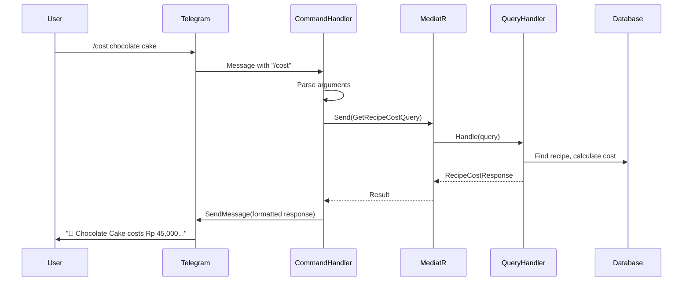

# Week 10: Bot Commands + Alert Notifications 🔔

> **Goal**: Implement Telegram bot commands (`/cost`, `/price`, `/low`, `/profit`), create `AlertNotificationService`, and connect domain events to Telegram notifications using MediatR `INotificationHandler`.

---

## Table of Contents
1. [Day 1: Command Architecture with MediatR](#day-1-command-architecture-with-mediatr)
2. [Day 2: Implement /cost Command](#day-2-implement-cost-command)
3. [Day 3: Implement /price and /low Commands](#day-3-implement-price-and-low-commands)
4. [Day 4: Implement /profit Command](#day-4-implement-profit-command)
5. [Day 5: Domain Events & Alert System](#day-5-domain-events--alert-system)
6. [Day 6: AlertNotificationService & Telegram Integration](#day-6-alertnotificationservice--telegram-integration)
7. [Day 7: Testing & Production Considerations](#day-7-testing--production-considerations)
8. [Resources](#resources)

---

# Day 1: Command Architecture with MediatR

## 🧒 Explain Like I'm 5

Bot commands are like asking questions:
- `/cost cake` → "How much does it cost to make a cake?"
- `/price flour` → "What's the current price of flour?"
- `/low` → "What ingredients are running low?"
- `/profit` → "How much money did I make today?"

The bot takes your question, finds the answer, and tells you!

## 🔧 Engineer Language

Using MediatR for command handling:
1. **Telegram Command** → Parsed by `ICommandHandler`
2. **MediatR Query** → Sent to Application layer
3. **Query Handler** → Fetches data from repositories
4. **Response** → Formatted and sent back via Telegram

### Command-to-Query Flow



### Bot Commands Summary

| Command | Query | Description |
|---------|-------|-------------|
| `/cost [recipe]` | `GetRecipeCostQuery` | Recipe cost breakdown |
| `/price [ingredient]` | `GetIngredientPriceQuery` | Current price + history |
| `/low` | `GetLowStockQuery` | Items below minimum |
| `/profit` | `GetDailyProfitQuery` | Today's P&L summary |
| `/help` | — | Show available commands |

### Base Command Handler Pattern

Create `src/Nastart.Bot/Commands/BaseCommandHandler.cs`:

```csharp
using MediatR;
using Telegram.Bot;
using Telegram.Bot.Types;
using Telegram.Bot.Types.Enums;

namespace Nastart.Bot.Commands;

/// <summary>
/// Base class for command handlers that use MediatR queries.
/// </summary>
public abstract class BaseCommandHandler : ICommandHandler
{
    protected readonly ITelegramBotClient BotClient;
    protected readonly IMediator Mediator;
    protected readonly ILogger Logger;

    protected BaseCommandHandler(
        ITelegramBotClient botClient,
        IMediator mediator,
        ILogger logger)
    {
        BotClient = botClient;
        Mediator = mediator;
        Logger = logger;
    }

    public abstract string Command { get; }
    public abstract string Description { get; }
    
    public abstract Task HandleAsync(Message message, CancellationToken cancellationToken = default);

    /// <summary>
    /// Parses command arguments from message text.
    /// </summary>
    protected string[] ParseArguments(string text)
    {
        var parts = text.Split(' ', StringSplitOptions.RemoveEmptyEntries);
        return parts.Length > 1 ? parts[1..] : [];
    }

    /// <summary>
    /// Sends a markdown-formatted message.
    /// </summary>
    protected async Task SendMarkdownAsync(
        long chatId,
        string text,
        CancellationToken cancellationToken)
    {
        await BotClient.SendMessage(
            chatId: chatId,
            text: text,
            parseMode: ParseMode.Markdown,
            cancellationToken: cancellationToken);
    }

    /// <summary>
    /// Sends an error message to the user.
    /// </summary>
    protected async Task SendErrorAsync(
        long chatId,
        string error,
        CancellationToken cancellationToken)
    {
        await BotClient.SendMessage(
            chatId: chatId,
            text: $"❌ {error}",
            cancellationToken: cancellationToken);
    }

    /// <summary>
    /// Sends usage instructions when command is malformed.
    /// </summary>
    protected async Task SendUsageAsync(
        long chatId,
        string usage,
        CancellationToken cancellationToken)
    {
        await BotClient.SendMessage(
            chatId: chatId,
            text: $"💡 *Usage:* `{usage}`",
            parseMode: ParseMode.Markdown,
            cancellationToken: cancellationToken);
    }
}
```

### References
- [MediatR Documentation](https://github.com/jbogard/MediatR)
- [CQRS Pattern](https://learn.microsoft.com/en-us/azure/architecture/patterns/cqrs)

---

# Day 2: Implement /cost Command

## 🧒 Explain Like I'm 5

When you ask `/cost chocolate cake`, the bot:
1. Finds the recipe called "chocolate cake"
2. Looks up all ingredients and their prices
3. Calculates total cost
4. Tells you the margin (how much profit you make)

## 🔧 Engineer Language

The `/cost` command queries recipe cost with full breakdown:
- Ingredient costs using current prices
- Total cost calculation
- Margin based on selling price
- Warning if margin is below threshold

### GetRecipeCostQuery

Create `src/Nastart.Application/Recipe/Queries/GetRecipeCost/GetRecipeCostQuery.cs`:

```csharp
using MediatR;
using Nastart.Application.Common;

namespace Nastart.Application.Recipe.Queries.GetRecipeCost;

/// <summary>
/// Query to get recipe cost breakdown.
/// </summary>
public record GetRecipeCostQuery(
    string RecipeName,
    long UserId
) : IRequest<Result<RecipeCostResponse>>;

/// <summary>
/// Detailed cost breakdown for a recipe.
/// </summary>
public record RecipeCostResponse(
    Guid RecipeId,
    string RecipeName,
    decimal SellingPrice,
    decimal TotalCost,
    decimal Margin,
    decimal MarginPercent,
    bool IsBelowThreshold,
    decimal Threshold,
    IReadOnlyList<IngredientCostItem> Ingredients,
    DateTime CostCalculatedAt
);

/// <summary>
/// Individual ingredient cost in a recipe.
/// </summary>
public record IngredientCostItem(
    Guid IngredientId,
    string IngredientName,
    decimal Quantity,
    string Unit,
    decimal UnitPrice,
    decimal LineCost
);
```

### GetRecipeCostQueryHandler

Create `src/Nastart.Application/Recipe/Queries/GetRecipeCost/GetRecipeCostQueryHandler.cs`:

```csharp
using MediatR;
using Microsoft.Extensions.Logging;
using Nastart.Application.Common;
using Nastart.Application.Common.Interfaces;

namespace Nastart.Application.Recipe.Queries.GetRecipeCost;

/// <summary>
/// Handles GetRecipeCostQuery using repository and domain logic.
/// </summary>
public class GetRecipeCostQueryHandler 
    : IRequestHandler<GetRecipeCostQuery, Result<RecipeCostResponse>>
{
    private readonly IRecipeRepository _recipeRepository;
    private readonly IIngredientRepository _ingredientRepository;
    private readonly IUserSettingsRepository _userSettingsRepository;
    private readonly ILogger<GetRecipeCostQueryHandler> _logger;

    public GetRecipeCostQueryHandler(
        IRecipeRepository recipeRepository,
        IIngredientRepository ingredientRepository,
        IUserSettingsRepository userSettingsRepository,
        ILogger<GetRecipeCostQueryHandler> logger)
    {
        _recipeRepository = recipeRepository;
        _ingredientRepository = ingredientRepository;
        _userSettingsRepository = userSettingsRepository;
        _logger = logger;
    }

    public async Task<Result<RecipeCostResponse>> Handle(
        GetRecipeCostQuery request, 
        CancellationToken cancellationToken)
    {
        // Find recipe by name (fuzzy search)
        var recipe = await _recipeRepository.FindByNameAsync(
            request.RecipeName, 
            request.UserId, 
            cancellationToken);

        if (recipe is null)
        {
            _logger.LogWarning(
                "Recipe '{Name}' not found for user {UserId}", 
                request.RecipeName, request.UserId);
            
            return Result<RecipeCostResponse>.Failure(
                Error.NotFound("RecipeNotFound", 
                    $"Recipe '{request.RecipeName}' not found"));
        }

        // Get user's margin threshold
        var settings = await _userSettingsRepository.GetByUserIdAsync(
            request.UserId, cancellationToken);
        var threshold = settings?.MinMarginPercent ?? 20m;

        // Calculate costs for each ingredient
        var ingredientCosts = new List<IngredientCostItem>();
        var totalCost = 0m;

        foreach (var recipeItem in recipe.Items)
        {
            var ingredient = await _ingredientRepository.GetByIdAsync(
                recipeItem.IngredientId, cancellationToken);

            if (ingredient is null) continue;

            var lineCost = recipeItem.Quantity.Value * ingredient.CurrentPrice.Amount;
            totalCost += lineCost;

            ingredientCosts.Add(new IngredientCostItem(
                IngredientId: ingredient.Id.Value,
                IngredientName: ingredient.Name,
                Quantity: recipeItem.Quantity.Value,
                Unit: ingredient.Unit.Name,
                UnitPrice: ingredient.CurrentPrice.Amount,
                LineCost: lineCost
            ));
        }

        // Calculate margin
        var margin = recipe.SellingPrice.Amount - totalCost;
        var marginPercent = recipe.SellingPrice.Amount > 0 
            ? (margin / recipe.SellingPrice.Amount) * 100 
            : 0;

        _logger.LogInformation(
            "Calculated cost for recipe {RecipeId}: Cost={Cost}, Margin={Margin}%",
            recipe.Id.Value, totalCost, marginPercent);

        return Result<RecipeCostResponse>.Success(new RecipeCostResponse(
            RecipeId: recipe.Id.Value,
            RecipeName: recipe.Name,
            SellingPrice: recipe.SellingPrice.Amount,
            TotalCost: totalCost,
            Margin: margin,
            MarginPercent: marginPercent,
            IsBelowThreshold: marginPercent < threshold,
            Threshold: threshold,
            Ingredients: ingredientCosts,
            CostCalculatedAt: DateTime.UtcNow
        ));
    }
}
```

### CostCommand Handler

Create `src/Nastart.Bot/Commands/CostCommand.cs`:

```csharp
using System.Text;
using MediatR;
using Telegram.Bot;
using Telegram.Bot.Types;
using Nastart.Application.Recipe.Queries.GetRecipeCost;

namespace Nastart.Bot.Commands;

/// <summary>
/// Handles /cost [recipe] command.
/// </summary>
public sealed class CostCommand : BaseCommandHandler
{
    public CostCommand(
        ITelegramBotClient botClient,
        IMediator mediator,
        ILogger<CostCommand> logger)
        : base(botClient, mediator, logger)
    {
    }

    public override string Command => "cost";
    public override string Description => "Get recipe cost breakdown";

    public override async Task HandleAsync(
        Message message, 
        CancellationToken cancellationToken = default)
    {
        var chatId = message.Chat.Id;
        var userId = message.From?.Id ?? 0;

        var args = ParseArguments(message.Text ?? string.Empty);
        
        if (args.Length == 0)
        {
            await SendUsageAsync(chatId, "/cost [recipe name]", cancellationToken);
            return;
        }

        var recipeName = string.Join(" ", args);

        Logger.LogInformation(
            "Cost query for '{Recipe}' from user {UserId}", 
            recipeName, userId);

        var query = new GetRecipeCostQuery(recipeName, userId);
        var result = await Mediator.Send(query, cancellationToken);

        if (!result.IsSuccess)
        {
            await SendErrorAsync(chatId, result.Error?.Message ?? "Recipe not found", cancellationToken);
            return;
        }

        var response = FormatCostResponse(result.Value);
        await SendMarkdownAsync(chatId, response, cancellationToken);
    }

    private static string FormatCostResponse(RecipeCostResponse cost)
    {
        var sb = new StringBuilder();

        // Header
        var marginEmoji = cost.IsBelowThreshold ? "⚠️" : "✅";
        sb.AppendLine($"🍳 *{cost.RecipeName}*\n");

        // Ingredient breakdown
        sb.AppendLine("*Ingredients:*");
        foreach (var item in cost.Ingredients)
        {
            sb.AppendLine($"• {item.IngredientName}");
            sb.AppendLine($"  {item.Quantity:N1} {item.Unit} × Rp {item.UnitPrice:N0} = *Rp {item.LineCost:N0}*");
        }

        sb.AppendLine();

        // Summary
        sb.AppendLine("─────────────────");
        sb.AppendLine($"📦 *Total Cost:* Rp {cost.TotalCost:N0}");
        sb.AppendLine($"💰 *Sell Price:* Rp {cost.SellingPrice:N0}");
        sb.AppendLine($"{marginEmoji} *Margin:* Rp {cost.Margin:N0} ({cost.MarginPercent:N1}%)");

        // Warning if below threshold
        if (cost.IsBelowThreshold)
        {
            sb.AppendLine();
            sb.AppendLine($"⚠️ _Margin is below your threshold of {cost.Threshold:N0}%_");
        }

        sb.AppendLine();
        sb.AppendLine($"_Updated: {cost.CostCalculatedAt:dd MMM yyyy HH:mm}_");

        return sb.ToString();
    }
}
```

### References
- [MediatR Request/Response](https://github.com/jbogard/MediatR/wiki)
- [Result Pattern in C#](https://learn.microsoft.com/en-us/dotnet/architecture/microservices/microservice-ddd-cqrs-patterns/domain-events-design-implementation)

---

# Day 3: Implement /price and /low Commands

## 🧒 Explain Like I'm 5

- `/price flour` → "What's the price of flour? Has it gone up or down?"
- `/low` → "What ingredients are running out?"

These commands help you stay on top of your inventory!

## 🔧 Engineer Language

### GetIngredientPriceQuery

Create `src/Nastart.Application/Inventory/Queries/GetIngredientPrice/GetIngredientPriceQuery.cs`:

```csharp
using MediatR;
using Nastart.Application.Common;

namespace Nastart.Application.Inventory.Queries.GetIngredientPrice;

public record GetIngredientPriceQuery(
    string IngredientName,
    long UserId
) : IRequest<Result<IngredientPriceResponse>>;

public record IngredientPriceResponse(
    Guid IngredientId,
    string IngredientName,
    decimal CurrentPrice,
    string Unit,
    decimal CurrentStock,
    decimal MinStock,
    bool IsLowStock,
    IReadOnlyList<PriceHistoryItem> RecentPrices,
    decimal? PriceChange,
    decimal? PriceChangePercent
);

public record PriceHistoryItem(
    DateTime Date,
    decimal Price,
    string? ShopName
);
```

### GetIngredientPriceQueryHandler

```csharp
using MediatR;
using Microsoft.Extensions.Logging;
using Nastart.Application.Common;
using Nastart.Application.Common.Interfaces;

namespace Nastart.Application.Inventory.Queries.GetIngredientPrice;

public class GetIngredientPriceQueryHandler 
    : IRequestHandler<GetIngredientPriceQuery, Result<IngredientPriceResponse>>
{
    private readonly IIngredientRepository _ingredientRepository;
    private readonly IPriceHistoryRepository _priceHistoryRepository;
    private readonly ILogger<GetIngredientPriceQueryHandler> _logger;

    public GetIngredientPriceQueryHandler(
        IIngredientRepository ingredientRepository,
        IPriceHistoryRepository priceHistoryRepository,
        ILogger<GetIngredientPriceQueryHandler> logger)
    {
        _ingredientRepository = ingredientRepository;
        _priceHistoryRepository = priceHistoryRepository;
        _logger = logger;
    }

    public async Task<Result<IngredientPriceResponse>> Handle(
        GetIngredientPriceQuery request, 
        CancellationToken cancellationToken)
    {
        var ingredient = await _ingredientRepository.FindByNameAsync(
            request.IngredientName, 
            request.UserId, 
            cancellationToken);

        if (ingredient is null)
        {
            return Result<IngredientPriceResponse>.Failure(
                Error.NotFound("IngredientNotFound", 
                    $"Ingredient '{request.IngredientName}' not found"));
        }

        // Get last 5 price entries
        var priceHistory = await _priceHistoryRepository.GetRecentAsync(
            ingredient.Id, 
            count: 5, 
            cancellationToken);

        var recentPrices = priceHistory
            .Select(p => new PriceHistoryItem(p.Date, p.Price.Amount, p.ShopName))
            .ToList();

        // Calculate price change from previous
        decimal? priceChange = null;
        decimal? priceChangePercent = null;

        if (recentPrices.Count >= 2)
        {
            var current = recentPrices[0].Price;
            var previous = recentPrices[1].Price;
            priceChange = current - previous;
            priceChangePercent = previous > 0 
                ? (priceChange / previous) * 100 
                : null;
        }

        return Result<IngredientPriceResponse>.Success(new IngredientPriceResponse(
            IngredientId: ingredient.Id.Value,
            IngredientName: ingredient.Name,
            CurrentPrice: ingredient.CurrentPrice.Amount,
            Unit: ingredient.Unit.Name,
            CurrentStock: ingredient.Stock.Value,
            MinStock: ingredient.MinimumStock.Value,
            IsLowStock: ingredient.Stock.Value < ingredient.MinimumStock.Value,
            RecentPrices: recentPrices,
            PriceChange: priceChange,
            PriceChangePercent: priceChangePercent
        ));
    }
}
```

### PriceCommand Handler

Create `src/Nastart.Bot/Commands/PriceCommand.cs`:

```csharp
using System.Text;
using MediatR;
using Telegram.Bot;
using Telegram.Bot.Types;
using Nastart.Application.Inventory.Queries.GetIngredientPrice;

namespace Nastart.Bot.Commands;

/// <summary>
/// Handles /price [ingredient] command.
/// </summary>
public sealed class PriceCommand : BaseCommandHandler
{
    public PriceCommand(
        ITelegramBotClient botClient,
        IMediator mediator,
        ILogger<PriceCommand> logger)
        : base(botClient, mediator, logger)
    {
    }

    public override string Command => "price";
    public override string Description => "Get ingredient price and history";

    public override async Task HandleAsync(
        Message message, 
        CancellationToken cancellationToken = default)
    {
        var chatId = message.Chat.Id;
        var userId = message.From?.Id ?? 0;

        var args = ParseArguments(message.Text ?? string.Empty);
        
        if (args.Length == 0)
        {
            await SendUsageAsync(chatId, "/price [ingredient name]", cancellationToken);
            return;
        }

        var ingredientName = string.Join(" ", args);

        var query = new GetIngredientPriceQuery(ingredientName, userId);
        var result = await Mediator.Send(query, cancellationToken);

        if (!result.IsSuccess)
        {
            await SendErrorAsync(chatId, result.Error?.Message ?? "Ingredient not found", cancellationToken);
            return;
        }

        var response = FormatPriceResponse(result.Value);
        await SendMarkdownAsync(chatId, response, cancellationToken);
    }

    private static string FormatPriceResponse(IngredientPriceResponse price)
    {
        var sb = new StringBuilder();

        // Header with price change indicator
        var changeEmoji = price.PriceChangePercent switch
        {
            > 10 => "🔴",
            > 0 => "🟡",
            < 0 => "🟢",
            _ => "⚪"
        };

        sb.AppendLine($"📦 *{price.IngredientName}*\n");

        // Current price
        sb.AppendLine($"💰 *Current Price:* Rp {price.CurrentPrice:N0}/{price.Unit}");

        // Price change
        if (price.PriceChange.HasValue)
        {
            var sign = price.PriceChange > 0 ? "+" : "";
            sb.AppendLine($"{changeEmoji} *Change:* {sign}Rp {price.PriceChange:N0} ({sign}{price.PriceChangePercent:N1}%)");
        }

        sb.AppendLine();

        // Stock status
        var stockEmoji = price.IsLowStock ? "⚠️" : "✅";
        sb.AppendLine($"{stockEmoji} *Stock:* {price.CurrentStock:N1} {price.Unit}");
        if (price.IsLowStock)
        {
            sb.AppendLine($"_Below minimum: {price.MinStock:N1} {price.Unit}_");
        }

        // Price history
        if (price.RecentPrices.Count > 1)
        {
            sb.AppendLine();
            sb.AppendLine("*Recent Prices:*");
            foreach (var entry in price.RecentPrices.Take(5))
            {
                var shop = !string.IsNullOrEmpty(entry.ShopName) ? $" ({entry.ShopName})" : "";
                sb.AppendLine($"• {entry.Date:dd MMM}: Rp {entry.Price:N0}{shop}");
            }
        }

        return sb.ToString();
    }
}
```

### GetLowStockQuery

Create `src/Nastart.Application/Inventory/Queries/GetLowStock/GetLowStockQuery.cs`:

```csharp
using MediatR;
using Nastart.Application.Common;

namespace Nastart.Application.Inventory.Queries.GetLowStock;

public record GetLowStockQuery(long UserId) : IRequest<Result<LowStockResponse>>;

public record LowStockResponse(
    int TotalLowStock,
    IReadOnlyList<LowStockItem> Items
);

public record LowStockItem(
    Guid IngredientId,
    string IngredientName,
    decimal CurrentStock,
    decimal MinStock,
    string Unit,
    decimal StockPercent
);
```

### LowCommand Handler

Create `src/Nastart.Bot/Commands/LowCommand.cs`:

```csharp
using System.Text;
using MediatR;
using Telegram.Bot;
using Telegram.Bot.Types;
using Nastart.Application.Inventory.Queries.GetLowStock;

namespace Nastart.Bot.Commands;

/// <summary>
/// Handles /low command to show low stock items.
/// </summary>
public sealed class LowCommand : BaseCommandHandler
{
    public LowCommand(
        ITelegramBotClient botClient,
        IMediator mediator,
        ILogger<LowCommand> logger)
        : base(botClient, mediator, logger)
    {
    }

    public override string Command => "low";
    public override string Description => "List low stock ingredients";

    public override async Task HandleAsync(
        Message message, 
        CancellationToken cancellationToken = default)
    {
        var chatId = message.Chat.Id;
        var userId = message.From?.Id ?? 0;

        var query = new GetLowStockQuery(userId);
        var result = await Mediator.Send(query, cancellationToken);

        if (!result.IsSuccess)
        {
            await SendErrorAsync(chatId, "Could not retrieve stock data", cancellationToken);
            return;
        }

        var response = FormatLowStockResponse(result.Value);
        await SendMarkdownAsync(chatId, response, cancellationToken);
    }

    private static string FormatLowStockResponse(LowStockResponse data)
    {
        var sb = new StringBuilder();

        if (data.Items.Count == 0)
        {
            sb.AppendLine("✅ *All stock levels are healthy!*");
            sb.AppendLine();
            sb.AppendLine("_No ingredients below minimum stock._");
            return sb.ToString();
        }

        sb.AppendLine($"⚠️ *Low Stock Alert* ({data.TotalLowStock} items)\n");

        foreach (var item in data.Items.OrderBy(i => i.StockPercent))
        {
            var urgency = item.StockPercent switch
            {
                < 25 => "🔴",
                < 50 => "🟠",
                _ => "🟡"
            };

            sb.AppendLine($"{urgency} *{item.IngredientName}*");
            sb.AppendLine($"   {item.CurrentStock:N1}/{item.MinStock:N1} {item.Unit} ({item.StockPercent:N0}%)");
        }

        sb.AppendLine();
        sb.AppendLine("_Send a receipt photo to restock!_");

        return sb.ToString();
    }
}
```

### References
- [Query Pattern with MediatR](https://github.com/jbogard/MediatR)
- [Repository Pattern](https://learn.microsoft.com/en-us/dotnet/architecture/microservices/microservice-ddd-cqrs-patterns/infrastructure-persistence-layer-design)

---

# Day 4: Implement /profit Command

## 🧒 Explain Like I'm 5

`/profit` is like checking your piggy bank:
- How much money came in today? (Revenue)
- How much did you spend on ingredients? (Expenses)
- How much did you actually make? (Profit!)

## 🔧 Engineer Language

The `/profit` command aggregates sales and purchase data:
- Daily revenue from sales
- Daily expenses from purchases
- Net profit/loss calculation

### GetDailyProfitQuery

Create `src/Nastart.Application/Finance/Queries/GetDailyProfit/GetDailyProfitQuery.cs`:

```csharp
using MediatR;
using Nastart.Application.Common;

namespace Nastart.Application.Finance.Queries.GetDailyProfit;

public record GetDailyProfitQuery(
    long UserId,
    DateTime? Date = null  // Defaults to today
) : IRequest<Result<DailyProfitResponse>>;

public record DailyProfitResponse(
    DateTime Date,
    decimal TotalRevenue,
    decimal TotalExpenses,
    decimal NetProfit,
    decimal ProfitMargin,
    int SalesCount,
    int PurchaseCount,
    IReadOnlyList<TopSellingItem> TopSellers,
    DailyProfitResponse? Yesterday  // For comparison
);

public record TopSellingItem(
    string RecipeName,
    int Quantity,
    decimal Revenue,
    decimal Profit
);
```

### GetDailyProfitQueryHandler

```csharp
using MediatR;
using Microsoft.Extensions.Logging;
using Nastart.Application.Common;
using Nastart.Application.Common.Interfaces;

namespace Nastart.Application.Finance.Queries.GetDailyProfit;

public class GetDailyProfitQueryHandler 
    : IRequestHandler<GetDailyProfitQuery, Result<DailyProfitResponse>>
{
    private readonly ISaleRepository _saleRepository;
    private readonly IPurchaseRepository _purchaseRepository;
    private readonly ILogger<GetDailyProfitQueryHandler> _logger;

    public GetDailyProfitQueryHandler(
        ISaleRepository saleRepository,
        IPurchaseRepository purchaseRepository,
        ILogger<GetDailyProfitQueryHandler> logger)
    {
        _saleRepository = saleRepository;
        _purchaseRepository = purchaseRepository;
        _logger = logger;
    }

    public async Task<Result<DailyProfitResponse>> Handle(
        GetDailyProfitQuery request, 
        CancellationToken cancellationToken)
    {
        var date = request.Date?.Date ?? DateTime.Today;

        // Get today's data
        var todayData = await CalculateDailyData(request.UserId, date, cancellationToken);

        // Get yesterday's data for comparison
        var yesterdayData = await CalculateDailyData(
            request.UserId, 
            date.AddDays(-1), 
            cancellationToken);

        return Result<DailyProfitResponse>.Success(todayData with 
        { 
            Yesterday = yesterdayData 
        });
    }

    private async Task<DailyProfitResponse> CalculateDailyData(
        long userId, 
        DateTime date,
        CancellationToken cancellationToken)
    {
        // Get sales for the day
        var sales = await _saleRepository.GetByDateAsync(userId, date, cancellationToken);
        var totalRevenue = sales.Sum(s => s.Revenue.Amount);
        var totalProfit = sales.Sum(s => s.Profit.Amount);

        // Get purchases for the day
        var purchases = await _purchaseRepository.GetByDateAsync(userId, date, cancellationToken);
        var totalExpenses = purchases.Sum(p => p.Total.Amount);

        // Calculate net profit (revenue - expenses)
        var netProfit = totalRevenue - totalExpenses;
        var profitMargin = totalRevenue > 0 
            ? (netProfit / totalRevenue) * 100 
            : 0;

        // Get top sellers
        var topSellers = sales
            .GroupBy(s => s.Recipe.Name)
            .Select(g => new TopSellingItem(
                RecipeName: g.Key,
                Quantity: g.Sum(s => s.Quantity),
                Revenue: g.Sum(s => s.Revenue.Amount),
                Profit: g.Sum(s => s.Profit.Amount)
            ))
            .OrderByDescending(t => t.Quantity)
            .Take(3)
            .ToList();

        return new DailyProfitResponse(
            Date: date,
            TotalRevenue: totalRevenue,
            TotalExpenses: totalExpenses,
            NetProfit: netProfit,
            ProfitMargin: profitMargin,
            SalesCount: sales.Count,
            PurchaseCount: purchases.Count,
            TopSellers: topSellers,
            Yesterday: null
        );
    }
}
```

### ProfitCommand Handler

Create `src/Nastart.Bot/Commands/ProfitCommand.cs`:

```csharp
using System.Text;
using MediatR;
using Telegram.Bot;
using Telegram.Bot.Types;
using Nastart.Application.Finance.Queries.GetDailyProfit;

namespace Nastart.Bot.Commands;

/// <summary>
/// Handles /profit command for daily P&L summary.
/// </summary>
public sealed class ProfitCommand : BaseCommandHandler
{
    public ProfitCommand(
        ITelegramBotClient botClient,
        IMediator mediator,
        ILogger<ProfitCommand> logger)
        : base(botClient, mediator, logger)
    {
    }

    public override string Command => "profit";
    public override string Description => "Today's profit summary";

    public override async Task HandleAsync(
        Message message, 
        CancellationToken cancellationToken = default)
    {
        var chatId = message.Chat.Id;
        var userId = message.From?.Id ?? 0;

        var query = new GetDailyProfitQuery(userId);
        var result = await Mediator.Send(query, cancellationToken);

        if (!result.IsSuccess)
        {
            await SendErrorAsync(chatId, "Could not retrieve profit data", cancellationToken);
            return;
        }

        var response = FormatProfitResponse(result.Value);
        await SendMarkdownAsync(chatId, response, cancellationToken);
    }

    private static string FormatProfitResponse(DailyProfitResponse data)
    {
        var sb = new StringBuilder();

        // Header
        var profitEmoji = data.NetProfit >= 0 ? "📈" : "📉";
        sb.AppendLine($"{profitEmoji} *Profit Summary*");
        sb.AppendLine($"_{data.Date:dddd, dd MMMM yyyy}_\n");

        // Main metrics
        sb.AppendLine($"💵 *Revenue:* Rp {data.TotalRevenue:N0}");
        sb.AppendLine($"🛒 *Expenses:* Rp {data.TotalExpenses:N0}");
        sb.AppendLine("─────────────────");
        
        var profitSign = data.NetProfit >= 0 ? "+" : "";
        var profitColor = data.NetProfit >= 0 ? "✅" : "❌";
        sb.AppendLine($"{profitColor} *Net Profit:* {profitSign}Rp {data.NetProfit:N0}");
        
        if (data.TotalRevenue > 0)
        {
            sb.AppendLine($"📊 *Margin:* {data.ProfitMargin:N1}%");
        }

        sb.AppendLine();

        // Activity counts
        sb.AppendLine($"📝 *Activity:*");
        sb.AppendLine($"   • {data.SalesCount} sales");
        sb.AppendLine($"   • {data.PurchaseCount} purchases");

        // Top sellers
        if (data.TopSellers.Count > 0)
        {
            sb.AppendLine();
            sb.AppendLine("🏆 *Top Sellers:*");
            foreach (var item in data.TopSellers)
            {
                sb.AppendLine($"   • {item.RecipeName}: {item.Quantity}x (Rp {item.Revenue:N0})");
            }
        }

        // Comparison with yesterday
        if (data.Yesterday is not null && data.Yesterday.TotalRevenue > 0)
        {
            sb.AppendLine();
            var revenueChange = data.TotalRevenue - data.Yesterday.TotalRevenue;
            var changePercent = (revenueChange / data.Yesterday.TotalRevenue) * 100;
            var changeSign = revenueChange >= 0 ? "+" : "";
            var changeEmoji = revenueChange >= 0 ? "⬆️" : "⬇️";
            
            sb.AppendLine($"{changeEmoji} _vs Yesterday: {changeSign}{changePercent:N1}%_");
        }

        return sb.ToString();
    }
}
```

### Register Commands in DI

Update `src/Nastart.Bot/Extensions/TelegramBotExtensions.cs`:

```csharp
// Register all command handlers
services.AddScoped<ICommandHandler, StartCommand>();
services.AddScoped<ICommandHandler, HelpCommand>();
services.AddScoped<ICommandHandler, CostCommand>();
services.AddScoped<ICommandHandler, PriceCommand>();
services.AddScoped<ICommandHandler, LowCommand>();
services.AddScoped<ICommandHandler, ProfitCommand>();
```

---

# Day 5: Domain Events & Alert System

## 🧒 Explain Like I'm 5

When something important happens (like a price spike!), the system needs to tell you. It's like when your mom says "Tell your dad dinner is ready!" — the message gets passed along automatically.

## 🔧 Engineer Language

Domain events enable loose coupling:
1. **Domain Event** → Raised when business rule triggers
2. **MediatR Notification** → Published via `IPublisher`
3. **Notification Handler** → Reacts to event (e.g., sends Telegram alert)

> 📖 **Microsoft Docs**: *"Domain events can be used to explicitly implement side effects of rules within your domain model."*
>
> — [Domain Events Design and Implementation](https://learn.microsoft.com/en-us/dotnet/architecture/microservices/microservice-ddd-cqrs-patterns/domain-events-design-implementation)

### Domain Events Review

From Week 5, we defined these events in `Nastart.Domain`:

```csharp
// src/Nastart.Domain/Common/IDomainEvent.cs
using MediatR;

namespace Nastart.Domain.Common;

/// <summary>
/// Marker interface for domain events.
/// Implements MediatR INotification for pub/sub.
/// </summary>
public interface IDomainEvent : INotification
{
    DateTime OccurredAt { get; }
}
```

### Alert-Triggering Domain Events

```csharp
// src/Nastart.Domain/Finance/Events/PriceSpikeDetectedEvent.cs
namespace Nastart.Domain.Finance.Events;

/// <summary>
/// Raised when ingredient price increases more than threshold (e.g., 15%).
/// </summary>
public record PriceSpikeDetectedEvent(
    Guid IngredientId,
    string IngredientName,
    decimal OldPrice,
    decimal NewPrice,
    decimal ChangePercent,
    long UserId
) : IDomainEvent
{
    public DateTime OccurredAt { get; } = DateTime.UtcNow;
}

// src/Nastart.Domain/Recipe/Events/MarginBelowThresholdEvent.cs
namespace Nastart.Domain.Recipe.Events;

/// <summary>
/// Raised when a recipe's margin falls below user's minimum threshold.
/// </summary>
public record MarginBelowThresholdEvent(
    Guid RecipeId,
    string RecipeName,
    decimal CurrentMargin,
    decimal Threshold,
    long UserId
) : IDomainEvent
{
    public DateTime OccurredAt { get; } = DateTime.UtcNow;
}

// src/Nastart.Domain/Inventory/Events/LowStockEvent.cs
namespace Nastart.Domain.Inventory.Events;

/// <summary>
/// Raised when ingredient stock falls below minimum.
/// </summary>
public record LowStockEvent(
    Guid IngredientId,
    string IngredientName,
    decimal CurrentStock,
    decimal MinimumStock,
    string Unit,
    long UserId
) : IDomainEvent
{
    public DateTime OccurredAt { get; } = DateTime.UtcNow;
}
```

### Dispatch Domain Events from DbContext

Following Microsoft's eShopOnContainers pattern:

```csharp
// src/Nastart.Infrastructure/Persistence/NastartDbContext.cs
public class NastartDbContext : DbContext, IUnitOfWork
{
    private readonly IMediator _mediator;

    public NastartDbContext(
        DbContextOptions<NastartDbContext> options,
        IMediator mediator)
        : base(options)
    {
        _mediator = mediator;
    }

    public async Task<bool> SaveEntitiesAsync(CancellationToken cancellationToken = default)
    {
        // Dispatch domain events before committing
        await DispatchDomainEventsAsync(cancellationToken);

        // Commit changes
        await base.SaveChangesAsync(cancellationToken);
        return true;
    }

    private async Task DispatchDomainEventsAsync(CancellationToken cancellationToken)
    {
        // Get all entities with domain events
        var domainEntities = ChangeTracker
            .Entries<AggregateRoot>()
            .Where(e => e.Entity.DomainEvents.Any())
            .ToList();

        // Collect all events
        var domainEvents = domainEntities
            .SelectMany(e => e.Entity.DomainEvents)
            .ToList();

        // Clear events from entities
        domainEntities.ForEach(e => e.Entity.ClearDomainEvents());

        // Publish each event via MediatR
        foreach (var domainEvent in domainEvents)
        {
            await _mediator.Publish(domainEvent, cancellationToken);
        }
    }
}
```

### References
- [Domain Events Design](https://learn.microsoft.com/en-us/dotnet/architecture/microservices/microservice-ddd-cqrs-patterns/domain-events-design-implementation)
- [MediatR INotification](https://github.com/jbogard/MediatR/wiki#notifications)

---

# Day 6: AlertNotificationService & Telegram Integration

## 🧒 Explain Like I'm 5

When the system detects a problem (like flour got expensive!), it sends you a message on Telegram right away. You don't have to ask — it tells you automatically!

## 🔧 Engineer Language

The `AlertNotificationService`:
1. Listens for domain events via `INotificationHandler<T>`
2. Looks up user's Telegram chat ID
3. Formats and sends alert message

### IAlertNotificationService Interface

Create `src/Nastart.Application/Common/Interfaces/IAlertNotificationService.cs`:

```csharp
namespace Nastart.Application.Common.Interfaces;

/// <summary>
/// Service for sending alert notifications to users.
/// </summary>
public interface IAlertNotificationService
{
    Task SendPriceSpikeAlertAsync(
        long userId,
        string ingredientName,
        decimal oldPrice,
        decimal newPrice,
        decimal changePercent,
        CancellationToken cancellationToken = default);

    Task SendMarginAlertAsync(
        long userId,
        string recipeName,
        decimal currentMargin,
        decimal threshold,
        CancellationToken cancellationToken = default);

    Task SendLowStockAlertAsync(
        long userId,
        string ingredientName,
        decimal currentStock,
        decimal minimumStock,
        string unit,
        CancellationToken cancellationToken = default);
}
```

### TelegramAlertNotificationService Implementation

Create `src/Nastart.Infrastructure/Notifications/TelegramAlertNotificationService.cs`:

```csharp
using Telegram.Bot;
using Telegram.Bot.Types.Enums;
using Microsoft.Extensions.Logging;
using Nastart.Application.Common.Interfaces;

namespace Nastart.Infrastructure.Notifications;

/// <summary>
/// Sends alert notifications via Telegram.
/// </summary>
public class TelegramAlertNotificationService : IAlertNotificationService
{
    private readonly ITelegramBotClient _botClient;
    private readonly IUserChatRepository _userChatRepository;
    private readonly ILogger<TelegramAlertNotificationService> _logger;

    public TelegramAlertNotificationService(
        ITelegramBotClient botClient,
        IUserChatRepository userChatRepository,
        ILogger<TelegramAlertNotificationService> logger)
    {
        _botClient = botClient;
        _userChatRepository = userChatRepository;
        _logger = logger;
    }

    public async Task SendPriceSpikeAlertAsync(
        long userId,
        string ingredientName,
        decimal oldPrice,
        decimal newPrice,
        decimal changePercent,
        CancellationToken cancellationToken = default)
    {
        var chatId = await GetChatIdAsync(userId, cancellationToken);
        if (chatId is null) return;

        var message = $"""
            🔴 *Price Spike Alert!*

            📦 *{ingredientName}*
            💰 Old Price: Rp {oldPrice:N0}
            💰 New Price: Rp {newPrice:N0}
            📈 Change: +{changePercent:N1}%

            _This may affect your recipe margins._
            Use /cost [recipe] to check.
            """;

        await SendAlertAsync(chatId.Value, message, cancellationToken);
    }

    public async Task SendMarginAlertAsync(
        long userId,
        string recipeName,
        decimal currentMargin,
        decimal threshold,
        CancellationToken cancellationToken = default)
    {
        var chatId = await GetChatIdAsync(userId, cancellationToken);
        if (chatId is null) return;

        var message = $"""
            ⚠️ *Margin Alert!*

            🍳 *{recipeName}*
            📊 Current Margin: {currentMargin:N1}%
            📉 Threshold: {threshold:N1}%

            _Consider increasing your sell price or finding cheaper ingredients._
            Use /cost {recipeName} for details.
            """;

        await SendAlertAsync(chatId.Value, message, cancellationToken);
    }

    public async Task SendLowStockAlertAsync(
        long userId,
        string ingredientName,
        decimal currentStock,
        decimal minimumStock,
        string unit,
        CancellationToken cancellationToken = default)
    {
        var chatId = await GetChatIdAsync(userId, cancellationToken);
        if (chatId is null) return;

        var stockPercent = (currentStock / minimumStock) * 100;

        var message = $"""
            🟡 *Low Stock Alert!*

            📦 *{ingredientName}*
            📉 Stock: {currentStock:N1} {unit}
            ⚠️ Minimum: {minimumStock:N1} {unit}
            📊 Level: {stockPercent:N0}%

            _Time to restock! Send a receipt photo after shopping._
            """;

        await SendAlertAsync(chatId.Value, message, cancellationToken);
    }

    private async Task SendAlertAsync(
        long chatId, 
        string message, 
        CancellationToken cancellationToken)
    {
        try
        {
            await _botClient.SendMessage(
                chatId: chatId,
                text: message,
                parseMode: ParseMode.Markdown,
                cancellationToken: cancellationToken);

            _logger.LogInformation("Alert sent to chat {ChatId}", chatId);
        }
        catch (Exception ex)
        {
            _logger.LogError(ex, "Failed to send alert to chat {ChatId}", chatId);
        }
    }

    private async Task<long?> GetChatIdAsync(
        long userId, 
        CancellationToken cancellationToken)
    {
        var userChat = await _userChatRepository.GetByUserIdAsync(userId, cancellationToken);
        
        if (userChat is null)
        {
            _logger.LogWarning("No chat found for user {UserId}", userId);
            return null;
        }

        return userChat.ChatId;
    }
}
```

### Domain Event Handlers (INotificationHandler)

Create `src/Nastart.Application/Finance/EventHandlers/PriceSpikeDetectedEventHandler.cs`:

```csharp
using MediatR;
using Microsoft.Extensions.Logging;
using Nastart.Application.Common.Interfaces;
using Nastart.Domain.Finance.Events;

namespace Nastart.Application.Finance.EventHandlers;

/// <summary>
/// Handles PriceSpikeDetectedEvent by sending Telegram alert.
/// </summary>
/// <remarks>
/// Following Microsoft's domain event handler pattern:
/// https://learn.microsoft.com/en-us/dotnet/architecture/microservices/microservice-ddd-cqrs-patterns/domain-events-design-implementation
/// </remarks>
public class PriceSpikeDetectedEventHandler 
    : INotificationHandler<PriceSpikeDetectedEvent>
{
    private readonly IAlertNotificationService _alertService;
    private readonly IAlertRepository _alertRepository;
    private readonly ILogger<PriceSpikeDetectedEventHandler> _logger;

    public PriceSpikeDetectedEventHandler(
        IAlertNotificationService alertService,
        IAlertRepository alertRepository,
        ILogger<PriceSpikeDetectedEventHandler> logger)
    {
        _alertService = alertService;
        _alertRepository = alertRepository;
        _logger = logger;
    }

    public async Task Handle(
        PriceSpikeDetectedEvent notification, 
        CancellationToken cancellationToken)
    {
        _logger.LogInformation(
            "Price spike detected for {Ingredient}: {OldPrice} → {NewPrice} ({Change}%)",
            notification.IngredientName,
            notification.OldPrice,
            notification.NewPrice,
            notification.ChangePercent);

        // Send Telegram notification
        await _alertService.SendPriceSpikeAlertAsync(
            userId: notification.UserId,
            ingredientName: notification.IngredientName,
            oldPrice: notification.OldPrice,
            newPrice: notification.NewPrice,
            changePercent: notification.ChangePercent,
            cancellationToken: cancellationToken);

        // Persist alert for history
        await _alertRepository.AddAsync(new Alert
        {
            Id = Guid.NewGuid(),
            UserId = notification.UserId,
            Type = AlertType.PriceSpike,
            Message = $"{notification.IngredientName} price increased {notification.ChangePercent:N1}%",
            CreatedAt = notification.OccurredAt,
            IsRead = false
        }, cancellationToken);
    }
}
```

Create similar handlers for other events:

```csharp
// src/Nastart.Application/Recipe/EventHandlers/MarginBelowThresholdEventHandler.cs
public class MarginBelowThresholdEventHandler 
    : INotificationHandler<MarginBelowThresholdEvent>
{
    private readonly IAlertNotificationService _alertService;
    private readonly IAlertRepository _alertRepository;
    private readonly ILogger<MarginBelowThresholdEventHandler> _logger;

    public async Task Handle(
        MarginBelowThresholdEvent notification, 
        CancellationToken cancellationToken)
    {
        _logger.LogInformation(
            "Margin below threshold for {Recipe}: {Margin}% < {Threshold}%",
            notification.RecipeName,
            notification.CurrentMargin,
            notification.Threshold);

        await _alertService.SendMarginAlertAsync(
            userId: notification.UserId,
            recipeName: notification.RecipeName,
            currentMargin: notification.CurrentMargin,
            threshold: notification.Threshold,
            cancellationToken: cancellationToken);

        await _alertRepository.AddAsync(new Alert
        {
            Id = Guid.NewGuid(),
            UserId = notification.UserId,
            Type = AlertType.MarginWarning,
            Message = $"{notification.RecipeName} margin is {notification.CurrentMargin:N1}%",
            CreatedAt = notification.OccurredAt,
            IsRead = false
        }, cancellationToken);
    }
}

// src/Nastart.Application/Inventory/EventHandlers/LowStockEventHandler.cs
public class LowStockEventHandler 
    : INotificationHandler<LowStockEvent>
{
    private readonly IAlertNotificationService _alertService;
    private readonly IAlertRepository _alertRepository;
    private readonly ILogger<LowStockEventHandler> _logger;

    public async Task Handle(
        LowStockEvent notification, 
        CancellationToken cancellationToken)
    {
        _logger.LogInformation(
            "Low stock for {Ingredient}: {Current}/{Min} {Unit}",
            notification.IngredientName,
            notification.CurrentStock,
            notification.MinimumStock,
            notification.Unit);

        await _alertService.SendLowStockAlertAsync(
            userId: notification.UserId,
            ingredientName: notification.IngredientName,
            currentStock: notification.CurrentStock,
            minimumStock: notification.MinimumStock,
            unit: notification.Unit,
            cancellationToken: cancellationToken);

        await _alertRepository.AddAsync(new Alert
        {
            Id = Guid.NewGuid(),
            UserId = notification.UserId,
            Type = AlertType.LowStock,
            Message = $"{notification.IngredientName} stock is low",
            CreatedAt = notification.OccurredAt,
            IsRead = false
        }, cancellationToken);
    }
}
```

### Register Services

Update `src/Nastart.Infrastructure/DependencyInjection.cs`:

```csharp
// Register alert notification service
services.AddScoped<IAlertNotificationService, TelegramAlertNotificationService>();
```

### References
- [MediatR Notifications](https://github.com/jbogard/MediatR/wiki#notifications)
- [Domain Event Handlers](https://learn.microsoft.com/en-us/dotnet/architecture/microservices/microservice-ddd-cqrs-patterns/domain-events-design-implementation#implement-domain-events)

---

# Day 7: Testing & Production Considerations

## 🧒 Explain Like I'm 5

Before we let real users use the bot, we need to make sure everything works. It's like practicing your piano piece before the recital!

## 🔧 Engineer Language

Testing strategy:
1. **Unit Tests** — Test command handlers in isolation
2. **Integration Tests** — Test full MediatR pipeline
3. **Rate Limiting** — Prevent Telegram API abuse
4. **Error Resilience** — Handle failures gracefully

### Unit Tests for Command Handlers

Create `tests/Nastart.Bot.Tests/Commands/CostCommandTests.cs`:

```csharp
using FluentAssertions;
using MediatR;
using NSubstitute;
using Telegram.Bot;
using Telegram.Bot.Types;
using Telegram.Bot.Types.Enums;
using Nastart.Application.Common;
using Nastart.Application.Recipe.Queries.GetRecipeCost;
using Nastart.Bot.Commands;
using Microsoft.Extensions.Logging;

namespace Nastart.Bot.Tests.Commands;

public class CostCommandTests
{
    private readonly ITelegramBotClient _botClient;
    private readonly IMediator _mediator;
    private readonly CostCommand _sut;

    public CostCommandTests()
    {
        _botClient = Substitute.For<ITelegramBotClient>();
        _mediator = Substitute.For<IMediator>();
        var logger = Substitute.For<ILogger<CostCommand>>();
        
        _sut = new CostCommand(_botClient, _mediator, logger);
    }

    [Fact]
    public async Task HandleAsync_WithValidRecipe_SendsCostBreakdown()
    {
        // Arrange
        var message = CreateMessage("/cost chocolate cake");
        var costResponse = CreateCostResponse();
        
        _mediator.Send(Arg.Any<GetRecipeCostQuery>(), Arg.Any<CancellationToken>())
            .Returns(Result<RecipeCostResponse>.Success(costResponse));

        // Act
        await _sut.HandleAsync(message);

        // Assert
        await _botClient.Received(1).SendMessage(
            chatId: 123,
            text: Arg.Is<string>(s => 
                s.Contains("Chocolate Cake") && 
                s.Contains("Total Cost")),
            parseMode: ParseMode.Markdown,
            cancellationToken: Arg.Any<CancellationToken>());
    }

    [Fact]
    public async Task HandleAsync_WithNoArguments_SendsUsageMessage()
    {
        // Arrange
        var message = CreateMessage("/cost");

        // Act
        await _sut.HandleAsync(message);

        // Assert
        await _botClient.Received(1).SendMessage(
            chatId: 123,
            text: Arg.Is<string>(s => s.Contains("Usage")),
            parseMode: ParseMode.Markdown,
            cancellationToken: Arg.Any<CancellationToken>());
        
        await _mediator.DidNotReceive().Send(
            Arg.Any<GetRecipeCostQuery>(), 
            Arg.Any<CancellationToken>());
    }

    [Fact]
    public async Task HandleAsync_RecipeNotFound_SendsErrorMessage()
    {
        // Arrange
        var message = CreateMessage("/cost nonexistent");
        
        _mediator.Send(Arg.Any<GetRecipeCostQuery>(), Arg.Any<CancellationToken>())
            .Returns(Result<RecipeCostResponse>.Failure(
                Error.NotFound("NotFound", "Recipe not found")));

        // Act
        await _sut.HandleAsync(message);

        // Assert
        await _botClient.Received(1).SendMessage(
            chatId: 123,
            text: Arg.Is<string>(s => s.Contains("❌")),
            cancellationToken: Arg.Any<CancellationToken>());
    }

    private static Message CreateMessage(string text)
    {
        return new Message
        {
            MessageId = 1,
            Chat = new Chat { Id = 123, Type = ChatType.Private },
            From = new User { Id = 456, FirstName = "Test" },
            Text = text,
            Date = DateTime.UtcNow
        };
    }

    private static RecipeCostResponse CreateCostResponse()
    {
        return new RecipeCostResponse(
            RecipeId: Guid.NewGuid(),
            RecipeName: "Chocolate Cake",
            SellingPrice: 100000,
            TotalCost: 60000,
            Margin: 40000,
            MarginPercent: 40,
            IsBelowThreshold: false,
            Threshold: 20,
            Ingredients: new List<IngredientCostItem>
            {
                new(Guid.NewGuid(), "Flour", 500, "gram", 20, 10000),
                new(Guid.NewGuid(), "Sugar", 200, "gram", 25, 5000),
                new(Guid.NewGuid(), "Cocoa", 100, "gram", 50, 5000)
            },
            CostCalculatedAt: DateTime.UtcNow
        );
    }
}
```

### Integration Tests for Event Handlers

Create `tests/Nastart.Application.Tests/EventHandlers/PriceSpikeEventHandlerTests.cs`:

```csharp
using FluentAssertions;
using NSubstitute;
using Microsoft.Extensions.Logging;
using Nastart.Application.Common.Interfaces;
using Nastart.Application.Finance.EventHandlers;
using Nastart.Domain.Finance.Events;

namespace Nastart.Application.Tests.EventHandlers;

public class PriceSpikeEventHandlerTests
{
    private readonly IAlertNotificationService _alertService;
    private readonly IAlertRepository _alertRepository;
    private readonly PriceSpikeDetectedEventHandler _sut;

    public PriceSpikeEventHandlerTests()
    {
        _alertService = Substitute.For<IAlertNotificationService>();
        _alertRepository = Substitute.For<IAlertRepository>();
        var logger = Substitute.For<ILogger<PriceSpikeDetectedEventHandler>>();

        _sut = new PriceSpikeDetectedEventHandler(
            _alertService, _alertRepository, logger);
    }

    [Fact]
    public async Task Handle_SendsAlertAndPersistsToRepository()
    {
        // Arrange
        var @event = new PriceSpikeDetectedEvent(
            IngredientId: Guid.NewGuid(),
            IngredientName: "Flour",
            OldPrice: 20000,
            NewPrice: 25000,
            ChangePercent: 25,
            UserId: 123
        );

        // Act
        await _sut.Handle(@event, CancellationToken.None);

        // Assert
        await _alertService.Received(1).SendPriceSpikeAlertAsync(
            userId: 123,
            ingredientName: "Flour",
            oldPrice: 20000,
            newPrice: 25000,
            changePercent: 25,
            cancellationToken: Arg.Any<CancellationToken>());

        await _alertRepository.Received(1).AddAsync(
            Arg.Is<Alert>(a => 
                a.UserId == 123 && 
                a.Type == AlertType.PriceSpike),
            Arg.Any<CancellationToken>());
    }
}
```

### Rate Limiting for Telegram API

Telegram has rate limits (30 messages/second to same chat). Implement throttling:

```csharp
// src/Nastart.Infrastructure/Notifications/RateLimitedTelegramService.cs
using System.Threading.Channels;

public class RateLimitedTelegramService : BackgroundService
{
    private readonly Channel<TelegramMessage> _messageQueue;
    private readonly ITelegramBotClient _botClient;
    private readonly ILogger<RateLimitedTelegramService> _logger;
    
    // Telegram allows ~30 msg/sec, we'll be conservative
    private readonly TimeSpan _minDelay = TimeSpan.FromMilliseconds(50);

    public RateLimitedTelegramService(
        ITelegramBotClient botClient,
        ILogger<RateLimitedTelegramService> logger)
    {
        _botClient = botClient;
        _logger = logger;
        _messageQueue = Channel.CreateBounded<TelegramMessage>(
            new BoundedChannelOptions(1000)
            {
                FullMode = BoundedChannelFullMode.DropOldest
            });
    }

    public async ValueTask QueueMessageAsync(TelegramMessage message)
    {
        await _messageQueue.Writer.WriteAsync(message);
    }

    protected override async Task ExecuteAsync(CancellationToken stoppingToken)
    {
        await foreach (var message in _messageQueue.Reader.ReadAllAsync(stoppingToken))
        {
            try
            {
                await _botClient.SendMessage(
                    chatId: message.ChatId,
                    text: message.Text,
                    parseMode: message.ParseMode,
                    cancellationToken: stoppingToken);

                await Task.Delay(_minDelay, stoppingToken);
            }
            catch (Exception ex)
            {
                _logger.LogError(ex, 
                    "Failed to send message to {ChatId}", message.ChatId);
            }
        }
    }
}

public record TelegramMessage(
    long ChatId,
    string Text,
    ParseMode? ParseMode = null
);
```

### Production Checklist

| Item | Status | Notes |
|------|--------|-------|
| Bot token in secrets | ⬜ | Use Azure Key Vault or AWS Secrets Manager |
| Webhook HTTPS | ⬜ | Required by Telegram |
| Rate limiting | ⬜ | Prevent API abuse |
| Error logging | ⬜ | Structured logging with correlation IDs |
| Alert deduplication | ⬜ | Don't spam same alert repeatedly |
| Chat ID persistence | ⬜ | Store in database when user starts bot |
| Graceful shutdown | ⬜ | Complete pending messages before exit |

### References
- [xUnit Testing](https://xunit.net/)
- [NSubstitute](https://nsubstitute.github.io/)
- [Telegram Rate Limits](https://core.telegram.org/bots/faq#broadcasting-to-users)

---

## Week 10 Summary

### Files Created/Updated

```
Nastart.Bot/
├── Commands/
│   ├── BaseCommandHandler.cs     (new)
│   ├── CostCommand.cs            (new)
│   ├── PriceCommand.cs           (new)
│   ├── LowCommand.cs             (new)
│   └── ProfitCommand.cs          (new)

Nastart.Application/
├── Common/Interfaces/
│   └── IAlertNotificationService.cs (new)
├── Recipe/Queries/GetRecipeCost/
│   ├── GetRecipeCostQuery.cs     (new)
│   └── GetRecipeCostQueryHandler.cs (new)
├── Inventory/Queries/
│   ├── GetIngredientPrice/       (new)
│   └── GetLowStock/              (new)
├── Finance/Queries/GetDailyProfit/
│   ├── GetDailyProfitQuery.cs    (new)
│   └── GetDailyProfitQueryHandler.cs (new)
├── Finance/EventHandlers/
│   └── PriceSpikeDetectedEventHandler.cs (new)
├── Recipe/EventHandlers/
│   └── MarginBelowThresholdEventHandler.cs (new)
├── Inventory/EventHandlers/
│   └── LowStockEventHandler.cs   (new)

Nastart.Infrastructure/
├── Notifications/
│   ├── TelegramAlertNotificationService.cs (new)
│   └── RateLimitedTelegramService.cs (new)
```

### Key Concepts Learned

1. **Command Pattern** — Bot commands routed to MediatR queries
2. **MediatR Queries** — Clean separation of concerns
3. **Domain Events** — `INotification` for cross-cutting concerns
4. **Event Handlers** — `INotificationHandler<T>` for reactions
5. **Alert Service** — Centralized notification sending
6. **Rate Limiting** — Prevent Telegram API abuse

### Bot Commands Implemented

| Command | Description |
|---------|-------------|
| `/cost [recipe]` | Recipe cost breakdown with margin |
| `/price [ingredient]` | Current price + history |
| `/low` | Low stock items list |
| `/profit` | Daily P&L summary |

### Alert Types

| Event | Alert |
|-------|-------|
| `PriceSpikeDetectedEvent` | 🔴 Price increased >15% |
| `MarginBelowThresholdEvent` | ⚠️ Recipe margin too low |
| `LowStockEvent` | 🟡 Stock below minimum |

### Next Week Preview

**Week 11: Frontend Foundation** — Initialize Nuxt.js project, learn Vue.js 3 composition API, create layout with Tailwind CSS, set up Pinia stores.
