# Nastart - Complete Product Documentation

> **Tagline**: "Start smart, bake profitable — track every ingredient, price every recipe"

*Named after nastar cookies — helping bakers **start** their business journey right.*

A smart inventory & finance tracking app for small F&B businesses, built with **Vertical Slice Architecture** and **Minimal APIs**.

---

# Table of Contents

1. [Overview](#overview)
2. [Purpose & Impact](#purpose--impact)
3. [Target Users](#target-users)
4. [System Architecture](#system-architecture)
5. [Vertical Slice Architecture](#vertical-slice-architecture)
6. [Database Schema](#database-schema)
7. [Features](#features)
8. [Workflows & BPMN](#workflows--bpmn)
9. [WhatsApp Integration](#whatsapp-integration)
10. [Edge Cases](#edge-cases)
11. [Tech Stack](#tech-stack)
12. [Project Structure](#project-structure)
13. [Learning Roadmap](#learning-roadmap)

---

# Overview

## Problem Statement

Small bakery/F&B owners:
- Don't know their **true profit margins** per product
- Can't track **ingredient price inflation** over time
- Have no visibility into **which products are profitable**
- Waste time manually calculating **recipe costs**
- Get surprised by **rising supplier prices**

## Solution

| Input | Processing | Output |
|-------|------------|--------|
| Receipt photo via Telegram | OCR + smart filtering | Inventory updates |
| Recipe photo/text | Ingredient parsing | Cost calculation |
| Daily purchases | Price tracking | Trend alerts |

---

# Purpose & Impact

## Why Nastart Exists

| Layer | Problem | Nastart Solution |
|-------|---------|------------------|
| **Visibility** | Owners don't know true cost per product | Automatic recipe costing from real purchase data |
| **Time** | Hours spent on manual calculations | OCR receipts → instant inventory updates |
| **Awareness** | Surprised by rising supplier prices | Real-time price spike alerts |
| **Pricing** | Gut-feel selling prices | Data-backed margin recommendations |
| **Growth** | Can't identify profitable products | Clear profit analytics per recipe |

## The Deeper Meaning

1. **Financial empowerment for the overlooked** — Enterprise tools exist for big companies; small bakers use spreadsheets or nothing. Nastart brings business intelligence to the underserved.

2. **From survival to strategy** — Most small F&B owners operate reactively. This app shifts them to proactive decision-making.

3. **Respect for craft** — Bakers focus on their art, not accounting. The app handles the numbers so they can focus on what they love.

4. **Accessible through familiar channels** — Using Telegram/WhatsApp meets users where they already are.

## Impact Map

| Level | Impact |
|-------|--------|
| 👤 **Individual** | Knows exact profit per product, prices confidently, stops undercharging |
| 🏪 **Business** | Identifies high-margin products, spots unprofitable items, negotiates with suppliers using price history |
| 🏘️ **Community** | More sustainable small businesses, local bakeries compete with chains |
| 🌍 **Systemic** | Raises financial literacy in micro-enterprises, model extends to other trades |

## Success Metrics

| Metric | Meaning |
|--------|--------|
| Users who reprice after seeing margin data | App changed behavior |
| % receipts logged via bot vs manual | Convenience is working |
| Users who catch price spikes early | Alerts are valuable |
| Retention after 3 months | Provides ongoing value |

---

# Target Users

| Persona | Description | Pain Point |
|---------|-------------|------------|
| **Home Baker** | Sells via Instagram/WhatsApp | No idea if pricing covers costs |
| **Small Bakery** | 1-3 employees, physical shop | Gut-feel pricing |
| **Café Owner** | 20+ menu items | Complex recipes, multiple suppliers |
| **Catering** | Event-based orders | Variable costs per event |

---

# System Architecture

## High-Level Overview

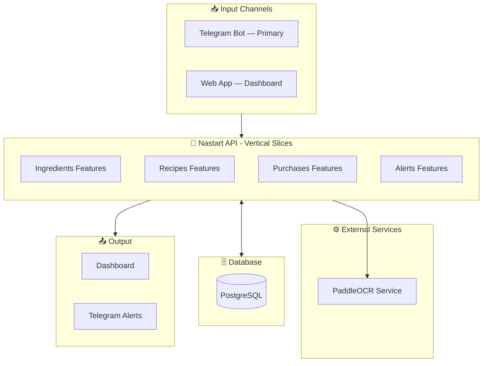

## Vertical Slice Architecture

Instead of organizing by technical layers (Controllers → Services → Repositories), we organize by **features**:

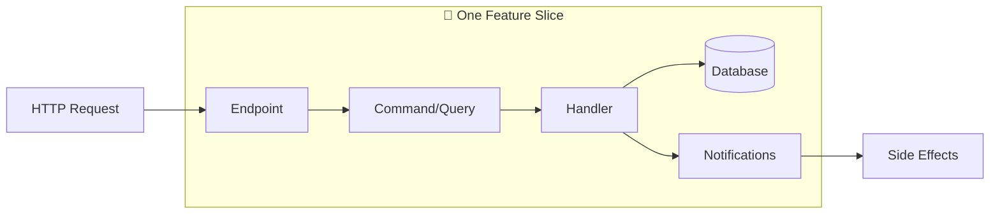

Each feature contains **everything it needs** in one place — no jumping between folders!

---

# Vertical Slice Architecture

## Why Vertical Slices?

| Traditional Layers | Vertical Slices |
|-------------------|-----------------|
| Changes span multiple folders | Changes in one folder |
| Hard to delete features | Delete folder = delete feature |
| Abstractions for abstraction's sake | Concrete implementations |
| Repository → Service → Controller | Everything in one file/folder |
| Cognitive load across layers | Full context in one place |

> 📖 **Reference**: *"Minimal APIs are designed to create HTTP APIs with minimal dependencies. They're ideal for microservices and apps that want to include only the minimum files, features, and dependencies."*
>
> — [Microsoft: Minimal APIs overview](https://learn.microsoft.com/en-us/aspnet/core/fundamentals/minimal-apis/overview)

## Feature Organization

```
Features/
├── Ingredients/
│   ├── CreateIngredient.cs      # Command + Handler + Endpoint
│   ├── GetIngredient.cs         # Query + Handler + Endpoint
│   ├── UpdateIngredientPrice.cs # Command + Handler + Endpoint
│   ├── GetLowStockIngredients.cs
│   ├── Ingredient.cs            # Entity model
│   └── IngredientsEndpoints.cs  # Route group
│
├── Recipes/
│   ├── CreateRecipe.cs
│   ├── GetRecipeCost.cs
│   ├── Recipe.cs
│   └── RecipesEndpoints.cs
│
├── Purchases/
│   ├── RecordPurchase.cs
│   ├── ScanReceipt.cs
│   ├── Purchase.cs
│   └── PurchasesEndpoints.cs
│
└── Alerts/
    ├── CreateAlert.cs
    ├── GetUnreadAlerts.cs
    └── AlertsEndpoints.cs
```

## Anatomy of a Feature Slice

Each feature file contains:

```csharp
// CreateIngredient.cs — Complete feature in one file

// ── Request (Command) ──
public sealed record CreateIngredientCommand(
    Guid UserId,
    string Name,
    string Unit,
    decimal? InitialPrice,  // null = not yet priced
    decimal MinStock
) : IRequest<Result<IngredientResponse>>;

// ── Response ──
public sealed record IngredientResponse(
    Guid Id,
    string Name,
    string Unit,
    decimal? CurrentPrice,
    decimal CurrentStock,
    bool IsLowStock,
    bool HasPrice
);

// ── Validator ──
public sealed class CreateIngredientValidator : AbstractValidator<CreateIngredientCommand>
{
    public CreateIngredientValidator()
    {
        RuleFor(x => x.Name).NotEmpty().MaximumLength(100);
        RuleFor(x => x.Unit).NotEmpty().MaximumLength(20);
        RuleFor(x => x.InitialPrice)
            .GreaterThanOrEqualTo(0)
            .When(x => x.InitialPrice.HasValue);  // only validate if provided
        RuleFor(x => x.MinStock).GreaterThanOrEqualTo(0);
    }
}

// ── Handler ──
public sealed class CreateIngredientHandler 
    : IRequestHandler<CreateIngredientCommand, Result<IngredientResponse>>
{
    private readonly NastartDbContext _db;

    public async Task<Result<IngredientResponse>> Handle(
        CreateIngredientCommand request, 
        CancellationToken cancellationToken)
    {
        // Direct database access — no repository abstraction
        var ingredient = new Ingredient { /* ... */ };
        _db.Ingredients.Add(ingredient);
        await _db.SaveChangesAsync(cancellationToken);
        
        return new IngredientResponse(/* ... */);
    }
}
```

## Glossary (Feature-Based)

| Term | Definition |
|------|------------|
| **Feature Slice** | A self-contained unit with Command/Query, Handler, Validator, and Endpoint |
| **Command** | A request to change state (e.g., `CreateIngredientCommand`) |
| **Query** | A request to read data (e.g., `GetRecipeCostQuery`) |
| **Handler** | Processes a command/query and returns a result |
| **Notification** | MediatR event for side effects (e.g., `PriceChangedNotification`) |
| **Result** | Success/Failure wrapper instead of exceptions |

## Data Records (Value-Like Objects)

```csharp
// Shared/Models/Money.cs
public sealed record Money(decimal Amount, string Currency = "IDR")
{
    public static Money Zero => new(0);
    public Money Add(Money other) => this with { Amount = Amount + other.Amount };
}

// Shared/Models/Quantity.cs
public sealed record Quantity(decimal Value, string Unit)
{
    public static Quantity Kilograms(decimal value) => new(value, "kg");
}

// Shared/Models/Result.cs
public class Result<T>
{
    public bool IsSuccess { get; }
    public T? Value { get; }
    public Error? Error { get; }
}
```

## MediatR Notifications for Side Effects

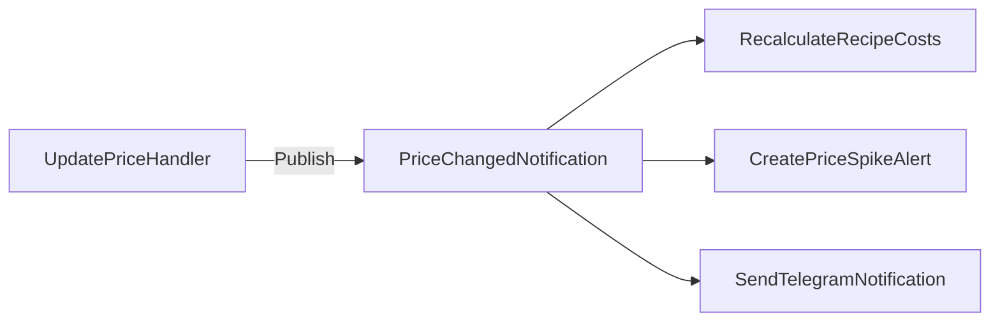

| Notification | Triggers |
|--------------|----------|
| `PriceChangedNotification` | Recalculates recipe costs |
| `PriceSpikeNotification` | Creates alert, sends Telegram message |
| `LowStockNotification` | Creates alert |
| `MarginBelowThresholdNotification` | Creates alert |

## CQRS Pattern (Simplified)

| Commands (Write) | Queries (Read) |
|------------------|----------------|
| `CreateIngredientCommand` | `GetIngredientQuery` |
| `RecordPurchaseCommand` | `GetLowStockIngredientsQuery` |
| `CreateRecipeCommand` | `GetRecipeCostQuery` |
| `ScanReceiptCommand` | `GetProfitSummaryQuery` |

---

# Database Schema

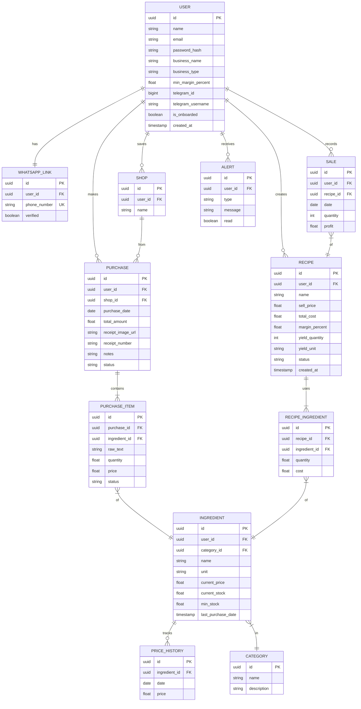

## Entity Summary

| Entity | Purpose |
|--------|---------|
| User | Account with min_margin, Telegram link, business type |
| WhatsApp_Link | Phone verification (future — Telegram-first for MVP) |
| Ingredient | Stock items with prices |
| Purchase | Receipt log |
| Recipe | Product formulas with yield/batch sizing |
| Sale | Revenue tracking |
| Alert | Notifications |

---

# Features

## MVP Features

### 1. Receipt Scanning
- Photo upload via WhatsApp or web
- OCR text extraction
- Ingredient detection & filtering
- Price tracking

### 2. Smart Alerts
| Alert | Trigger |
|-------|---------|
| 🔴 Price Spike | Item >15% increase |
| 🟠 Inflation | Item >10% over 30 days |
| 🔴 Margin Danger | Below min_margin |
| 🟡 Low Stock | Below min_stock |

### 3. Recipe Costing
- Photo/text recipe input
- Auto ingredient matching
- Cost calculation
- Margin analysis

### 4. Dashboard
- Monthly revenue/expense/profit
- Recent purchases
- Recipe margins
- Price trends

## Future Features
- Voice input
- Multi-user support
- POS integration
- Offline mode

---

# Workflows & BPMN

## Main User Flow

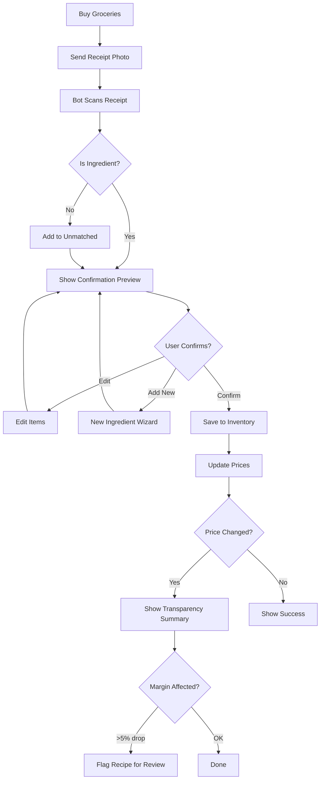

## Onboarding Flow

```mermaid
flowchart TD
    A[/start Command] --> B[Welcome Message]
    B --> C{First Time User?}
    C -->|Yes| D[Show Business Type Selection]
    C -->|No| E[Show Main Menu]
    D --> F{Select Type}
    F -->|Bakery| G[Seed Bakery Ingredients]
    F -->|Café| H[Seed Café Ingredients]
    F -->|Catering| I[Seed Catering Ingredients]
    F -->|Home| J[Seed Home Kitchen Ingredients]
    F -->|Skip| K[Start Empty]
    G --> L[Show Ingredient List]
    H --> L
    I --> L
    J --> L
    K --> E
    L --> M[Tutorial Prompt]
    M --> E
```

## Registration Flow

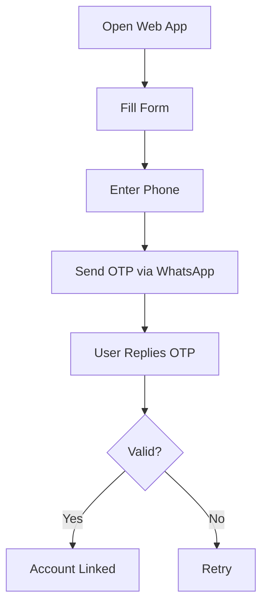

## Receipt Processing (Enhanced)

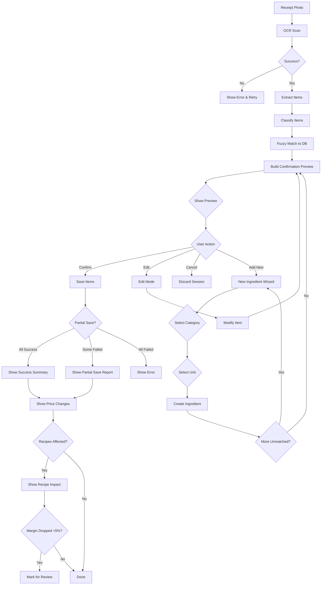

## Recipe Creation (Enhanced with Draft State)

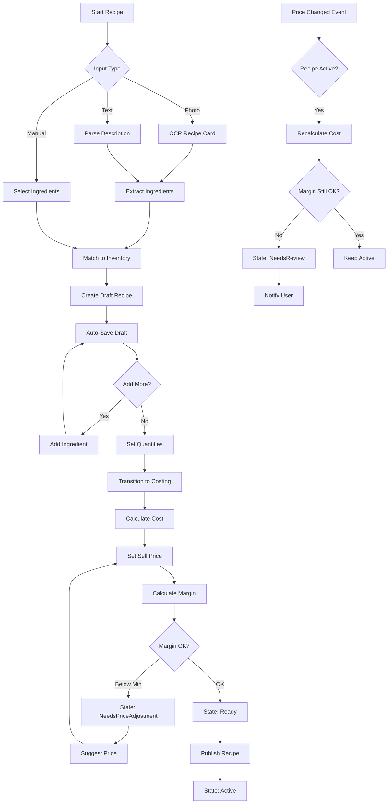

## Alert System

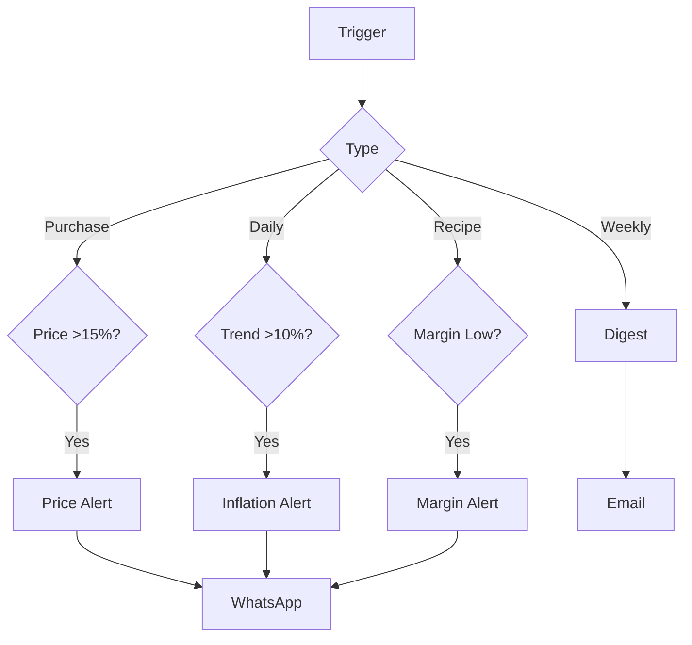

## State Diagrams

### Purchase States
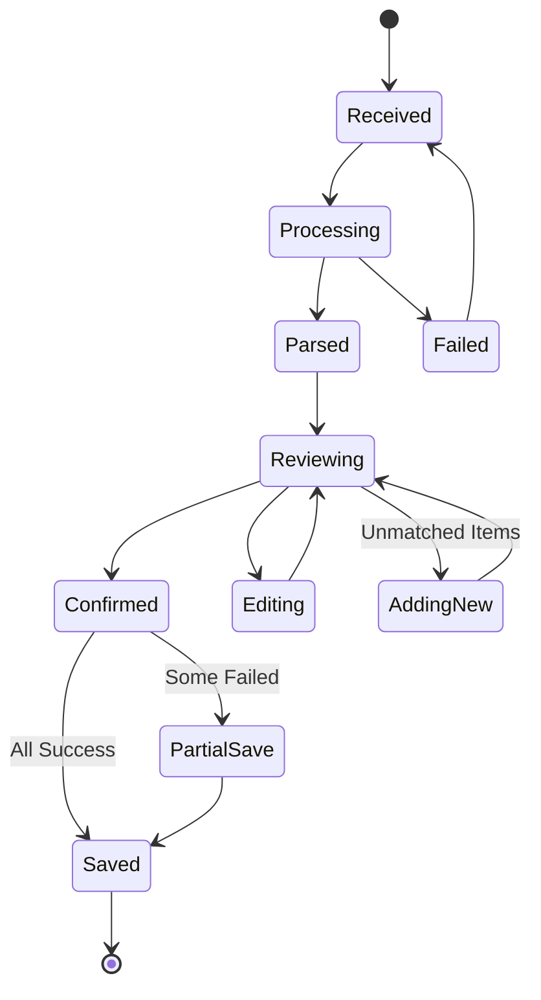

### Recipe States
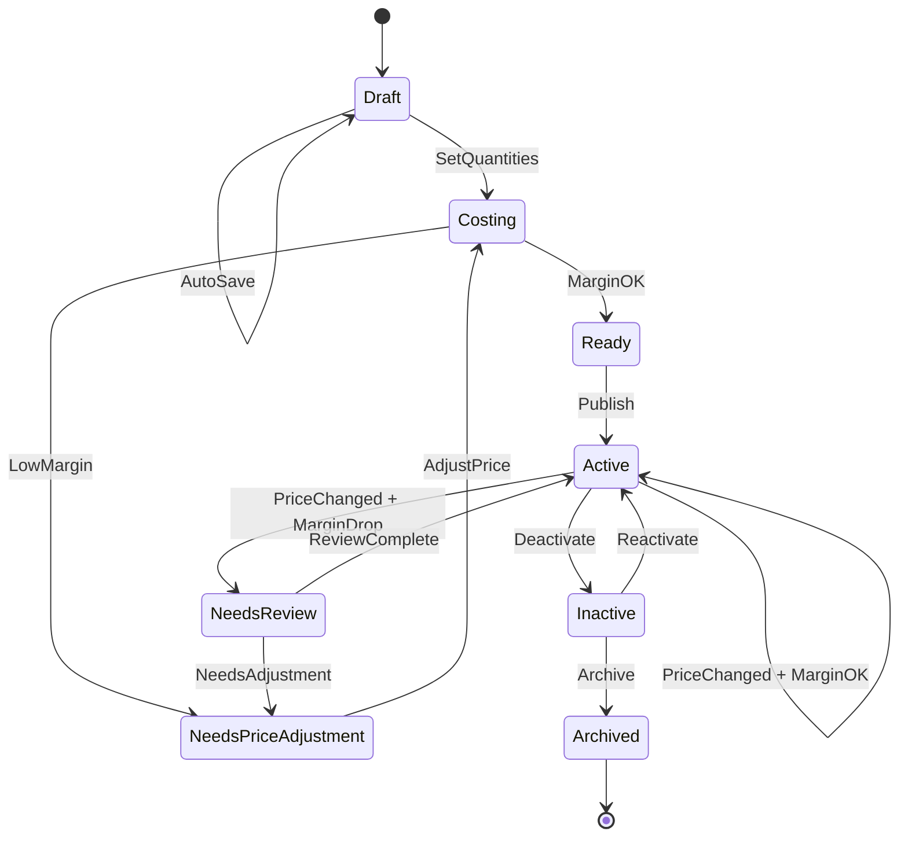

---

# WhatsApp Integration

> **Note**: The MVP uses **Telegram** as the primary bot channel. WhatsApp Cloud API integration is planned for Phase 5 (Week 15+). The flows below document the future WhatsApp design.

## Flow: Phone Linking

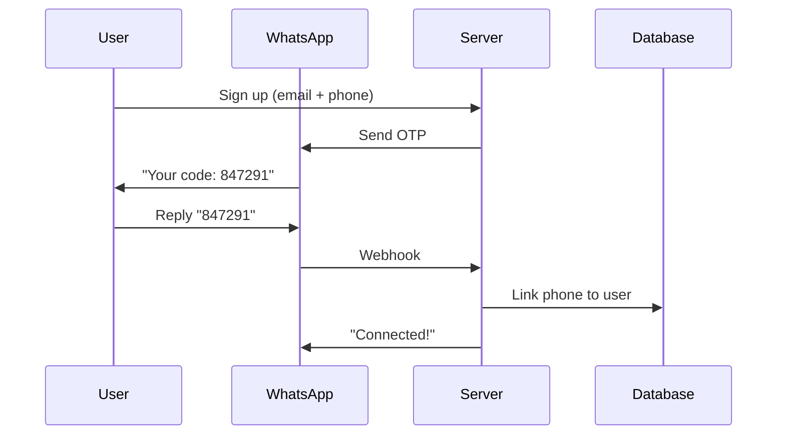

## Flow: Receipt Processing

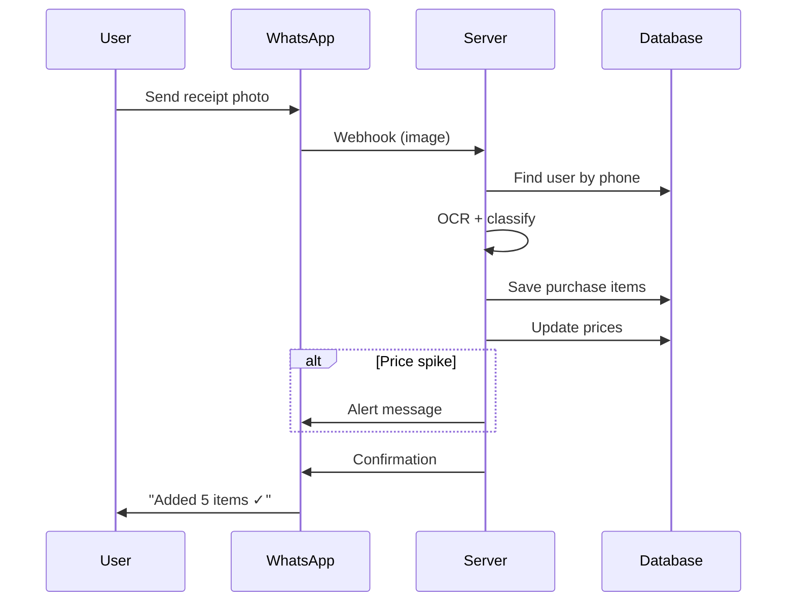

## Bot Commands

| Command | Action |
|---------|--------|
| 📷 Photo | Log receipt |
| `/cost cake` | Get recipe cost |
| `/price flour` | Check price |
| `/low` | List low stock |
| `/profit` | Quick summary |

---

# Edge Cases

## OCR Failures
| Issue | Solution |
|-------|----------|
| Blurry image | Request retake |
| Partial receipt | Manual fallback |
| Unreadable | Guided entry |

## Price Anomalies
| Issue | Solution |
|-------|----------|
| Price = 0 | Flag for review |
| Price 10x normal | Confirm with user |
| Missing price | Use last known |

## Matching Failures
| Issue | Solution |
|-------|----------|
| Unknown ingredient | Fuzzy suggest |
| Ambiguous match | User select |
| Unit mismatch | Convert |

---

# Project Structure

## Repository Layout (Vertical Slice Architecture)

```
nastart/
├── README.md
├── docker-compose.yml
├── .github/workflows/deploy.yml
│
├── backend/
│   ├── Nastart.slnx
│   ├── src/
│   │   └── Nastart.Api/
│   │       ├── Features/                        # 🎯 Feature Slices
│   │       │   ├── Ingredients/
│   │       │   │   ├── Ingredient.cs            # Entity model
│   │       │   │   ├── CreateIngredient.cs      # Command + Handler + Validator
│   │       │   │   ├── GetIngredient.cs         # Query + Handler
│   │       │   │   ├── GetIngredients.cs
│   │       │   │   ├── UpdateIngredientPrice.cs
│   │       │   │   ├── GetLowStockIngredients.cs
│   │       │   │   ├── IngredientNotifications.cs
│   │       │   │   └── IngredientsEndpoints.cs  # Route group
│   │       │   │
│   │       │   ├── Recipes/
│   │       │   │   ├── Recipe.cs
│   │       │   │   ├── RecipeItem.cs
│   │       │   │   ├── CreateRecipe.cs
│   │       │   │   ├── GetRecipeCost.cs
│   │       │   │   ├── AddIngredientToRecipe.cs
│   │       │   │   └── RecipesEndpoints.cs
│   │       │   │
│   │       │   ├── Purchases/
│   │       │   │   ├── Purchase.cs
│   │       │   │   ├── PurchaseItem.cs
│   │       │   │   ├── RecordPurchase.cs
│   │       │   │   ├── ScanReceipt.cs
│   │       │   │   ├── GetPurchaseHistory.cs
│   │       │   │   └── PurchasesEndpoints.cs
│   │       │   │
│   │       │   ├── Alerts/
│   │       │   │   ├── Alert.cs
│   │       │   │   ├── CreateAlert.cs
│   │       │   │   ├── GetUnreadAlerts.cs
│   │       │   │   └── AlertsEndpoints.cs
│   │       │   │
│   │       │   └── Bot/                         # Telegram Bot Features (in-API)
│   │       │       ├── Commands/
│   │       │       │   ├── StartCommand.cs
│   │       │       │   ├── HelpCommand.cs
│   │       │       │   ├── CostCommand.cs
│   │       │       │   └── PriceCommand.cs
│   │       │       ├── Handlers/
│   │       │       │   ├── PhotoHandler.cs
│   │       │       │   └── CallbackHandler.cs
│   │       │       ├── TelegramWebhookEndpoint.cs
│   │       │       └── BotEndpoints.cs
│   │       │
│   │       ├── Shared/                          # Cross-cutting concerns
│   │       │   ├── Data/
│   │       │   │   └── NastartDbContext.cs
│   │       │   ├── Models/
│   │       │   │   ├── Result.cs                # Canonical Result<T> pattern
│   │       │   │   ├── Money.cs
│   │       │   │   ├── Quantity.cs
│   │       │   │   └── PagedResult.cs
│   │       │   ├── Behaviors/
│   │       │   │   ├── ValidationBehavior.cs
│   │       │   │   └── LoggingBehavior.cs
│   │       │   └── Services/
│   │       │       ├── PaddleOcrService.cs
│   │       │       └── TelegramService.cs
│   │       │
│   │       ├── Program.cs
│   │       └── Nastart.Api.csproj
│   │
│   └── tests/
│       └── Nastart.Api.Tests/
│           ├── Features/
│           │   ├── Ingredients/
│           │   │   ├── CreateIngredientTests.cs
│           │   │   └── CreateIngredientValidatorTests.cs
│           │   └── Recipes/
│           │       └── GetRecipeCostTests.cs
│           └── Nastart.Api.Tests.csproj
│
├── ocr-service/                                 # Python PaddleOCR
│   ├── main.py
│   ├── requirements.txt
│   └── Dockerfile
│
├── frontend/
│   ├── nuxt.config.ts
│   ├── pages/
│   ├── components/
│   ├── composables/
│   └── stores/
│
└── docs/
    ├── nastart-complete-docs.md
    ├── glossary.md
    └── lessons/
        ├── week-01-strategic-design.md
        ├── week-02-domain-foundation.md
        └── ...
```

---

# Learning Roadmap

> **Approach**: Feature-by-feature learning with Vertical Slice Architecture — Telegram bot first, WhatsApp later.

## Phase 0: Strategic Design (Week 1)

| Day | Task |
|-----|------|
| 1-2 | Event Storming — map domain events on paper |
| 3 | Define Bounded Contexts — Inventory, Recipe, Finance, Alert |
| 4 | Write Ubiquitous Language glossary |
| 5 | Create GitHub repo `nastart` with monorepo structure |
| 6 | Initialize solution — `dotnet new sln -n Nastart` |
| 7 | Setup Docker — PostgreSQL in docker-compose.yml |

## Phase 1: Feature Building Blocks (Weeks 2-4)

### Week 2 — Domain Foundation + First Feature Slice
- [ ] Create feature-based folder structure (`Features/Ingredients/`, etc.)
- [ ] Install MediatR, FluentValidation, EF Core
- [ ] Build `User` entity model (golden source — includes `TelegramId`)
- [ ] Build `Ingredient` entity model (canonical: `CurrentStock`, `CurrentPrice`)
- [ ] Build `Category` entity model (with `Description`)
- [ ] Create `NastartDbContext` with all DbSets
- [ ] Create `CreateIngredient` feature slice (Command + Handler + Validator + Endpoint)
- [ ] Create `GetIngredients` query feature
- [ ] Define `Result<T>`, `Money`, `Quantity` value objects
- [ ] Unit test feature handlers

### Week 3 — Purchase & Finance Features
- [ ] Build `Purchase` entity (canonical: `TotalAmount`, `PurchaseStatus` enum)
- [ ] Build `PurchaseItem` entity (with `RawText` for OCR traceability)
- [ ] Build `Shop` and `PriceHistory` entities
- [ ] Create `RecordPurchase` feature slice with validation
- [ ] Create `GetPurchaseHistory` query with `PagedResult<T>`
- [ ] Implement price change detection in handler
- [ ] Create `PriceChangedNotification` and handlers (single definition)
- [ ] Create `PriceSpikeNotification` for >15% changes
- [ ] Unit test purchase features

### Week 4 — Recipe Features + Alerts
- [ ] Build `Recipe` entity (with `YieldQuantity`, `YieldUnit`, `RecipeStatus` enum)
- [ ] Build `RecipeItem` entity model
- [ ] Create `CreateRecipe` feature slice with draft state
- [ ] Create `GetRecipeCost` query with live cost-per-unit calculation
- [ ] Create `AddIngredientToRecipe` and `RemoveIngredientFromRecipe` features
- [ ] Implement margin calculation: per-batch and per-unit
- [ ] Build `Alert` entity and `CreateAlert` feature
- [ ] Create `MarginBelowThresholdNotification` (single canonical definition)
- [ ] Create `RecalculateRecipeCostsHandler` (single canonical definition)

## Phase 2: Infrastructure & Integration (Weeks 5-7)

### Week 5 — Database & Shared Services
- [ ] Configure EF Core entity mappings
- [ ] Create database migrations
- [ ] Seed initial Category data
- [ ] Create `Result<T>` pattern for error handling
- [ ] Add `ValidationBehavior` pipeline
- [ ] Add `LoggingBehavior` for debugging

### Week 6 — PaddleOCR Integration
- [ ] Set up PaddleOCR Python microservice with FastAPI
- [ ] Create `PaddleOcrService` HTTP client in .NET
- [ ] Create `ScanReceipt` feature slice
- [ ] Implement `FuzzyMatchingService` for ingredient detection
- [ ] Handle OCR errors gracefully
- [ ] Test with real receipt photos

### Week 7 — API Polish & OpenAPI
- [ ] Configure OpenAPI/Swagger documentation
- [ ] Add request/response examples
- [ ] Configure CORS for frontend
- [ ] Add health check endpoints
- [ ] Rate limiting for bot endpoints
- [ ] Error handling middleware

## Phase 3: Telegram Bot (Weeks 8-10)

### Week 8 — Bot Fundamentals
- [ ] Create Telegram bot via BotFather
- [ ] Study Telegram Bot API — webhooks, message types
- [ ] Create `TelegramWebhookEndpoint` feature
- [ ] Create `StartCommand` feature slice
- [ ] Create `HelpCommand` feature slice
- [ ] Implement command routing

### Week 9 — Receipt Photo Handling
- [ ] Implement `PhotoHandler` feature
- [ ] Download image from Telegram servers
- [ ] Connect to `ScanReceipt` feature
- [ ] Build confirmation keyboard UI
- [ ] Handle user confirmation/edit callbacks
- [ ] Send progress updates during OCR

### Week 10 — Bot Commands + Alerts
- [ ] Create `CostCommand` — `/cost [recipe]`
- [ ] Create `PriceCommand` — `/price [ingredient]`
- [ ] Create `LowStockCommand` — `/low`
- [ ] Create `ProfitCommand` — `/profit`
- [ ] Connect notifications to Telegram messages
- [ ] Test full bot workflow

## Phase 4: Containerization & DevOps (Week 11)

### Week 11 — Docker & Containerization
- [ ] Multi-stage Dockerfiles for API, OCR service
- [ ] Docker Compose orchestration with health checks
- [ ] Production hardening: non-root users, resource limits
- [ ] `.dockerignore` and image optimization
- [ ] Security scanning

> **Note**: Frontend (Vue.js/Nuxt), Authentication, CI/CD, and Dashboard lessons are planned but not yet written. The curriculum currently covers Weeks 1-11 (backend + bot + Docker).

## Phase 5: WhatsApp & Deployment (Weeks 15-16)

### Week 15 — WhatsApp Integration
- [ ] Apply for WhatsApp Cloud API
- [ ] Adapt bot features for WhatsApp webhooks
- [ ] Implement phone linking with OTP

### Week 16 — AWS Deployment
- [ ] Set up RDS PostgreSQL
- [ ] Deploy API to ECS Fargate
- [ ] Deploy frontend to S3 + CloudFront
- [ ] Configure GitHub Actions CI/CD
- [ ] Launch! 🚀

## Learning Outcomes

| What You Build | What You Learn | Career Value |
|----------------|----------------|---------------|
| .NET 10 API with VSA | Feature-based architecture, Minimal APIs | Modern patterns |
| MediatR + FluentValidation | CQRS-lite, pipeline behaviors | Clean code |
| PaddleOCR Python microservice | ML service integration, microservices | In-demand skill |
| Telegram bot | Event-driven architecture, webhooks | Modern integrations |
| Nuxt 4 / Vue.js 3 dashboard | Frontend data visualization | Full-stack capability |
| Complete product | Shipping end-to-end | Portfolio differentiator |

---

# Tech Stack

## Local Development

| Layer | Technology |
|-------|------------|
| Frontend | Vue.js 3 (Nuxt 4) |
| Backend | .NET 10 (C#) with Minimal APIs |
| Database | PostgreSQL 18 (local) |
| OCR | PaddleOCR (Python microservice) |
| Bot | Telegram Bot API |
| Storage | Local filesystem |

### Local Setup
```bash
# Prerequisites
- Node.js 24+
- .NET 10 SDK
- PostgreSQL 18+
- Python 3.12+ (for PaddleOCR service)

# Install PaddleOCR
pip install paddlepaddle paddleocr

# Run locally
cd ocr-service && python main.py  # OCR on localhost:8001
cd frontend && npm run dev        # Nuxt on localhost:3000
cd backend && dotnet run          # API on localhost:5000
```

### PaddleOCR Python Microservice
```python
# ocr-service/main.py
from fastapi import FastAPI, UploadFile
from paddleocr import PaddleOCR
import base64

app = FastAPI()
ocr = PaddleOCR(use_angle_cls=True, lang='id')  # Indonesian language support

@app.post("/scan-receipt")
async def scan_receipt(file: UploadFile):
    contents = await file.read()
    result = ocr.ocr(contents, cls=True)
    
    # Extract text lines from OCR result
    extracted_lines = []
    for line in result[0]:
        text = line[1][0]  # Get the text content
        confidence = line[1][1]  # Get confidence score
        extracted_lines.append({"text": text, "confidence": confidence})
    
    return {"lines": extracted_lines}
```

```csharp
// .NET API call to PaddleOCR microservice
public class PaddleOcrService : IOcrService
{
    private readonly HttpClient _httpClient;
    
    public async Task<string> ExtractTextAsync(byte[] imageBytes)
    {
        using var content = new MultipartFormDataContent();
        content.Add(new ByteArrayContent(imageBytes), "file", "receipt.jpg");
        
        var response = await _httpClient.PostAsync("http://localhost:8001/scan-receipt", content);
        var result = await response.Content.ReadFromJsonAsync<OcrResult>();
        
        return string.Join("\n", result.Lines.Select(l => l.Text));
    }
}
```

---

## AWS Production

| Layer | Technology |
|-------|------------|
| Frontend | Vue.js 3 (Nuxt 4) → AWS S3 + CloudFront |
| Backend | .NET 10 → AWS ECS / EC2 |
| OCR Service | PaddleOCR (Python) → AWS ECS |
| Database | PostgreSQL 18 → AWS RDS |
| Bot | Telegram → WhatsApp Cloud API |
| Storage | AWS S3 |
| CDN | AWS CloudFront |
| Secrets | AWS Secrets Manager |

### AWS Architecture
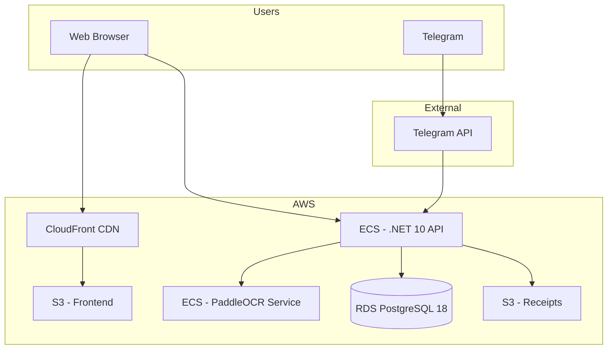

### Deployment Flow
```
Local Dev → GitHub → AWS CodePipeline → ECS/S3
```

---

*Nastart — Start smart, bake profitable*

*Document updated: February 6, 2026*
