# Nastart - Complete Product Documentation

> **Tagline**: "Start smart, bake profitable — track every ingredient, price every recipe"

*Named after nastar cookies — helping bakers **start** their business journey right.*

A smart inventory & finance tracking app for small F&B businesses, built with Domain-Driven Design.

---

# Table of Contents

1. [Overview](#overview)
2. [Purpose & Impact](#purpose--impact)
3. [Target Users](#target-users)
4. [System Architecture](#system-architecture)
5. [Domain-Driven Design](#domain-driven-design)
6. [Database Schema](#database-schema)
7. [Features](#features)
8. [Workflows & BPMN](#workflows--bpmn)
9. [WhatsApp Integration](#whatsapp-integration)
10. [Edge Cases](#edge-cases)
11. [Tech Stack](#tech-stack)
12. [Project Structure](#project-structure)
13. [Learning Roadmap](#learning-roadmap)

---

# Overview

## Problem Statement

Small bakery/F&B owners:
- Don't know their **true profit margins** per product
- Can't track **ingredient price inflation** over time
- Have no visibility into **which products are profitable**
- Waste time manually calculating **recipe costs**
- Get surprised by **rising supplier prices**

## Solution

| Input | Processing | Output |
|-------|------------|--------|
| Receipt photo via WhatsApp | OCR + smart filtering | Inventory updates |
| Recipe photo/text | Ingredient parsing | Cost calculation |
| Daily purchases | Price tracking | Trend alerts |

---

# Purpose & Impact

## Why Nastart Exists

| Layer | Problem | Nastart Solution |
|-------|---------|------------------|
| **Visibility** | Owners don't know true cost per product | Automatic recipe costing from real purchase data |
| **Time** | Hours spent on manual calculations | OCR receipts → instant inventory updates |
| **Awareness** | Surprised by rising supplier prices | Real-time price spike alerts |
| **Pricing** | Gut-feel selling prices | Data-backed margin recommendations |
| **Growth** | Can't identify profitable products | Clear profit analytics per recipe |

## The Deeper Meaning

1. **Financial empowerment for the overlooked** — Enterprise tools exist for big companies; small bakers use spreadsheets or nothing. Nastart brings business intelligence to the underserved.

2. **From survival to strategy** — Most small F&B owners operate reactively. This app shifts them to proactive decision-making.

3. **Respect for craft** — Bakers focus on their art, not accounting. The app handles the numbers so they can focus on what they love.

4. **Accessible through familiar channels** — Using Telegram/WhatsApp meets users where they already are.

## Impact Map

| Level | Impact |
|-------|--------|
| 👤 **Individual** | Knows exact profit per product, prices confidently, stops undercharging |
| 🏪 **Business** | Identifies high-margin products, spots unprofitable items, negotiates with suppliers using price history |
| 🏘️ **Community** | More sustainable small businesses, local bakeries compete with chains |
| 🌍 **Systemic** | Raises financial literacy in micro-enterprises, model extends to other trades |

## Success Metrics

| Metric | Meaning |
|--------|--------|
| Users who reprice after seeing margin data | App changed behavior |
| % receipts logged via bot vs manual | Convenience is working |
| Users who catch price spikes early | Alerts are valuable |
| Retention after 3 months | Provides ongoing value |

---

# Target Users

| Persona | Description | Pain Point |
|---------|-------------|------------|
| **Home Baker** | Sells via Instagram/WhatsApp | No idea if pricing covers costs |
| **Small Bakery** | 1-3 employees, physical shop | Gut-feel pricing |
| **Café Owner** | 20+ menu items | Complex recipes, multiple suppliers |
| **Catering** | Event-based orders | Variable costs per event |

---

# System Architecture

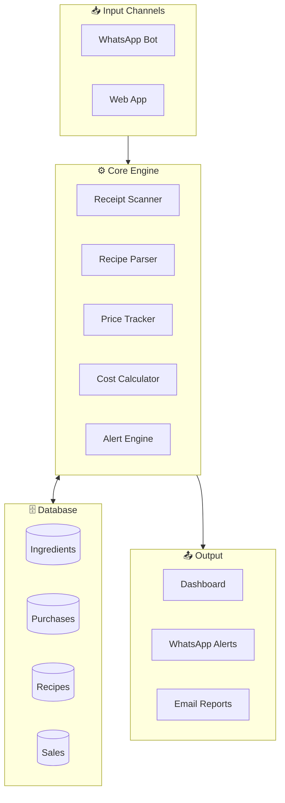

---

# Domain-Driven Design

## Bounded Contexts

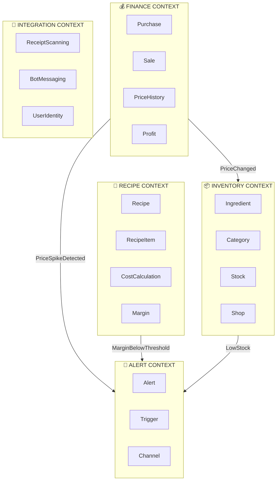

## Ubiquitous Language

| Term | Definition |
|------|------------|
| **Ingredient** | A trackable item used in recipes (flour, sugar, butter) |
| **Purchase** | A single shopping transaction with receipt |
| **Recipe** | A product formula with ingredients and quantities |
| **Cost** | Total ingredient expense to produce one unit |
| **Margin** | Percentage profit after deducting cost from sell price |
| **Price Spike** | When ingredient price increases >15% from last purchase |
| **Low Stock** | When ingredient quantity falls below minimum threshold |

## Aggregates & Entities

### Inventory Context
```
Ingredient (Aggregate Root)
├── IngredientId (Value Object)
├── Name
├── Unit (Value Object: kg, liter, pcs)
├── CurrentPrice (Money Value Object)
├── Stock (Quantity Value Object)
├── MinimumStock
└── Category

Shop (Aggregate Root)
├── ShopId
└── Name
```

### Recipe Context
```
Recipe (Aggregate Root)
├── RecipeId
├── Name
├── SellPrice (Money)
├── RecipeItems (Entity Collection)
│   ├── IngredientId
│   ├── Quantity
│   └── Cost (Money)
├── TotalCost (Money) — calculated
└── Margin (Percentage) — calculated
```

### Finance Context
```
Purchase (Aggregate Root)
├── PurchaseId
├── ShopId
├── PurchaseDate
├── ReceiptImage (Value Object)
├── PurchaseItems (Entity Collection)
│   ├── IngredientId
│   ├── Quantity
│   ├── UnitPrice (Money)
│   └── LineTotal (Money)
└── Total (Money)
```

## Value Objects

```csharp
public record Money(decimal Amount, string Currency = "IDR");
public record Quantity(decimal Value, Unit Unit);
public record Unit(string Name);  // kg, gram, liter, ml, pcs
public record Percentage(decimal Value)
{
    public bool IsBelow(decimal threshold) => Value < threshold;
}
public record IngredientId(Guid Value);
public record RecipeId(Guid Value);
public record PurchaseId(Guid Value);
```

## Domain Events

| Context | Event | Triggers |
|---------|-------|----------|
| Finance | `PurchaseRecordedEvent` | Updates ingredient prices |
| Finance | `PriceSpikeDetectedEvent` | Creates alert |
| Inventory | `PriceChangedEvent` | Recalculates recipe costs |
| Recipe | `MarginBelowThresholdEvent` | Creates alert |
| Inventory | `LowStockEvent` | Creates alert |

## CQRS Pattern

| Commands (Write) | Queries (Read) |
|------------------|----------------|
| CreateIngredient | GetIngredientById |
| RecordPurchase | GetLowStockIngredients |
| CreateRecipe | GetRecipeCost |
| RecordSale | GetProfitSummary |
| UpdateStock | GetPriceHistory |

---

# Database Schema

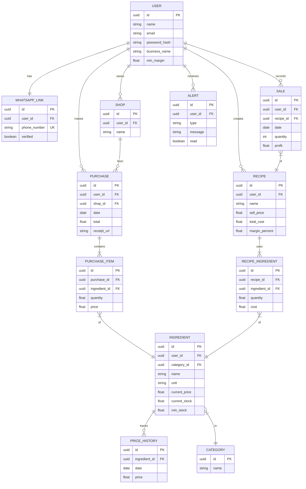

## Entity Summary

| Entity | Purpose |
|--------|---------|
| User | Account with min_margin setting |
| WhatsApp_Link | Phone verification |
| Ingredient | Stock items with prices |
| Purchase | Receipt log |
| Recipe | Product formulas |
| Sale | Revenue tracking |
| Alert | Notifications |

---

# Features

## MVP Features

### 1. Receipt Scanning
- Photo upload via WhatsApp or web
- OCR text extraction
- Ingredient detection & filtering
- Price tracking

### 2. Smart Alerts
| Alert | Trigger |
|-------|---------|
| 🔴 Price Spike | Item >15% increase |
| 🟠 Inflation | Item >10% over 30 days |
| 🔴 Margin Danger | Below min_margin |
| 🟡 Low Stock | Below min_stock |

### 3. Recipe Costing
- Photo/text recipe input
- Auto ingredient matching
- Cost calculation
- Margin analysis

### 4. Dashboard
- Monthly revenue/expense/profit
- Recent purchases
- Recipe margins
- Price trends

## Future Features
- Voice input
- Multi-user support
- POS integration
- Offline mode

---

# Workflows & BPMN

## Main User Flow

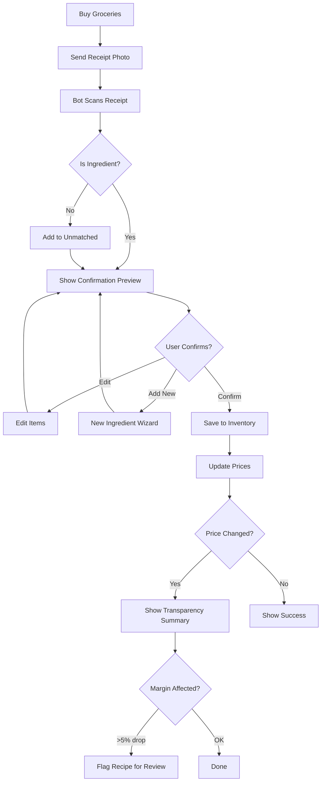

## Onboarding Flow

```mermaid
flowchart TD
    A[/start Command] --> B[Welcome Message]
    B --> C{First Time User?}
    C -->|Yes| D[Show Business Type Selection]
    C -->|No| E[Show Main Menu]
    D --> F{Select Type}
    F -->|Bakery| G[Seed Bakery Ingredients]
    F -->|Café| H[Seed Café Ingredients]
    F -->|Catering| I[Seed Catering Ingredients]
    F -->|Home| J[Seed Home Kitchen Ingredients]
    F -->|Skip| K[Start Empty]
    G --> L[Show Ingredient List]
    H --> L
    I --> L
    J --> L
    K --> E
    L --> M[Tutorial Prompt]
    M --> E
```

## Registration Flow

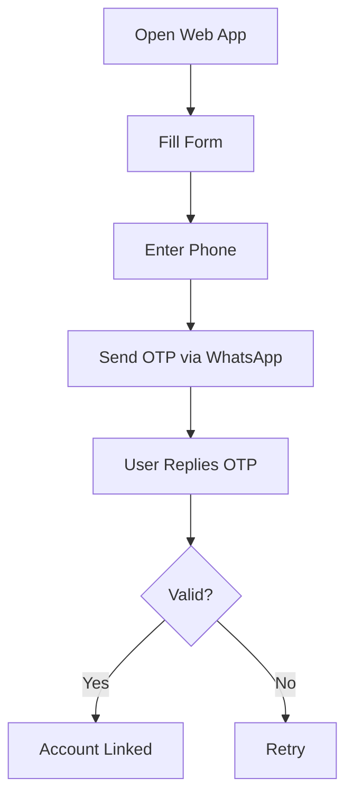

## Receipt Processing (Enhanced)

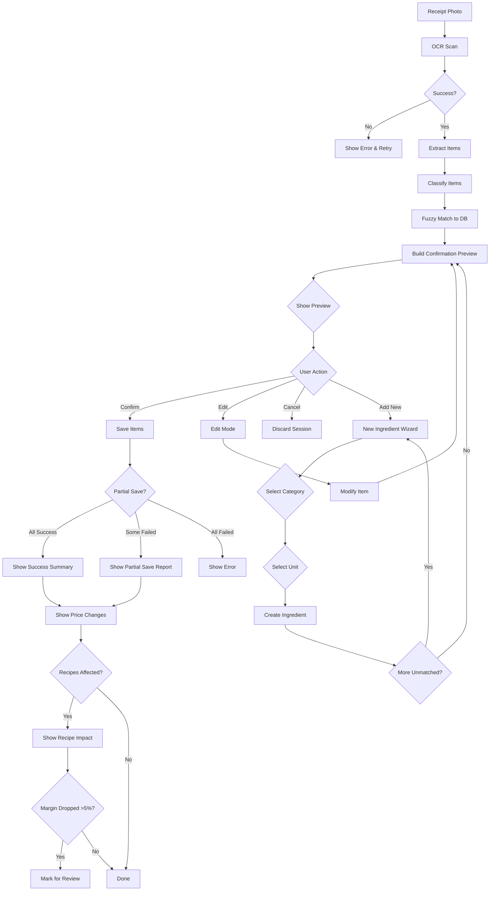

## Recipe Creation (Enhanced with Draft State)

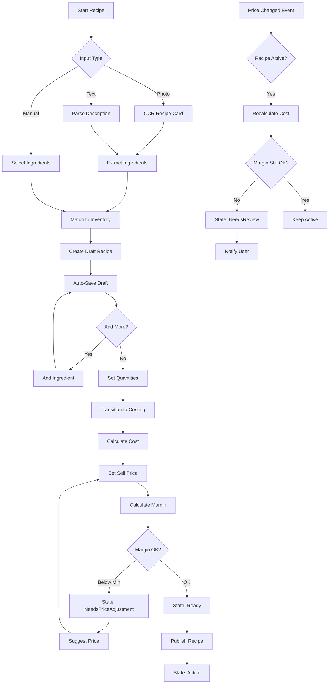

## Alert System

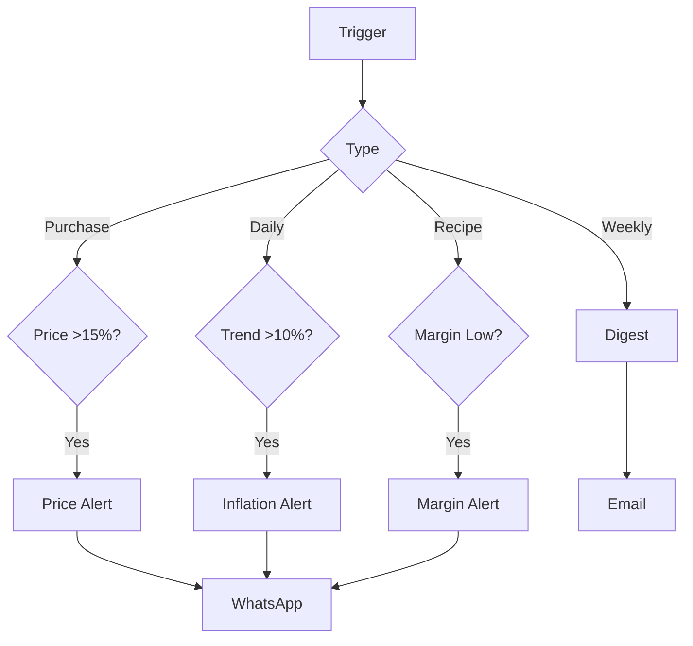

## State Diagrams

### Purchase States
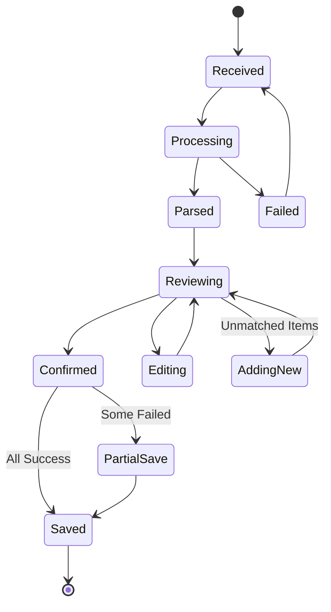

### Recipe States
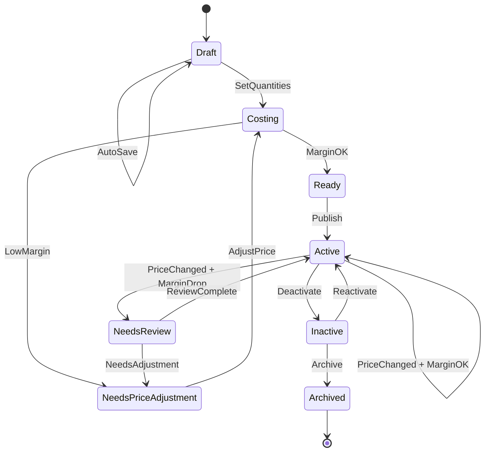

---

# WhatsApp Integration

## Flow: Phone Linking

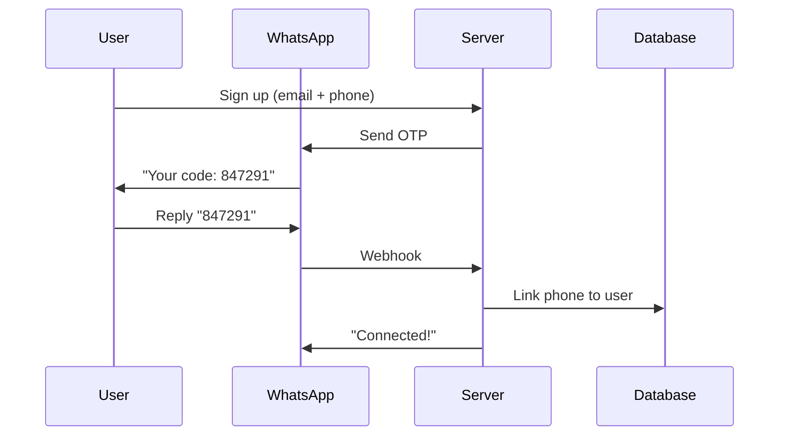

## Flow: Receipt Processing

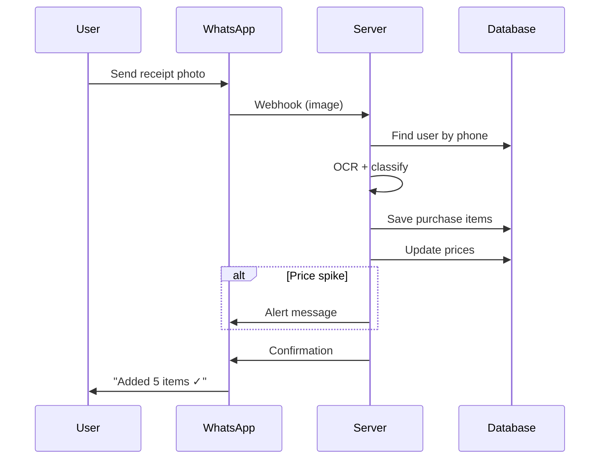

## Bot Commands

| Command | Action |
|---------|--------|
| 📷 Photo | Log receipt |
| `/cost cake` | Get recipe cost |
| `/price flour` | Check price |
| `/low` | List low stock |
| `/profit` | Quick summary |

---

# Edge Cases

## OCR Failures
| Issue | Solution |
|-------|----------|
| Blurry image | Request retake |
| Partial receipt | Manual fallback |
| Unreadable | Guided entry |

## Price Anomalies
| Issue | Solution |
|-------|----------|
| Price = 0 | Flag for review |
| Price 10x normal | Confirm with user |
| Missing price | Use last known |

## Matching Failures
| Issue | Solution |
|-------|----------|
| Unknown ingredient | Fuzzy suggest |
| Ambiguous match | User select |
| Unit mismatch | Convert |

---

# Project Structure

## Repository Layout

```
nastart/
├── README.md
├── docker-compose.yml
├── .github/workflows/deploy.yml
│
├── backend/
│   ├── Nastart.slnx
│   ├── src/
│   │   ├── Nastart.Api/
│   │   │   ├── Controllers/
│   │   │   ├── Middleware/
│   │   │   └── Program.cs
│   │   │
│   │   ├── Nastart.Domain/
│   │   │   ├── Common/
│   │   │   │   ├── Entity.cs
│   │   │   │   ├── AggregateRoot.cs
│   │   │   │   ├── ValueObject.cs
│   │   │   │   └── IDomainEvent.cs
│   │   │   ├── Inventory/
│   │   │   │   ├── Aggregates/
│   │   │   │   ├── ValueObjects/
│   │   │   │   └── Events/
│   │   │   ├── Recipe/
│   │   │   ├── Finance/
│   │   │   └── Alert/
│   │   │
│   │   ├── Nastart.Application/
│   │   │   ├── Inventory/
│   │   │   │   ├── Commands/
│   │   │   │   ├── Queries/
│   │   │   │   └── EventHandlers/
│   │   │   ├── Recipe/
│   │   │   └── Finance/
│   │   │
│   │   ├── Nastart.Infrastructure/
│   │   │   ├── Persistence/
│   │   │   │   ├── NastartDbContext.cs
│   │   │   │   ├── Configurations/
│   │   │   │   └── Repositories/
│   │   │   └── ExternalServices/
│   │           ├── PaddleOcrService.cs
│   │   │       └── TelegramBotService.cs
│   │   │
│   │   └── Nastart.Bot/
│   │       ├── Configuration/
│   │       │   └── TelegramOptions.cs
│   │       ├── Controllers/
│   │       │   └── TelegramWebhookController.cs
│   │       ├── Commands/
│   │       │   ├── ICommandHandler.cs
│   │       │   ├── StartCommand.cs
│   │       │   ├── HelpCommand.cs
│   │       │   └── CostCommand.cs
│   │       ├── Handlers/
│   │       │   ├── ITextHandler.cs
│   │       │   ├── IPhotoHandler.cs
│   │       │   ├── ICallbackHandler.cs
│   │       │   ├── TextHandler.cs
│   │       │   ├── PhotoHandler.cs
│   │       │   └── CallbackHandler.cs
│   │       ├── Keyboards/
│   │       │   ├── IKeyboardBuilder.cs
│   │       │   └── KeyboardBuilder.cs
│   │       ├── Middleware/
│   │       │   └── TelegramErrorHandlingMiddleware.cs
│   │       ├── Routing/
│   │       │   ├── IUpdateRouter.cs
│   │       │   └── UpdateRouter.cs
│   │       ├── Services/
│   │       │   ├── IUpdateQueue.cs
│   │       │   ├── UpdateQueue.cs
│   │       │   ├── WebhookRegistrationService.cs
│   │       │   └── UpdateProcessingService.cs
│   │       └── Extensions/
│   │           └── TelegramBotExtensions.cs
│   │
│   └── tests/
│       ├── Nastart.Domain.Tests/
│       └── Nastart.Application.Tests/
│
├── frontend/
│   ├── nuxt.config.ts
│   ├── pages/
│   ├── components/
│   ├── composables/
│   └── stores/
│
└── docs/
    ├── glossary.md
    ├── architecture.md
    └── learning-log.md
```

---

# Learning Roadmap

> **Approach**: Deep learning with understanding — Telegram bot first, WhatsApp later.

## Phase 0: Strategic Design (Week 1)

| Day | Task |
|-----|------|
| 1-2 | Event Storming — map domain events on paper |
| 3 | Define Bounded Contexts — Inventory, Recipe, Finance, Alert |
| 4 | Write Ubiquitous Language glossary |
| 5 | Create GitHub repo `nastart` with monorepo structure |
| 6 | Initialize solution — `dotnet new sln -n Nastart` |
| 7 | Setup Docker — PostgreSQL in docker-compose.yml |

## Phase 1: Domain Layer Foundation (Weeks 2-4)

### Week 2 — Common Building Blocks + Inventory Context
- [ ] Create `Entity.cs`, `AggregateRoot.cs`, `ValueObject.cs`, `IDomainEvent.cs`
- [ ] Build Value Objects — `Money`, `Quantity`, `Unit`
- [ ] Create `Ingredient` aggregate root with business rules
- [ ] Create `Category` entity, `Shop` aggregate
- [ ] Write domain event `PriceChangedEvent`
- [ ] Unit test Value Objects and Ingredient aggregate

### Week 3 — Finance Context Domain
- [ ] Create `PurchaseId`, `SaleId` strongly-typed IDs
- [ ] Build `Purchase` aggregate with `PurchaseItem` entities
- [ ] Implement `AddItem()`, `CalculateTotal()` business methods
- [ ] Build `PriceHistory` aggregate
- [ ] Create `PriceAnalysisService` — detect spikes (>15%)
- [ ] Write `PriceSpikeDetectedEvent`

### Week 4 — Recipe Context Domain
- [ ] Create `RecipeId` and `Margin` value objects
- [ ] Build `Recipe` aggregate with `RecipeItem` collection
- [ ] Implement `AddIngredient()`, `RecalculateCost()`
- [ ] Create `CostCalculationService` (Domain Service)
- [ ] Write `MarginBelowThresholdEvent`
- [ ] Build `Alert` aggregate

## Phase 2: Application & Infrastructure (Weeks 5-7)

### Week 5 — Application Layer with CQRS
- [ ] Install MediatR, configure in Program.cs
- [ ] Create Commands — `CreateIngredientCommand`, `RecordPurchaseCommand`
- [ ] Create Command Handlers with validation
- [ ] Create Queries — `GetIngredientByIdQuery`, `GetLowStockQuery`
- [ ] Create Event Handlers — `PriceChangedHandler`, `PriceSpikeHandler`

### Week 6 — Infrastructure Layer (Persistence)
- [ ] Create `NastartDbContext` with DbSets
- [ ] Configure EF Core mappings — map Value Objects
- [ ] Implement repositories — `IngredientRepository`, `PurchaseRepository`
- [ ] Create initial migration, seed Category data
- [ ] Implement Unit of Work pattern

### Week 7 — API Layer + PaddleOCR Integration
- [ ] Create controllers using MediatR
- [ ] Configure dependency injection
- [ ] Set up PaddleOCR Python microservice with FastAPI
- [ ] Implement `PaddleOcrService` client in .NET
- [ ] Create `ScanReceiptCommand`

## Phase 3: Telegram Bot (Weeks 8-10)

### Week 8 — Bot Fundamentals
- [ ] Create Telegram bot via BotFather
- [ ] Study Telegram Bot API — webhooks, message types
- [ ] Create `Nastart.Bot` project
- [ ] Implement `TelegramUpdateController`
- [ ] Create `CommandRouter` for `/start`, `/help`

### Week 9 — Receipt Photo Handling
- [ ] Implement photo message detection
- [ ] Create `ReceiptPhotoHandler` — download image
- [ ] Connect to `PaddleOcrService` for OCR
- [ ] Create `IngredientMatchingService` (fuzzy match)
- [ ] Send confirmation with extracted items

### Week 10 — Bot Commands + Alerts
- [ ] Implement `/cost [recipe]`
- [ ] Implement `/price [ingredient]`
- [ ] Implement `/low` — list low stock
- [ ] Implement `/profit` — quick summary
- [ ] Create `AlertNotificationService`
- [ ] Connect domain events to Telegram notifications

## Phase 4: Vue.js Dashboard (Weeks 11-14)

### Week 11 — Frontend Foundation
- [ ] Learn Vue.js 3 — composition API, reactivity
- [ ] Initialize Nuxt.js project
- [ ] Configure TypeScript, Tailwind CSS
- [ ] Create layout — sidebar, header
- [ ] Install Pinia, create stores

### Week 12 — Authentication Flow
- [ ] Create login/register pages
- [ ] Implement JWT in .NET API
- [ ] OTP verification via Telegram
- [ ] Add route guards

### Week 13 — Dashboard Views
- [ ] Build `ProfitChart.vue` — revenue/expense/profit
- [ ] Build `RecentPurchases.vue`
- [ ] Build `RecipeCard.vue` with margin colors
- [ ] Build `LowStockAlert.vue`

### Week 14 — Recipe Builder & Polish
- [ ] Build recipe listing page
- [ ] Create `RecipeBuilder.vue` with live cost
- [ ] Add price trend charts
- [ ] Responsive design

## Phase 5: WhatsApp & Deployment (Weeks 15-16)

### Week 15 — WhatsApp Integration
- [ ] Apply for WhatsApp Cloud API
- [ ] Adapt bot logic for WhatsApp webhooks
- [ ] Implement phone linking with OTP

### Week 16 — AWS Deployment
- [ ] Set up RDS PostgreSQL
- [ ] Deploy API to ECS Fargate
- [ ] Deploy frontend to S3 + CloudFront
- [ ] Configure GitHub Actions CI/CD
- [ ] Launch! 🚀

## Learning Outcomes

| What You Build | What You Learn | Career Value |
|----------------|----------------|---------------|
| .NET 10 API with DDD | Domain modeling, clean architecture | Enterprise patterns |
| PaddleOCR Python microservice | ML service integration, microservices | In-demand skill |
| Telegram bot | Event-driven architecture | Modern integrations |
| Nuxt 4 / Vue.js 3 dashboard | Frontend data visualization | Full-stack capability |
| Complete product | Shipping end-to-end | Portfolio differentiator |

---

# Tech Stack

## Local Development

| Layer | Technology |
|-------|------------|
| Frontend | Vue.js 3 (Nuxt 4) |
| Backend | .NET 10 (C#) |
| Database | PostgreSQL 18 (local) |
| OCR | PaddleOCR (Python microservice) |
| Bot | Telegram Bot API |
| Storage | Local filesystem |

### Local Setup
```bash
# Prerequisites
- Node.js 24+
- .NET 10 SDK
- PostgreSQL 18+
- Python 3.12+ (for PaddleOCR service)

# Install PaddleOCR
pip install paddlepaddle paddleocr

# Run locally
cd ocr-service && python main.py  # OCR on localhost:8001
cd frontend && npm run dev        # Nuxt on localhost:3000
cd backend && dotnet run          # API on localhost:5000
```

### PaddleOCR Python Microservice
```python
# ocr-service/main.py
from fastapi import FastAPI, UploadFile
from paddleocr import PaddleOCR
import base64

app = FastAPI()
ocr = PaddleOCR(use_angle_cls=True, lang='id')  # Indonesian language support

@app.post("/scan-receipt")
async def scan_receipt(file: UploadFile):
    contents = await file.read()
    result = ocr.ocr(contents, cls=True)
    
    # Extract text lines from OCR result
    extracted_lines = []
    for line in result[0]:
        text = line[1][0]  # Get the text content
        confidence = line[1][1]  # Get confidence score
        extracted_lines.append({"text": text, "confidence": confidence})
    
    return {"lines": extracted_lines}
```

```csharp
// .NET API call to PaddleOCR microservice
public class PaddleOcrService : IOcrService
{
    private readonly HttpClient _httpClient;
    
    public async Task<string> ExtractTextAsync(byte[] imageBytes)
    {
        using var content = new MultipartFormDataContent();
        content.Add(new ByteArrayContent(imageBytes), "file", "receipt.jpg");
        
        var response = await _httpClient.PostAsync("http://localhost:8001/scan-receipt", content);
        var result = await response.Content.ReadFromJsonAsync<OcrResult>();
        
        return string.Join("\n", result.Lines.Select(l => l.Text));
    }
}
```

---

## AWS Production

| Layer | Technology |
|-------|------------|
| Frontend | Vue.js 3 (Nuxt 4) → AWS S3 + CloudFront |
| Backend | .NET 10 → AWS ECS / EC2 |
| OCR Service | PaddleOCR (Python) → AWS ECS |
| Database | PostgreSQL 18 → AWS RDS |
| Bot | Telegram → WhatsApp Cloud API |
| Storage | AWS S3 |
| CDN | AWS CloudFront |
| Secrets | AWS Secrets Manager |

### AWS Architecture
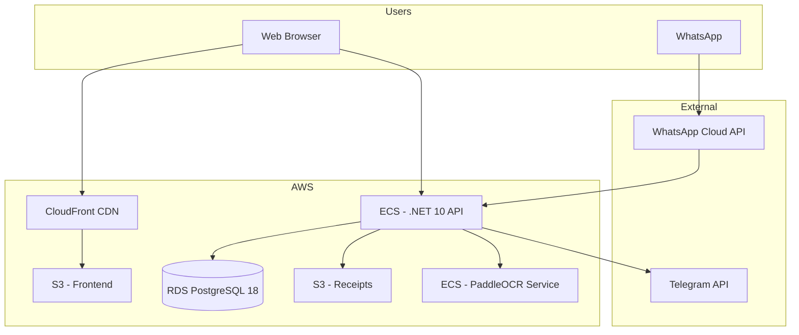

### Deployment Flow
```
Local Dev → GitHub → AWS CodePipeline → ECS/S3
```

---

*Nastart — Start smart, bake profitable*

*Document updated: January 30, 2026*
